**************
Tema 1
**************

1. Breu introducció a l'entorn de treball de QGIS
=================================================

La interfície gràfica de QGIS compta amb diversos elements i apartats que convé destacar per tal de familiaritzar-se amb el programa informàtic. En la següent imatge es ressalten amb diferents colors cadascuna de les zones o aspectes de la interfície del programa:

   * **Vermell**: barra de menús.
   * **Lila**: barres d'eines.
   * **Taronja**: taula de continguts (*TOC*).
   * **Fúcsia**: finestra de mapa.
   * **Verd**: barra d'informació o d'estat.
   * **Blau**: barra de cerca.

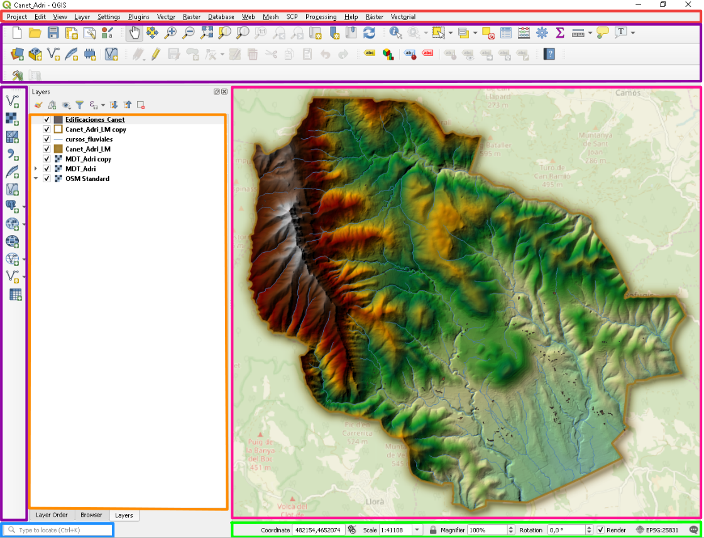

Cadascuna d'aquestes àrees de la interfície gràfica o GUI (Graphic User Interface) de QGIS varien lleugerament en funció del so, de l'idioma o de les extensions que tinguem instal·lades. A continuació se'n detallen les principals funcions.

1.1. La barra de menús
----------------------

La barra de menús contextuals de QGIS compta amb dues tipologies bàsiques de menús: els **fixes** o **genèrics**, i els **contextuals**. Els genèrics són tots aquells menús que sempre són visibles amb independència de les eines o extensions que tinguem instal·lades al nostre QGIS: *File*, *Edit*, *View*, *Layer*, *Settings*...

Els menús contextuals, en canvi, són aquells menús l'existència dels quals depèn exclusivament de la instal·lació d'una extensió o plugin de QGIS: *MMQGIS*, *CADTools*, *CADDigitize*, *Web*...

1.2. La barra d'eines
---------------------

La barra d'eines proporciona accés a pràcticament totes les funcions de la barra de menús, així com eines addicionals per a interactuar amb el mapa. Si es manté uns segons el ratolí sobre cadascuna de les eines, apareix un menú contextual amb una breu descripció de la funcionalitat de l'eina.

Cada barra d'eines es pot moure d'acord amb les necessitats de l'usuari. Així mateix, es pot amagar cada barra d'eines utilitzant el menú contextual del botó dret del ratolí.

1.3. Taula de Continguts (TOC)
------------------------------

La zona de la taula de continguts del mapa registra totes les capes del projecte. La casella de verificació de cada entrada de la llegenda es pot utilitzar per a mostrar o ocultar la capa.
Des de la TOC també es pot modificar l'ordre de visualització de les capes.

Fent clic amb el botó dret sobre cada una de les capes de la TOC, es pot accedir al seu menú contextual, des d'on podrem dur a terme diferents operacions com modificar el zoom de visualització de la capa, mostrar en la vista general, eliminar, propietats de la capa...

A més, també es poden crear agrupacions de capes.

1.4. Barra d'informació o d'estat
---------------------------------

La barra d'estat disposa d'un menú que permet mostrar les coordenades del cursor o l'extensió de la vista.
En un altre menú, es pot visualitzar l'escala de la vista, i a través del seu menú contextual, es pot arribar a modificar aquesta escala sense necessitat d'utilitzar les eines de zoom de QGIS.

També hi ha una casella que permet aturar el renderitzat de les capes. I just al costat d'aquesta casella, apareix el codi EPSG de la projecció del projecte de QGIS en el que estem treballant.

1.5. Barra de cerca
-------------------

A l'angle inferior esquerre de la finestra de QGIS, hi ha un accés a un cercador de múltiples elements de QGIS. La barra de cerca permet accedir de forma àgil i ràpida a qualsevol tipus de capa, element de la capa activa, algoritme o paràmetre de configuració, entre d'altres, implementant, a més, una funció de filtre de resultats de la cerca. Basant-se un prefix de cerca i un valor, la barra de localització identifica i mostra les diferents opcions que responen a un patró de cerca.

1.6. Finestra de mapa
---------------------

Aquí és on es mostra el mapa i es carreguen capes. Al llenç del mapa podeu interactuar amb les capes visibles: ampliar o redfuir el zoom, moure el mapa, seleccionar funcions i moltes altres operacions que veurem en detall a les properes seccions.

1.7. Configuració de QGIS
-------------------------

Des del menú **Settings>Options** podem canviar diferents aspectes de la configuració de QGIS.

Configurar l'idioma
###################

Des de la pestanya **General** podem canviar l'idioma de la interfície d'usuari que per defecte es mostra en anglès. Des d'aquí també podem canviar la configuració regional pel format de dates, números i monedes.

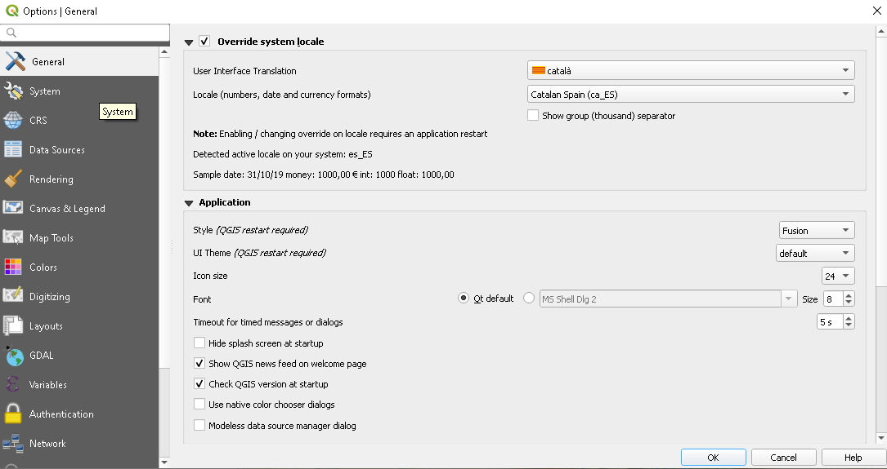

Canviar l'estil i el tema de la interfície d'usuari
###################################################

A la mateixa pestanya **General** podem canviar l'aspecte de la interfície d'usuari: colors, estils dels menús, tipus de lletra, mida de les icones, etc.

Comportament de QGIS en obrir-se
################################

A la mateixa finestra també podrem especificar el comportament de QGIS quan obrim el programa. Podem triar entre:

 * Obrir un projecte nou
 * Obrir un projecte específic
 * Obrir el darrer projecte amb el qual hem treballat
 * Obrir pàgina de benvinguda (opció per defecte)

Canviar el color de la finestra de mapa
#######################################

Des de la pestanya **Canvas & Legend** a **Background color** podem canviar el color de fons de la vista o finestra del mapa.
Des d'aquí també podrem canviar el color amb què es representen els elements seleccionats d'una capa, que per defecte es mostren sempre en groc.

Al llarg del curs tornarem a la configuració de QGIS per modificar altres paràmetres.

1.8. Projectes QGIS
-------------------

Tota l'activitat en una sessió de QGIS es desenvolupa dins del que s'anomena **Projecte**. Un projecte mostra QGIS amb les capes, taules, imatges, mapes, escala, simbologia, projecció i altres paràmetres que l'usuari ha definit durant una sessió. Aquest projecte pot ser emmagatzemat en un arxiu amb extensió **qgz** o **qgs** mitjançant les opcions del menú **Projecte>Guardar** o **Projecte>Guardar com...**, de manera que quan s'obri es mostrarà la sessió de QGIS tal i com es va guardar per darrera vegada.

Un arxiu de projecte és un document on s'indica quin aspecte té el projecte segons com el vam desar la darrera vegada (capes actives, zoom, colors de les capes...), però cal tenir molt present que no conté les dades que mostra. L'arxiu de projecte va a buscar les dades a la carpeta on es trobaven originalment quan es va guardar per darrer cop.  En cas que aquestes dades no es trobin a la carpeta o que s'hagin mogut a un altre carpeta, QGIS no podrà carregar-les i mostrarà un missatge d'advertència demanant que indiquem la carpeta on es troben.

Quan obrim una sessió de QGIS podem optar entre crear un projecte nou o obrir-ne un de ja existent.

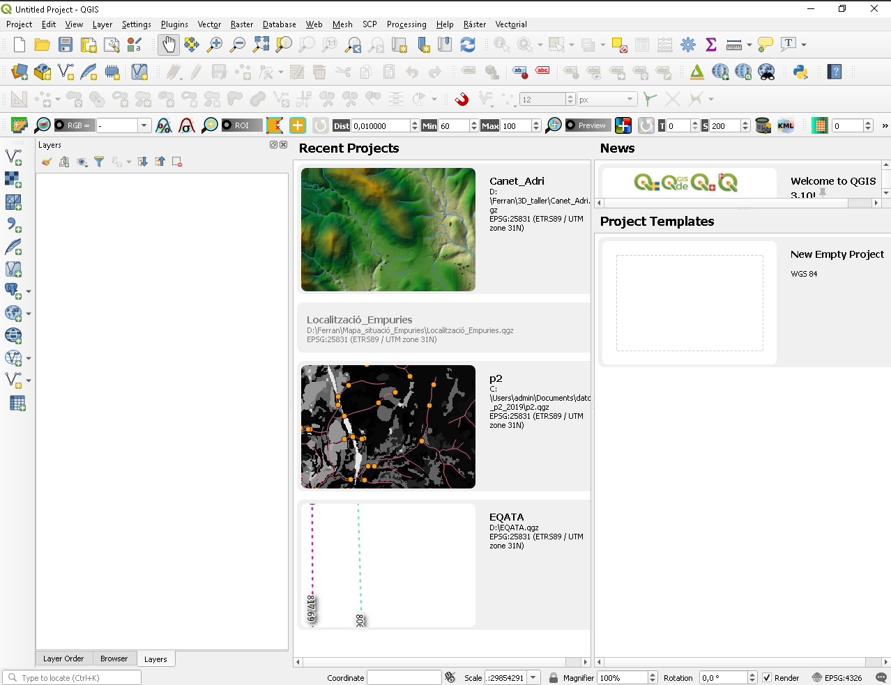

1.9. Les propietats bàsiques d’un projecte de QGIS
--------------------------------------------------

Es pot accedir al menú de propietats del projecte des de **Project>Properties...** del Projecte. Des d’aquest menú, tenim accés a:

* **General:** Permet definir el títol del projecte, el color de fons i el color dels elements seleccionats, la possibilitat de guardar els fitxers en rutes absolutes o relatives, les unitats de mesura i la precisió (núm. decimals) a utilitzar.
* **Sistema de Referència de Coordenades (SRC):** Permet triar el SRC per a aquest projecte i permet projectar al vol les capes vectorials quan es mostren capes amb un SRC diferent.
* **Identificar capes:** S’estableixen (o desactiven) les capes que respondran a l’eina d’identificació.
* **Estils predeterminats:** Permet controlar com es visualitzaran les capes en cas que no tinguin un estil ja definit. També es pot definir el % de transparència de les capes per defecte, i si es poden assignar colors a l’atzar.
* **Servidors OWS:** Permet definir informació de QGIS com a servidor WMS així com les capacitats del WFS, extensió i restriccions del SRC.
* **Relacions:** S’utilitza per a definir les relacions 1:n entre les capes.

1.10. Instal·lació de nous complements o *plugins*
--------------------------------------------------

Un dels grans avantatges de QGIS és la seva escalabilitat. Això significa que es pot anar ampliant les funcionalitats del programa a mesura que s'hi van afegint extensions o complements.
L'accés a aquests complements es pot dur a terme des del menú **Plugins>Manage and Install Plugins...**

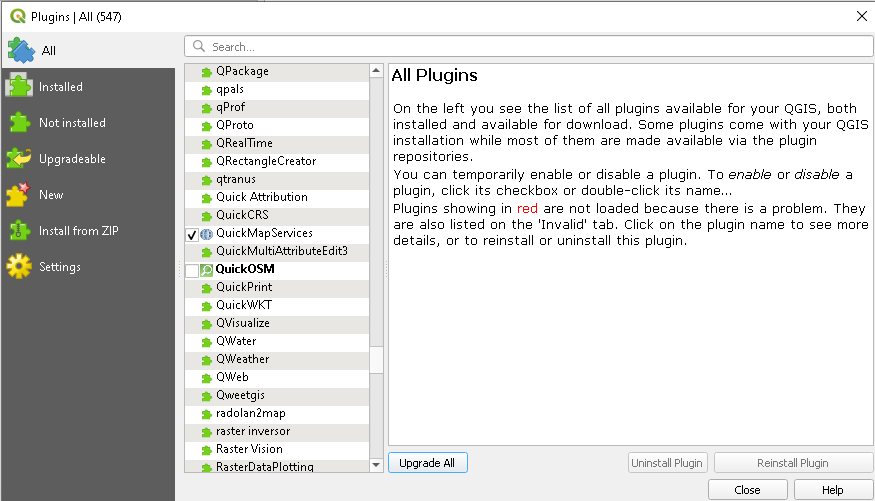

A través d'aquest menú podem instal·lar al programa més de 500 complements, mirar quins d'aquests ja tenim instal·lats i quins no, així com activar l'accés a complements experimentals o d'altres fonts.

1.11. Accés a programari de tercers
-----------------------------------

A més de la utilització dels complements explicats en el punt anterior, la funcionalitat de QGIS pot ampliar-se mitjançant l'accés a altres aplicacions o programes. QGIS funciona en aquest cas com una interfície pont a través de la qual podem accedir als algoritmes i funciones d'aquests programes que s'anomenen **Proveïdors**. Per poder accedir a aquests programes es necessari instal·lar-los prèviament i configurar els proveïdors des del menú **Options>Settings>Processing>Providers**.

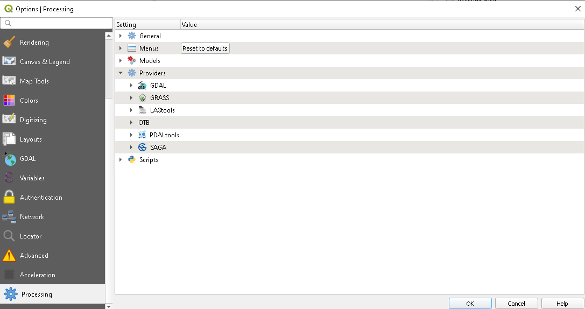

- **GRASS**:  és un programa de sistemes d'informació geogràfica utilitzat per a la gestió i anàlisi de dades geospatials, processament d'imatges, producció de gràfics i mapes, modelatge espacial i temporal i visualització. https://grass.osgeo.org/
- **LAStools**: conjunt d'eines pel processament de dades LiDAR. https://rapidlasso.com/lastools/
- **Orfeo Toolbox (OTB)**: biblioteca per al processament d'imatges orientada a la Teledetecció, oferint una àmplia varietat d'aplicacions des de la ortorectificació a la classificació supervisada o no supervisada. https://www.tysmagazine.com/orfeo-toolbox-otb-una-herramienta-gratuita-eficiente-procesamiento-imagenes-satelite-en-qgis/
-  **SAGA**: el primer objectiu de SAGA és donar una plataforma eficaç i fàcil per a la posada en pràctica de mètodes geocientífics mitjançant la seva interfície de programació (API). El segon és fer aquests mètodes accessibles d'una manera fàcil. http://www.saga-gis.org/

1.12. Accions sobre capes
-------------------------

Fent clic amb el botó dret del ratolí sobre una capa o des de el menú **Layer** (seleccionant prèviament la capa dins de la TOC) podem accedir a diverses accions sobre una capa.

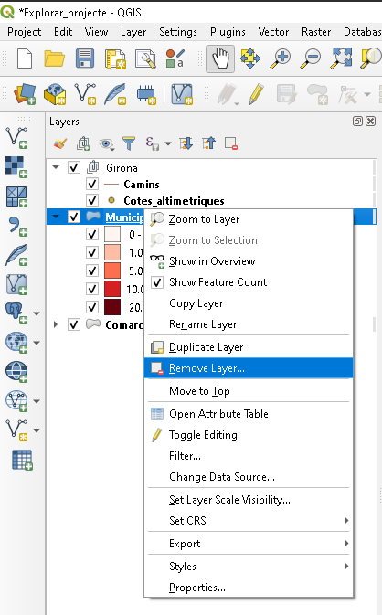

- **Zoom to Layer**: fa un zoom a l'extensió geogràfica de la capa seleccionada o activa.
- **Zoom to selection**: fa un zoom sobre l'extensió dels elements seleccionats d'una capa.
- **Show in overview**: indiquem si volem que la capa formi part de la vista general o mapa de localització.
- **Show Feature Count**: mostra al costat de la capa i entre parèntesi el número d'entitats o elements que conté la capa.
- **Copy Layer**
- **Rename Layer**
- **Duplicate Layer**: fa una còpia de la capa a la taula de continguts amb la mateixa llegenda. L'arxiu font és el mateix, no es duplica a la nostra carpeta.
- **Remove Layer**: eliminar una capa de la taula de continguts. No s'esborra físicament de la carpeta d'arxius.
- **Move to top**: desplaça la capa a la part superior de la TOC.
- **Open Attribute Table**: obre la taula d'atributs de la capa.
- **Toggle Editing**: activa/desactiva l'edició de la capa.
- **Filter**: permet filtrar els elements de la capa que volem que es visualitzin. Per exemple, visualitzar només municipis més grans de 10.000 habitants.
- **Change Data Source**: canvia l'arxiu font al que fa referència la capa.
- **Set Layer Scale Visibility**: permet definir un rang d'escala màxima i mínima a la qual la capa es visualitzarà.
- **Set CRS**: estableix un sistema de coordenades per la capa.
- **Export**: permet exportar la capa o els elements seleccionats d'una capa a una capa. Seria l'equivalent a fer una còpia física d'un arxiu font. També permet guardar un estil de la capa o els paràmetres definits per la visualització d'una capa.
- **Styles**: serveix per gestionar diferents estils per la mateixa capa.
- **Properties**: obre les propietats de la capa.

2.  Explorant un projecte QGIS
==============================

Obrirem el projecte **Explorar_projecte.qgz** des del menú **Project>Open**

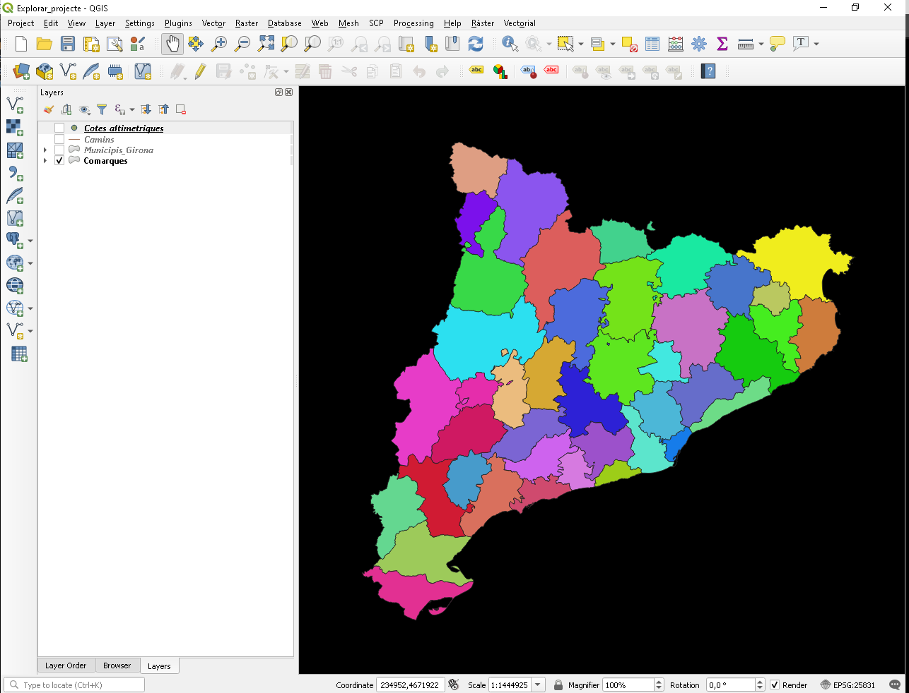

2.1. Explorar el panell de capes
--------------------------------

Mostrar/ocultar capes
#####################

Seleccionar capa activa
#######################

Una capa activa és aquella sobre la qual s'apliquen totes les accions que realitzem amb QGIS. Per fer activar una capa només hem de fer clic sobre la capa en qüestió a la taula de continguts i quedarà ressaltada.

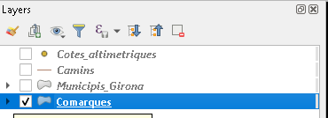

Obrir les propietats d'una capa
###############################

Per obrir les propietats d'una capa farem doble clic sobre la capa en qüestió o alternativament accedirem a l'opció del menú **Layer>Layer Properties...**

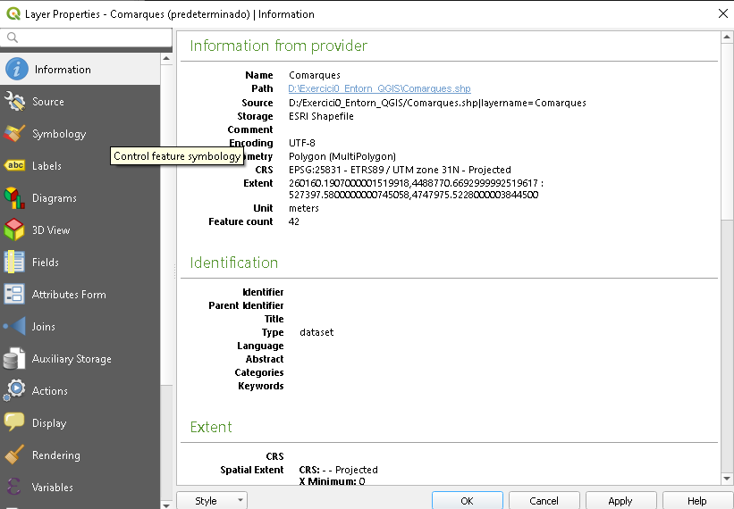

Canviar l’ordre de les capes
############################

Fem clic sobre la capa que volem desplaçar i sense deixar anar el botó esquerra del ratolí, l'arrosseguem fins la seva nova ubicació.

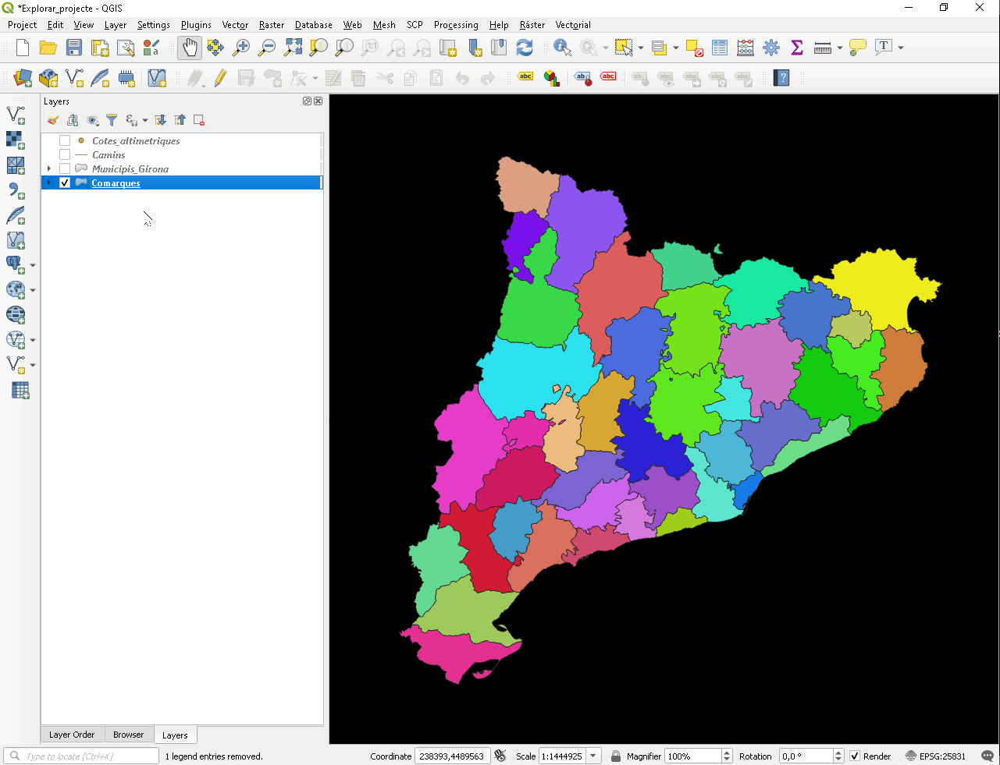

Duplicar una capa
#################

Podem duplicar una capa a la taula de continguts. Duplicar una capa equivaldria a carregar el mateix fitxer un altre cop al mateix projecte. En cap cas estem duplicant l'arxiu font.

Duplicar una capa pot servir per mostrar-la amb estils diferents.

Esborrar una capa de la taula de continguts
###########################################

Aquesta acció només elimina una capa del projecte, però no esborra físicament l'arxiu font. Per tant, podrem tornar-la a carregar de nou en qualsevol moment.

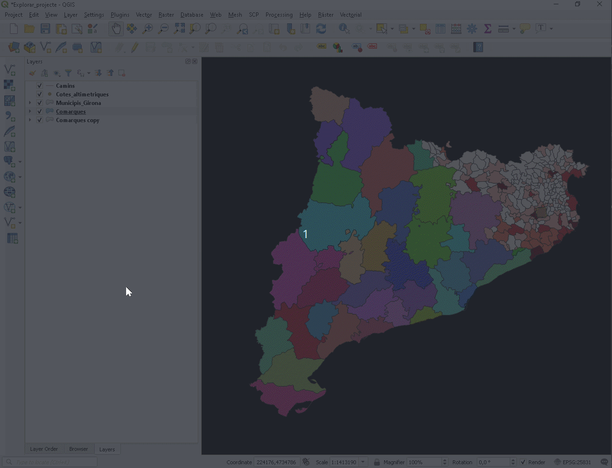

Agrupar capes
#############

Agrupar capes pot resultar útil per gestionar la visualització conjunta d'un grup de capes relacionades entres sí, ja sigui per temàtica com podria ser un grup de "vies de comunicació"" (que inclouria les capes carreteres, ferrocarrils i camins) o, per exemple, per àrea o àmbit geogràfic (grup de capes d'àmbit europeu, grup de capes d'àmbit estatal, grup de capes d'àmbit Catalunya...).

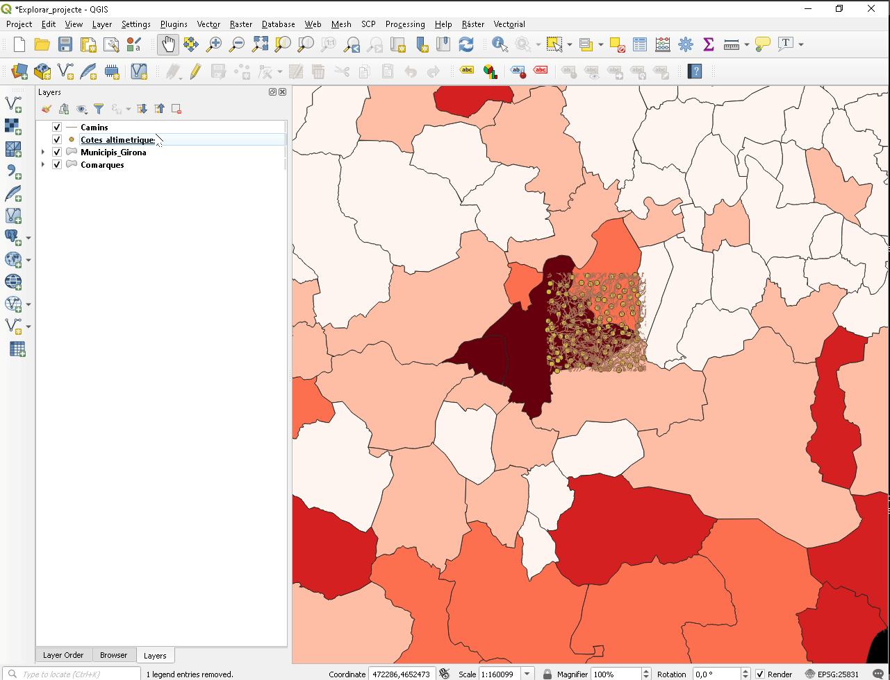

Mostrar/ocultar llegendes
#########################

Es poden mostrar o ocultar les llegendes de les capes de la taula de continguts de forma individual o conjunta.

- Individual

- Conjunta

2.2. Crear una vista general del mapa
-------------------------------------

Una *overview* és una vista general o mapa de localització que ens ajuda a contextualitzar el mapa en un àmbit geogràfic més ampli.

- Obriu la vista general des **View>Panels>Overview**
- Activeu les capes que formaran part de la vista general

   + Seleccionar la capa i amb el botó dret del ratolí seleccionar **Show in Overview**
   + Si volem mostrar totes les capes a la vista general **Layer>Show All in Overview**

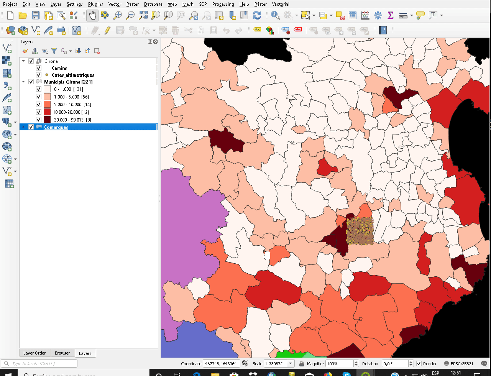

Navegar pel mapa
----------------

Per navegar pel mapa podem fer servir la barra d'eines **Map Navigation Toolbar**. També podem accedir a les mateixes eines de navegació des del menú **View**

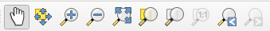

En el cas de que la barra d'eines no estigui oberta o per error s'hagi tancat podem obrir-la des del menú **View>Toolbars>Map Navigation Toolbar**

Ampliar/reduir el mapa
###################

Per acostar-se o allunyar-se del mapa (augmentar o reduir l'escala) podem fer servir la roda central del ratolí (endavant per acostar-se i endarrere per allunyar-se) o els botons **Zoom in** i **Zoom out**

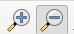

Desplaçament
############

Permet desplaçar-se pel mapa mantenint l'escala o zoom. Fem clic sobre el botó **Pan Map** i sense deixar-lo anar arrosseguem el mapa en la direcció que desitgem

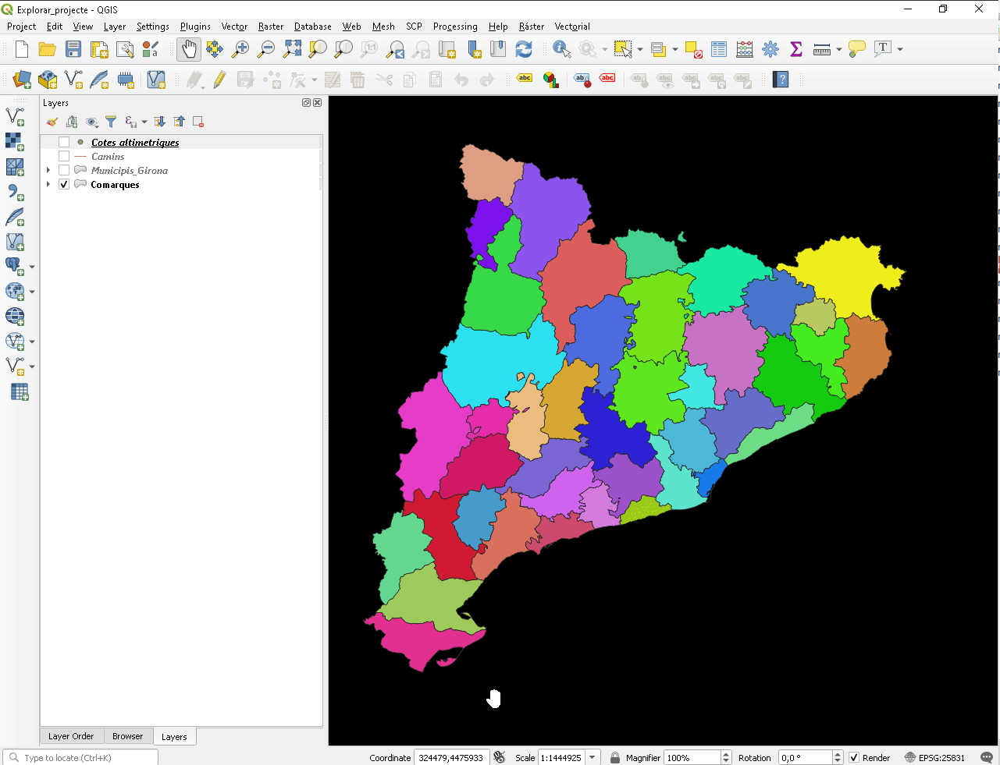

Zoom general
############

Si volem tornar a tenir una visió general de tot el mapa farem servir l'eina **Zoom Full**

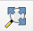

Zoom a la capa
##############

No totes les capes d'un projecte tenen sempre la mateixa extensió. Aquesta funció permet fer un zoom sobre l'extensió d'una capa de la taula de continguts. Podem accedir a aquesta eina de la barra d'eines o des del menú contextual de la capa

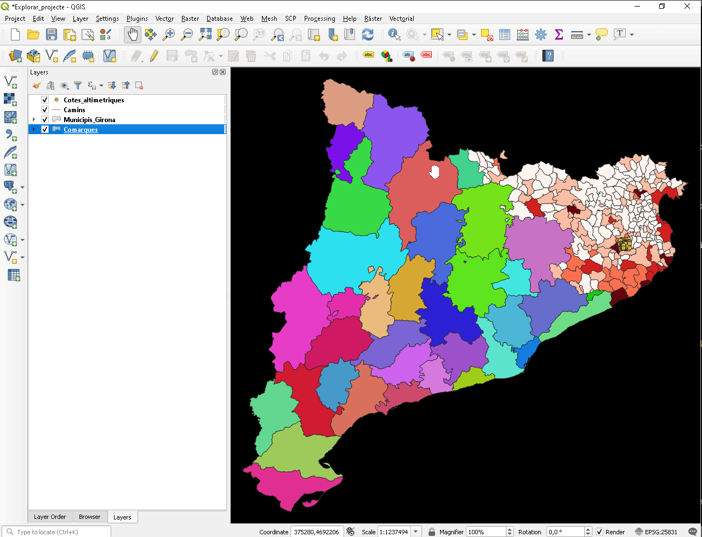

2.3. Selecció espacial
----------------------

Seleccionar objectes o entitats d'una capa ens permetrà no només destacar-los sobre la resta, sinó que també podrem fer diferents accions que actuaran exclusivament sobre els objectes seleccionats. Per exemple, podem exportar els objectes seleccionats a una nova capa.

Els elements d'una capa es poden seleccionar de diverses maneres: des del mapa, a partir d'un valor de la taula d'atributs o mitjançant una expressió tipus SQL.
Ara veurem com seleccionar objectes des del mapa:

- Fem clic a la TOC per activar la capa de la qual volem seleccionar entitats o objectes (la capa activa és sempre la que té el nom subratllat)
- Cliquem al botó **Select Features by area or single click**
- Si fem clic sobre un objecte queda seleccionat en groc. Si seleccionem un altre objecte, en fer clic sobre aquest, l'anteior queda deseleccionat. Si volem afegir un objecte a la selecció que ja tenim farem **Shift+clic**.
- Si volem seleccionar un conjunt d'objectes arrossegarem el ratolí mantenint pitjat el botó dret del ratolí.
- També podem seleccionar objectes dibuixant un polígon, una àrea, a mà alçada o a partir del radi d'una circumferència. En el primer cas, per finalitzar el polígon haurem de fer clic sobre el botó dret del ratolí.

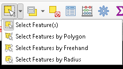

- Per netejar la selecció farem clic sobre el botó **Deselect Features from All Layers**

Zoom a la selecció
##################

Podem centrar la vista sobre els elements seleccionats fent clic sobre el botó **Zoom to Selection**

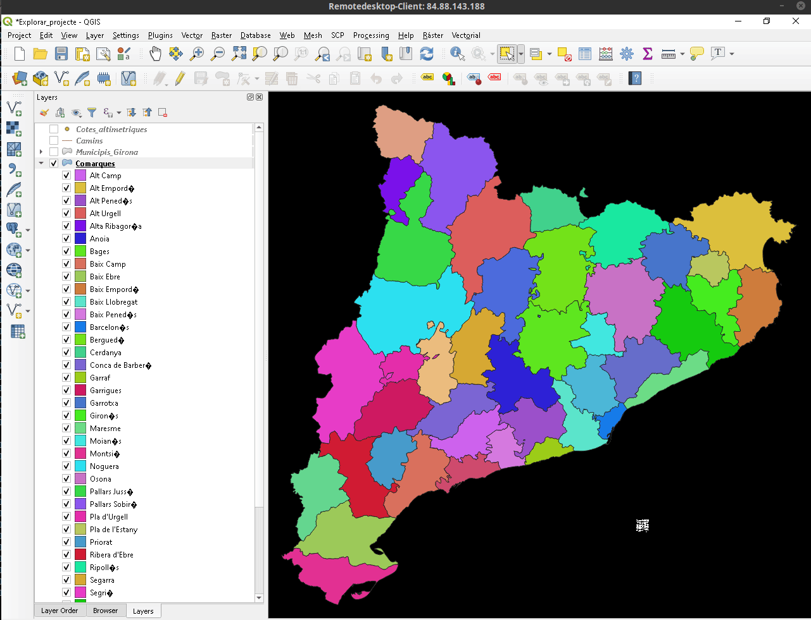

Desplaçar mapa a la selecció
############################

Si tenim un zoom sobre la vista i volem desplaçar-nos als objectes seleccionats mantenint la mateixa escala podem utilitzar l'eina **Pan Map to Selection**

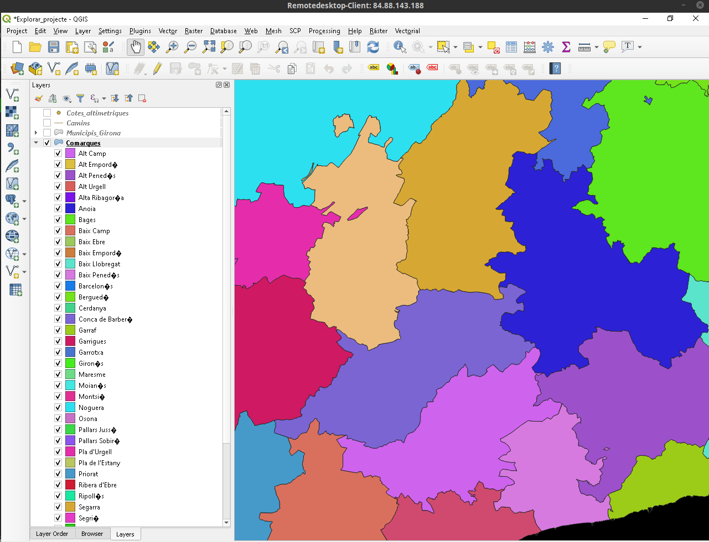

Identificar objectes espacials
------------------------------

Podem veure la informació o atributs de cada entitat fent clic sobre la geometria amb l'eina **Identify Features**.

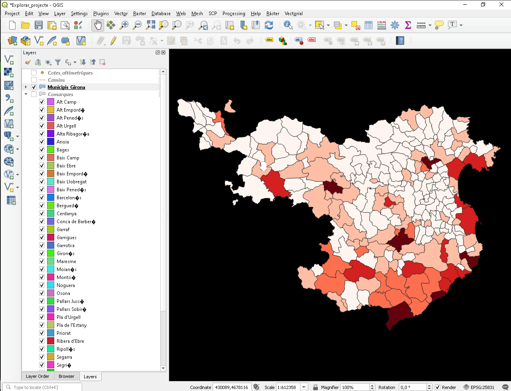

Crear marcadors espacials
-------------------------

Els marcadors espacials o *spatial bookmarks* son àrees d'interès de la vista que podem guardar per tornar-hi més tard. Els marcadors espacials es guarden a l'ordinador, el que significa que estan disponibles a qualsevol projecte del mateix equip.

Para crear un marcador:

- Fem un zoom o ens desplacem a l'àrea d'interès.
- Seleccionem  **View>New Spatial Bookmark** (o premem Ctrl+B).
- S'obre el panell **spatial bookmark** on definim el nom del marcador.

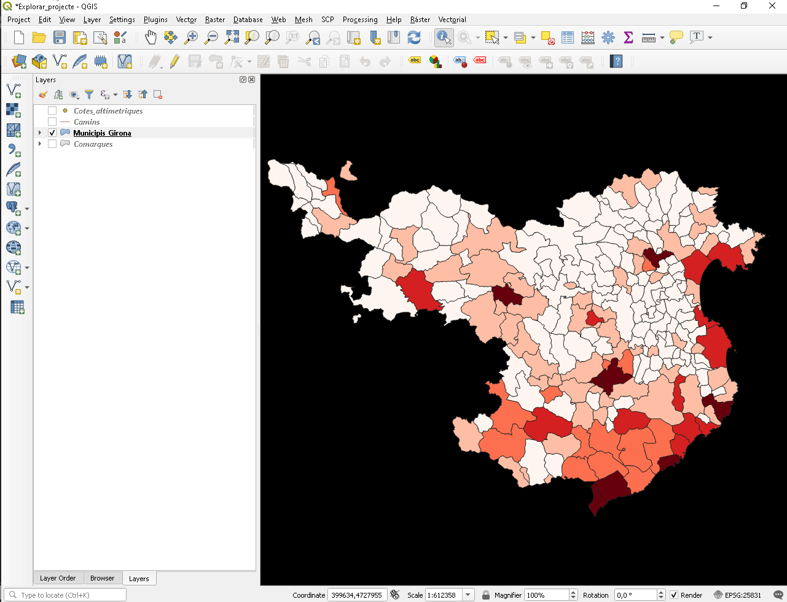

Per veure els marcadors anirem a **View>Show Spatial Bookmark** (o premem Ctrl+Shift+B). S'obre el panell del navegador d'arxius i a l'apartat **Spatial Bookmarks** tenim les nostres àrees d'interès. Només hem de fer doble clic sobre la que volem visualitzar. Fent clic amb el botó dret podem esborrar l'àrea d'interès o ajustar les coordenades d'aquesta.

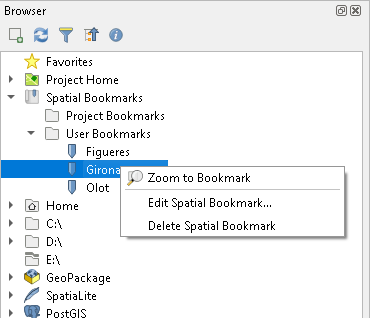

També podem accedir als nostres marcadors espacials des de l'administrador de marcadors espacials **View>Show Spatial Bookmark Manager**

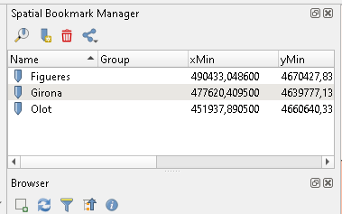

2.4. Navegar per la taula d'atributs
------------------------------------

Obrir la taula d'atributs
#########################

La taula d'atributs conté tota la informació associada a cada objecte o entitat de la capa. Conté tantes files como objectes. Per obrir la taula d'atributs d'una capa ho podem fer des del menú contextual (botó dret sobre la capa) i seleccionar l'opció **Open Attribute Table**. Alternativament podem obrir la taula des del menú **Open Attribute Table** de la barra d'eines **Attributes Toolbar** o des del menú **Layer**. En aquests dos darrers casos ens haurem d'assegurar que la capa de la qual volem obrir la taula està seleccionada a la TOC.

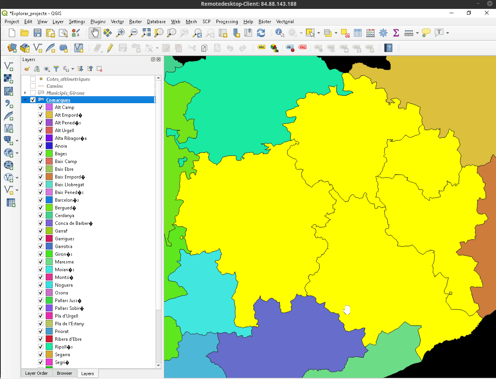

A la taula d'atributs de la imatge es mostren ressaltades les files o registres corresponents als objectes seleccionats de la capa. En l'Exemple hi ha 42 files corresponents a les 42 comarques de Catalunya de les quals n'hi ha 5 seleccionades. Amb el botó **Move selection to top** hem desplaçat les files seleccionades a dalt de la taula, per facilitar la seva visualització. Això resulta especialment útil quan la capa té centenars o milers d'objectes.

- Obrim la taula d'atributs de la capa **Municipis_Girona** fent clic sobre ella amb el botó dret i seleccionant **Open Attribute Table**
- Fem clic sobre una fila per seleccionar-la.
- Fixem la taula a la part inferior de la interfície fent clic al botó **Dock Attribute Table**
- Cliquem sobre **Zoom map to the selected rows**. Veurem que la vista del mapa ha fet un zoom sobre l'objecte (municipi) associat a la fila seleccionada. Amb **Shift+clic** podem seleccionar varies files.

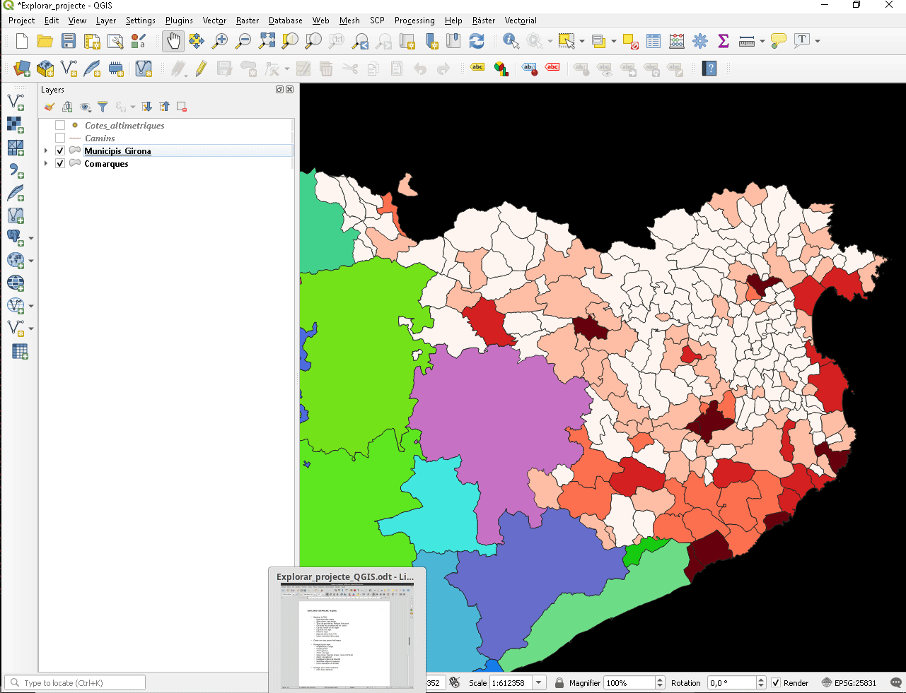

A la part superior de la taula es mostra el nombre de files (una per objecte o entitat) que conté la taula i el nombre de files seleccionades.

- Amb el botó **Invert selection** o pitjant Ctrl+R invertim la selecció de forma que els registres no seleccionats quedaran seleccionats i a l'inrevés.
- Cliquem el botó **Select all** o  premem Ctrl+A per seleccionar tots el registres de la taula.
- Cliquem el botó **Deselect all** o pulsem Ctrl+Shift+A per esborrar totes les seleccions.

Alternar vista de taula/vista formulari
#######################################

Podem visualitzar la taula d'atributs en format taula de files i columnes (opció per defecte) o en forma de formulari, en el qual es mostra les columnes de cada fila com una fitxa de formulari. Per alternar entre un mode i un altre farem clic als botons **Switch to table view** i **Switch to table form** a la part inferior dreta de la taula d'atributs.

- Fem clic a **Switch to table form**
- Despleguem el botó **Expression** i  a **Colum preview** escollim la columna **NOMMUNI** que conté el nom de cada municipi. El noms dels municipis es mostren a la finestra esquerra.
- El requadre groc indica que aquest municipi està seleccionat a la taula i la vista. Si fem clic sobre el requadre seleccionem o deseleccionem l'objecte. Amb **Shift+Clic** podem seleccionar més d'un objecte.
-  Si no ho està ja, cliqueu sobre el botó de la bombeta a la part inferior de la finestra **Highlight current feature on map**. Quan cliquem sobre un municipi de la llista, la geometria d'aquest municipi es destaca a la vista del mapa.
-  Seleccionem el botó **Automatically zoom to the current feature** (el botó de la lupa al costat de la bombeta). Fem clic sobre qualsevol municipi de la llista. La vista fa un zoom sobre el municipi i el destaca.
-  Seleccionem el botó **Automatically pan to the current feature** (botó de les quatre fletxes al costa de la bombeta). Fem clic sobre qualsevol municipi de la llista. El zoom de la vista es desplaça al municipi i el destaca.

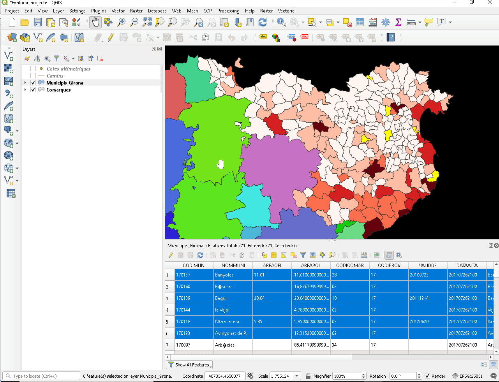

3. Projeccions i Sistemes de Coordenades
========================================

Comencem amb un exercici en el qual haureu d'integrar capes en un projecte de QGIS en diversos Sistemes de Coordenades.

3.1. Crear un projecte nou de QGIS
----------------------------------

En primer lloc, haureu de crear un projecte nou de QGIS, amb una vista al Sistema de Referència EPSG:25831, corresponent al ETRS89 UTM 31N.

A **Settings>Options>CRS** podem definir quin sistema de referencia de coordenades (SRC) tindran per defecte els projectes nous. En aquest cas definirem que el projecte tingui el mateix SRC de la primera capa que carreguem.

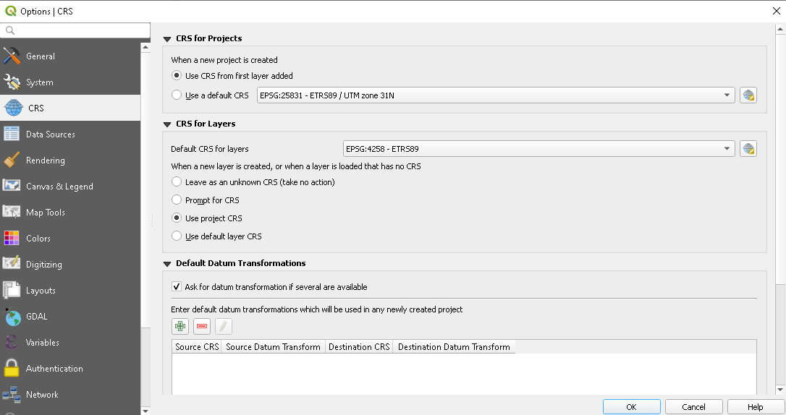

També podem canviar l'SRC d'un projecte ja creat des de **Project>Properties...>CRS** o fent clic al botó amb el EPSG que podem trobar a la barra d'estat.

.. figure:: ./static/Exercici2_2.gif
   :align: center
   :scale: 75%

3.2. Carregar dades de l'ICGC a l'SRC de la vista del Projecte
----------------------------------------------------------------

Carregueu al projecte de QGIS la capa **Municipis_Catalunya.shp** que conté els límits municipals de Catalunya i que s'ha obtingut del visor de descàrregues de l'ICGC http://www.icc.cat/appdownloads/. Aquesta capa té d'origen el SRC **ETRS89/ UTM zone 31N (EPSG: 25831)**

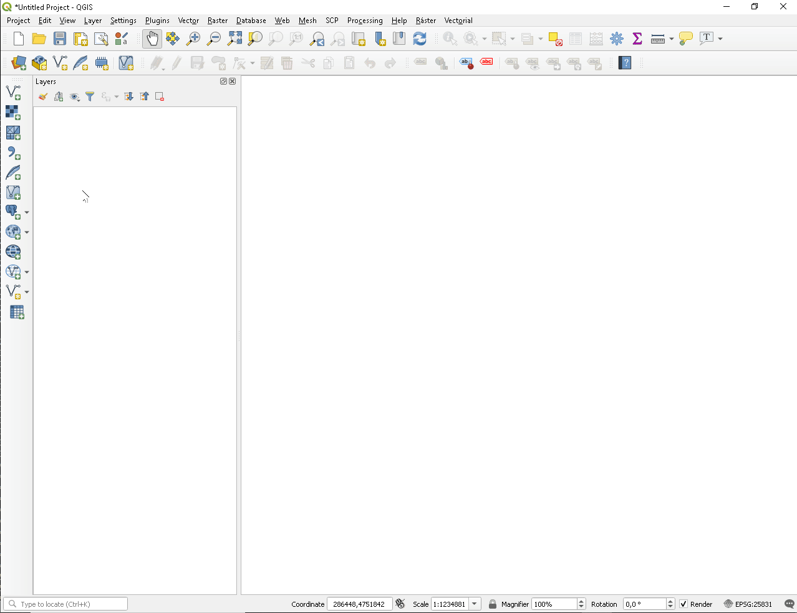

Com es pot observar a la part inferior dreta de la pantalla, el EPSG del projecte és el 25831.

3.3. Carregar al projecte dades GPS i reprojectar al vol
--------------------------------------------------------

Les dades provinent d'un GPS normalment estan en **coordenades geogràfiques WGS84** o, el que és el mateix, en **EPSG: 4326**.

Carregueu un arxiu anomenat **de-girona-al-santuari-dels-angels.gpx**. Es tracta d'una capa multigeometries, és a dir, conté diferents tipologies d'entitats como són punts, línies, multilínies, etc... En aquest cas triem la capa **tracks** que és la que conté la ruta que volem mostrar en la vista.

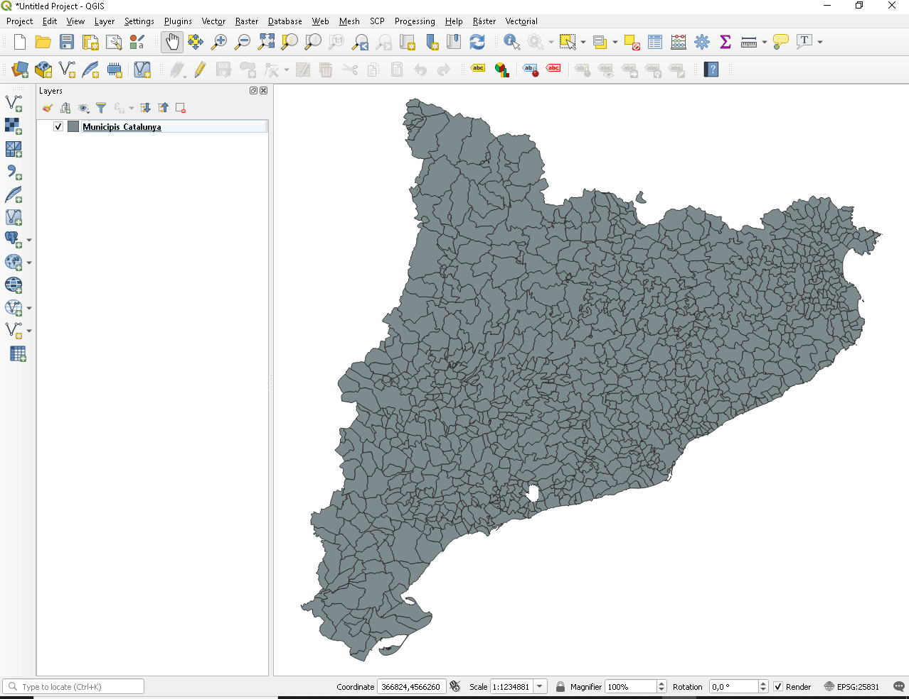

Observeu que tot i que el SRC de la capa GPX és EPSG:4326 (WGS84), aquesta està alineada amb la capa  **Municipis_Catalunya.shp** i per tant es mostra en EPSG:25831. Això vol dir que s'ha reprojectat al vol.

Ara obriu un nou projecte QGIS i carregueu de nou el gpx amb la ruta. Observeu a la barra d'estat que el SRC ha canviat a EPSG:4326 (WGS84) que correspon a la ruta GPX. Si ara afegiu la capa de municipis de Catalunya veureu que aquesta s'ha reprojectat al vol i ara es visualitza en aquest SRC.

3.4. Reprojeccions de capes
---------------------------

La reprojecció al vol és una solució que no ens serveix per a modificar el SRC de les capes. És a dir, no transforma realment el fitxer de dades.
Per a fer-ho, caldrà dur a terme un procés de reprojecció, que amb QGIS es pot executar des del menú contextual de la capa (botó dret del ratolí) GPX **Exportar>Guardar objetos como...** des de la finestra de propietats de la capa:

Reprojecteu el gpx a ETRS89 UTM 31N i carregueu-lo a la vista de QGIS. Com que a les opcions de QGIS hem definit que el projecte agafi el SRC de la primera capa que es carregui, veiem que la capa **track-reprojectat** està correctament reprojectada perquè quan es carrega a la vista el SRC del projecte és 25831.

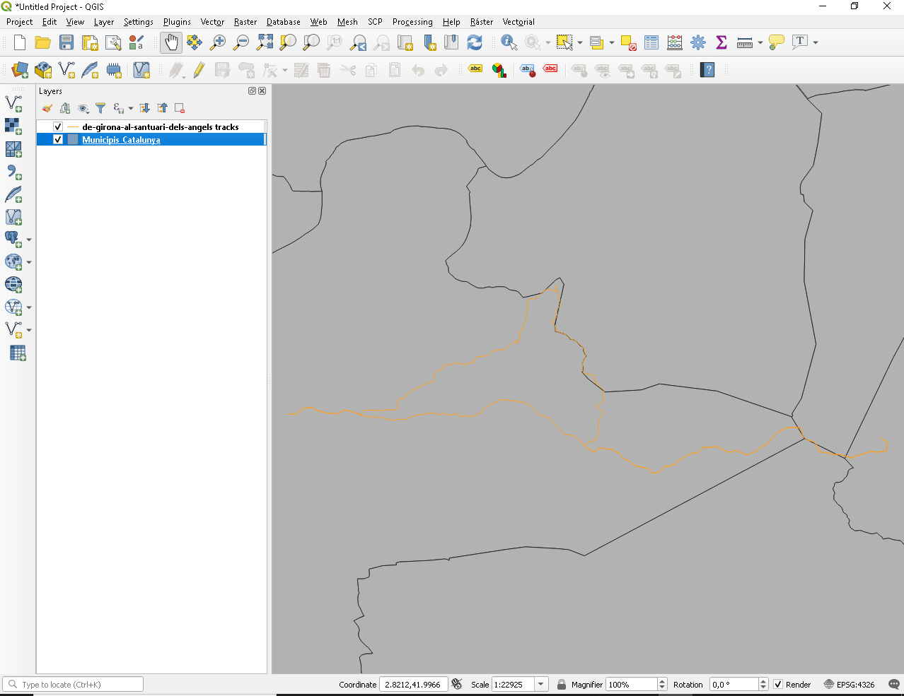

Proveu a reprojectar la capa de límits municipals de l'`IGN <http://centrodedescargas.cnig.es/CentroDescargas/equipamiento.do?method=descargarEquipamiento&codEquip=3>`_, que està en EPSG:4258 i reprojecteu-la a EPSG:25831. El fitxer amb el que haureu de treballar es diu **ll_autonomicas_inspire_peninbal_etrs89**.

Comproveu que coincideix amb la cartografia dels límits municipals de l'ICC.

4. Accions bàsiques amb dades vectorials i raster
=================================================

4.1. Càrrega i visualització de dades a una vista
--------------------------------------------------

A l'exercici anterior ja hem vist com carregar capes vectorials en format **.shp** i en format **.gpx** en diferents SRC.

Amb QGIS tenim diferents maneres de carregar dades (tant vectorials, com rasters o taules alfanumèriques sense geometries):

Barra d'administrar capes
#########################

Aquesta barra d'eines per defecte apareix a la part esquerra de la pantalla. Si no apareix, la podem obrir des de **View>Toolbars>Manage Layers Toolbars** .

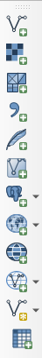

Des d'aquí podem carregar qualsevol format de dades vectorial, raster, base de dades, taules alfanumèriques i fer connexions a serveis de cartografia remots. Per a cada format de dades hi ha un botó específic.

Administrador de fonts de dades
###############################

L'administrador de fonts de dades funciona exactament igual que la barra administradora de capes. El podem activar de tres maneres: des del menú **Layer>Data Source Manager**, pulsant CTRL+L, o des de la barra d'eines **Data Source Manager Toolbar**.

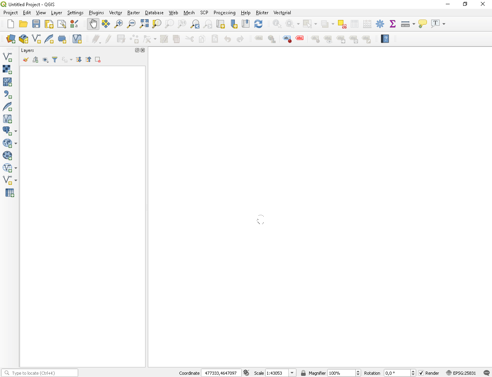

Navegador de fitxers
####################

Funciona exactament igual que l'explorador de fitxers de qualsevol sistema operatiu. Des d'aquí podem buscar les nostres capes a l'estructura de directoris i afegir-les a la vista fent doble clic sobre els arxius o arrossegant-los cap a la TOC o la vista del mapa. El navegador permet explorar i navegar per tota l'estructura de carpetes del nostre sistema.

Mitjançant un clic amb el botó dret del ratolí es poden crear noves carpetes i fitxers, accedir a la carpeta des de l'explorador de fitxers del sistema, o del terminal, així com també accedir a les propietats de les carpetes i dels fitxers.

Per activar el navegador anirem al menú **View>Panels** i seleccionarem **Browser**.

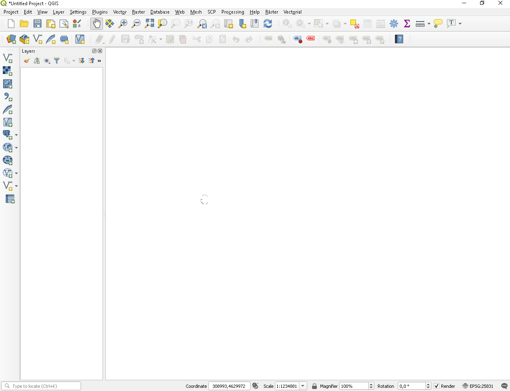

Si fem clic en el botó dret de la part superior del **Navegador** s'obre una finestra en la part inferior on podem fer un previsualització de la capa, de la taula d'atributs i de les metadades de la capa seleccionada abans de carregar-la a la vista.

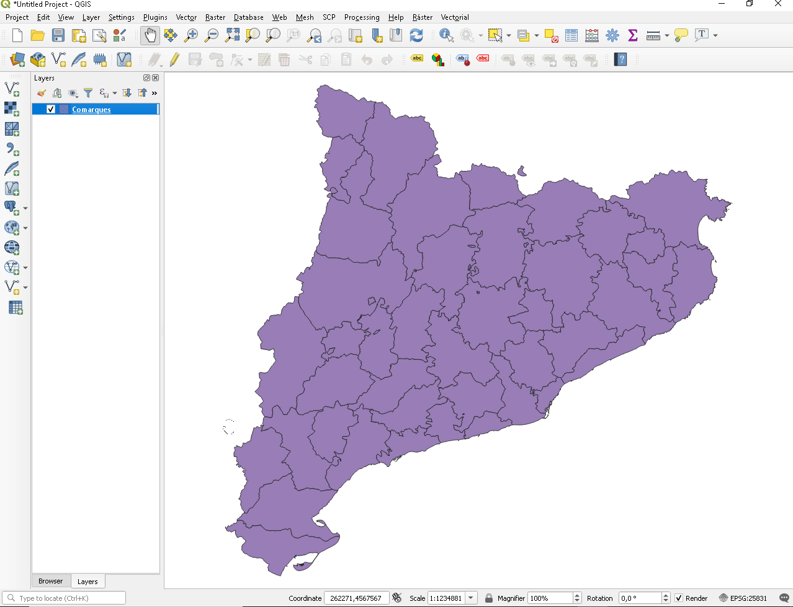

4.2. Carregar dades GPS
-----------------------

El format GPX és el format estàndard d'intercanvi de dades provinents de receptors GPS. Tot i que QGIS reconeix aquest format i permet carregar-lo i canviar la simbologia o l'estil, no permet editar-lo i, per tant, no podem modificar les seves geometries o la seva taula d'atributs. Per fer-ho haurem d'exportar el fitxer a un format de dades que sigui editable des de QGIS.

En aquest cas, transformarem el track **de-girona-al-santuari-dels-angels.gpx**, a format `GeoJSON <https://es.wikipedia.org/wiki/GeoJSON.>`_

Per a fer-ho, utilitzarem el menú contextual de la capa (botó dret del retolí) **Exportar>Guardar objetos como...**, indicant a **Formato** el format del fitxer amb el qual volem guardar l'arxiu.

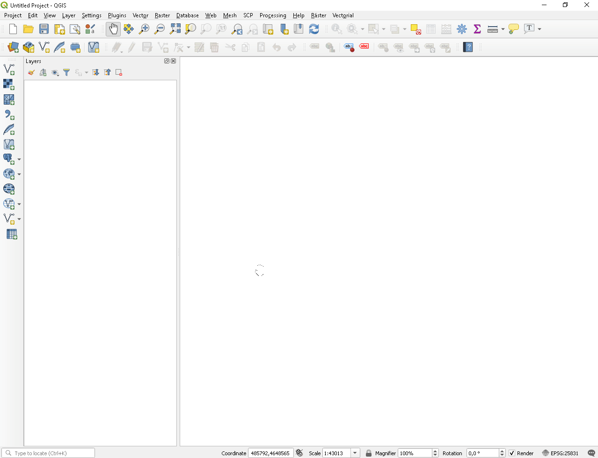

Guardeu el .gpx reprojectat a EPSG25831 en format **GeoJSON**.

4.3. Importació i estructuració de fitxers CAD
----------------------------------------------

QGIS pot llegir formats **CAD** com **DWG** d'AutoCAD o el **DGN** de Microstation així com `DXF <http://ca.wikipedia.org/wiki/DXF>`_ que és el format d'intercanvi per arxius CAD. De la mateixa manera que passa amb els arxius GPS, QGIS només pot visualitzar i canviar l'estil dels arxius CAD, però no els poden editar. Per fer-ho s'hauran d'exportar a un format editable.

A continuació carregarem una capa DXF d'un full de la **Base topogràfica 1.25000** l'ICGC en format **DXF** corresponent a Girona.

Carreguem a la vista de QGIS el l'arxiu **px1r020.dxf**:

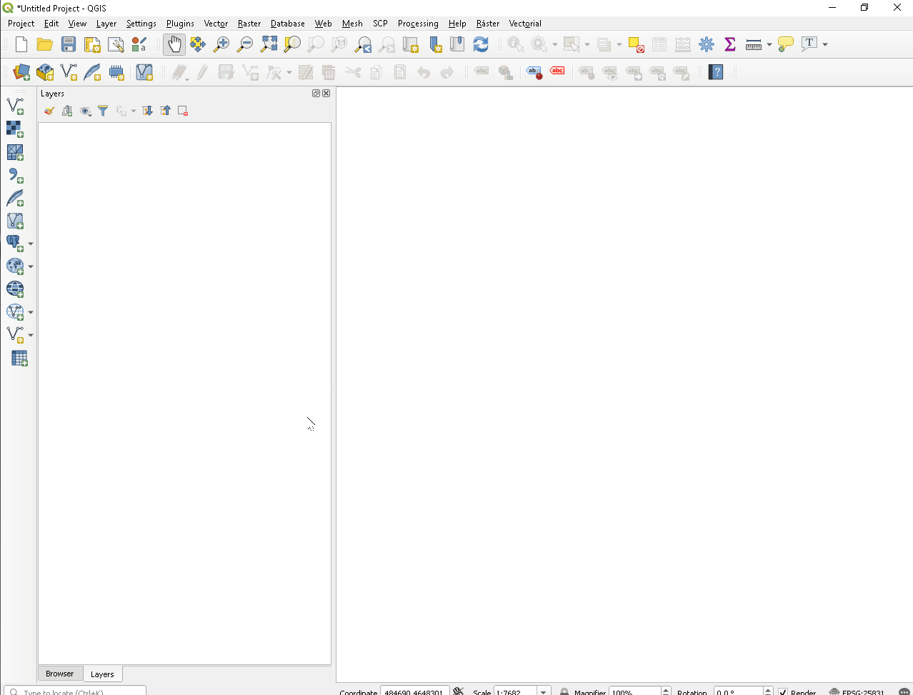

Un arxiu CAD conté diferents tipus de geometries que en el programa natiu estan repartides en diferents *Levels* o *Layers* definides per l'usuari. Quan QGIS carrega aquests fitxer agrupa cada tipus de geometria en una única capa. La taula d'atributs dels arxius CAD no conté informació associada a cada entitat, sinó que conté les característiques originals d'aquesta com, per exemple, el nivell al que es trobaven, el color, el tipus de línia, etc...

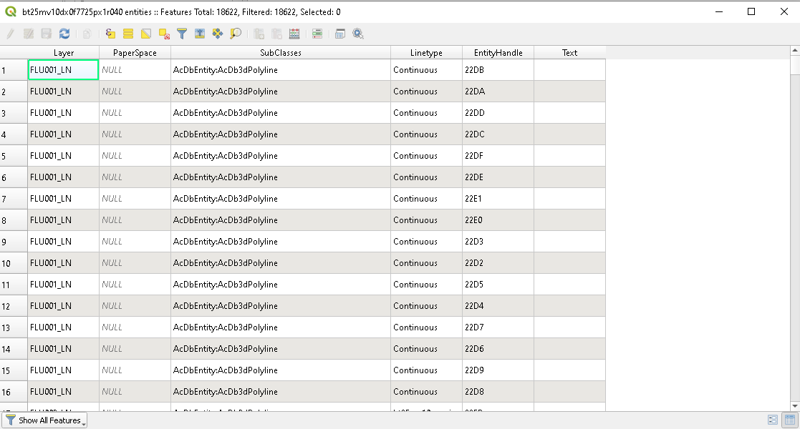

Seleccionem les línies corresponents als edificis del Campus del Barri Vell de la Universitat de Girona i les guardem com una capa nova, en format **GeoJSON**. Recordeu  mantenir polsada la tecla **SHIFT** mentre anem seleccionat les diferents entitats o geometries que formen cada edifici.

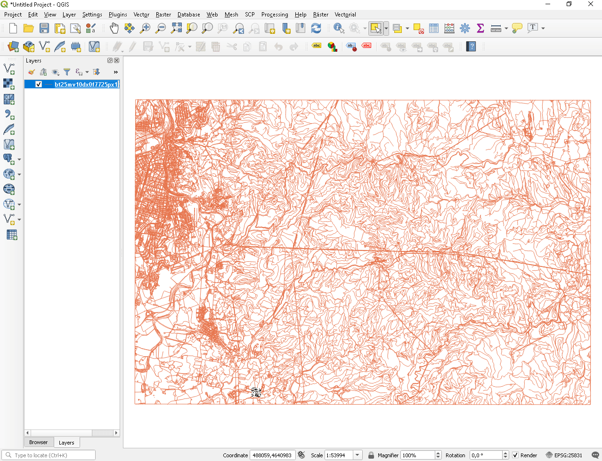

4.4. Treball amb dades raster
-----------------------------

Les dades rater són un model de dades on les dades es mostren en un malla o *grid* de files i columnes que formen cel·les o píxels. Cada cel·la conté un únic valor o atribut. Per exemple, en un model digital d'elevacions (MDE) els valors de les cel·les representen l'elevació o alçada. Una característica important de les capes raster és la resolució. La resolució d'un raster es mesura amb la mida de les cel·les, és a dir, l'àrea que ocupa cada píxel. Per exemple, una imatge satèl·lit pot tenir una resolució de 30 metres, el que significa que cada cel·la cobreix 30 metres quadrats.

Carregar un MDE
###############

A continuació carregarem un `MDE <http://www.icgc.cat/ca/Ciutada/Informa-t/Diccionaris/Model-digital-d-elevacions>`_ del municipi de Girona amb una resolució de 2x2 on, per tant, cada píxel cobreix una àrea de 2 metres quadrats. En total, hem descarregat del `Visor de descàrregues de l'ICGC <http://www.icc.cat/appdownloads/>`_ 20 fulls en format TXT que cobreixen la totalitat del municipi de Girona.

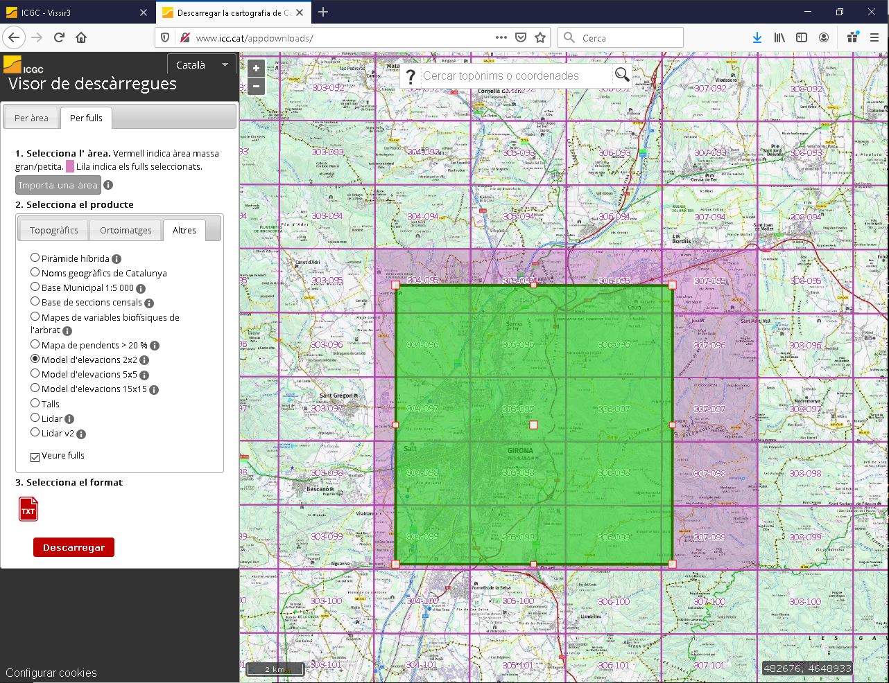

- Carregueu els arxius TXT com capes raster a la vista de QGIS.

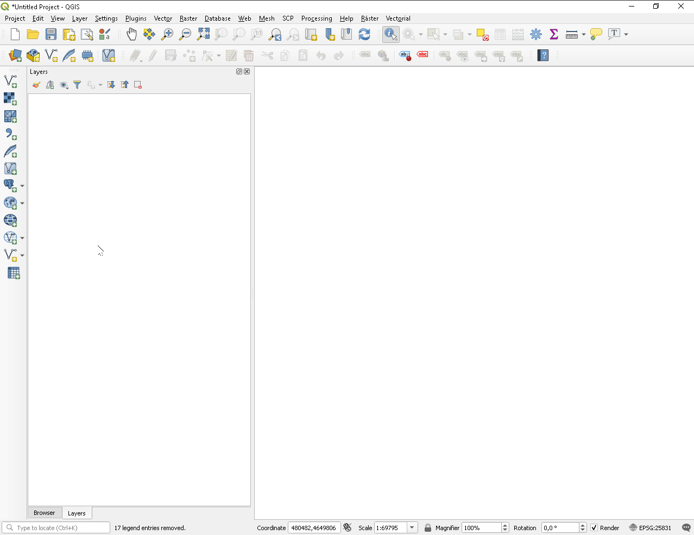

Amb l'eina **Identify Features** feu clic sobre diferents zones i es mostrarà el valor del píxel sobre el qual heu fet clic (en aquest cas l'elevació sobre el nivell del mar). Per defecte, les capes raster es representen amb una paleta que va del negre al blanc, on el valor més baix és el negre i el valor més alt és blanc.

Feu doble clic sobre qualsevol de les capes raster per obrir les seves propietats i accediu a la pestanya **Information**. Aquí trobareu informació sobre el format de l'arxiu, les estadístiques de les cel·les, les dimensions, les coordenades d'origen, la mida del píxel (2 metres) i el tipus de dades.

Les capes raster son sempre rectangulars. Si el contingut de les dades no emplena l'àrea rectangular, a les cel·les sobrants s'assignarà un valor que indica que no hi ha dades per aquella cel·la, aquest valor s'anomena **No Data** i en QGIS per defecte és -9999.

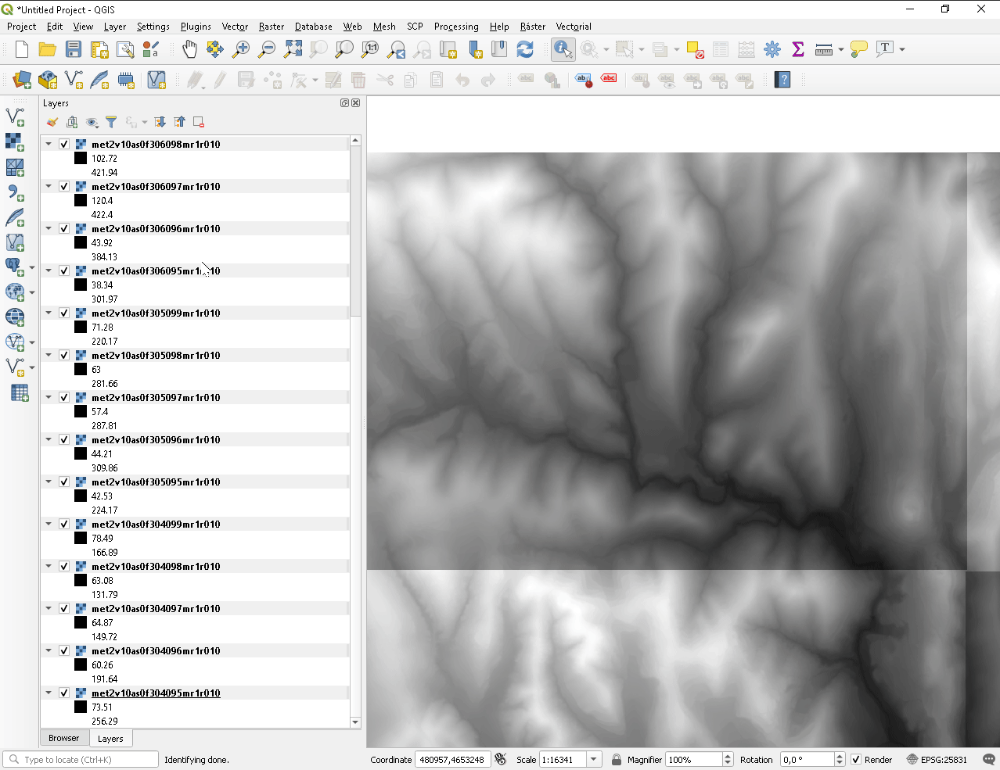

Unir capes raster
#################

A continuació unirem els quatre arxius raster de l'MDE en una sola capa i posteriorment la tallarem amb una capa vectorial que conté el límit de l'àrea d'estudi.
En primer lloc, crearem una capa raster virtual amb els quatre MDE.

- Obrim la **caixa de eines de processament**.
- A la finestra de cerca de la part superior busquem l'eina **Build Virtual raster**.
- Emplenem l'eina amb els següents paràmetres:

   + *Input Layers*: Clic al botó de punts suspensius i seleccionem les **quatre capes raster**.
   + *Resolution*: **Average**
   + Desactivem l'opció **Place each input file into a separate band**
   + *Resampling algorithm*: **Bilinear**
   + *Virtual output*: **Save to temporary file**

- Quan estiguin introduïts tots els paràmetres cliquem a **Run**

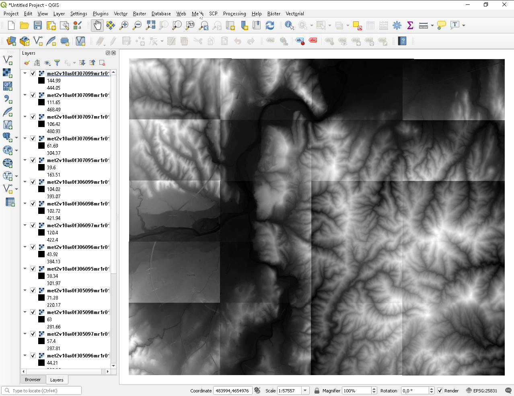

Ara ja tenim tots els raster units en un de sol. Es tracta d'un arxiu temporal. Si tanquéssim la sessió de QGIS, aquest desapareixeria, encara que guardéssim el projecte.

Tallar capes raster
###################

El següent pas serà tallar el raster virtual que hem generat al pas anterior amb l'àrea d'estudi, és a dir, amb el límit municipal de Girona.

- Afegim la capa **Limit_Girona.geojson** al projecte

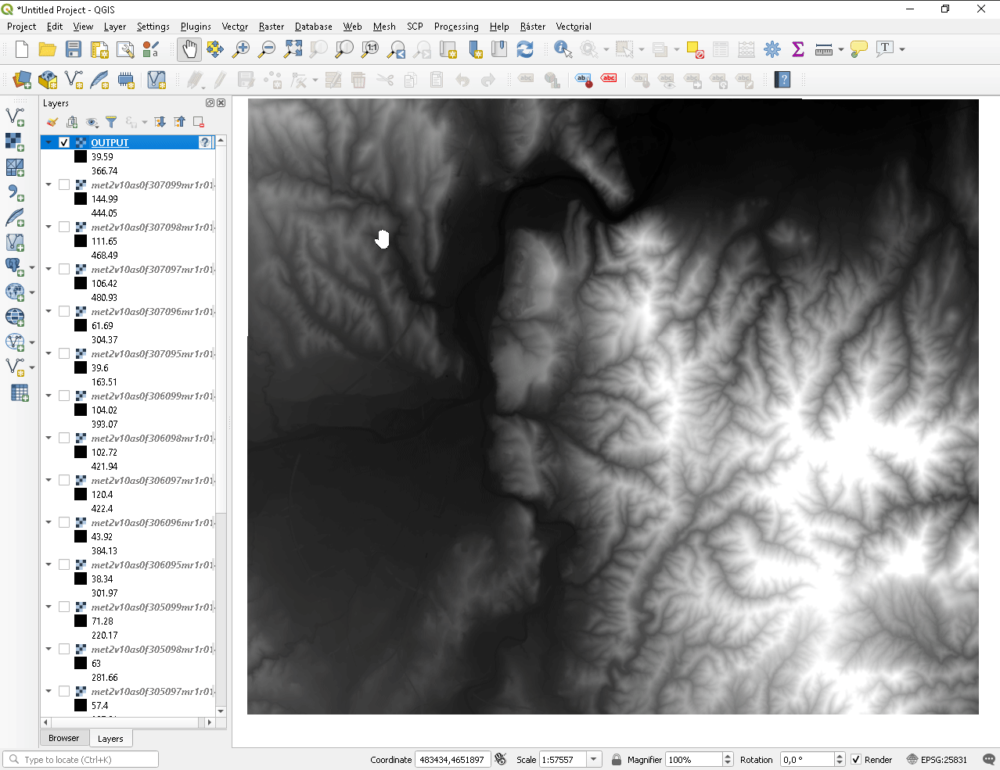

- A la **caixa de eines de processament** busquen l'eina **Clip raster by mask layer** i hi introduïm els següents paràmetres:

   + *Input Layers*: **OUTPUT**.
   + *Mask layer*: **Limit_Girona**
   + *Source CRS*: **EPSG: 25831**
   + *Target CRS*:  **EPSG: 25831**
   + *Assign a specified nodata value to output bands*: **-9999**
   + *Clipped (mask)*: Escollim **Tif files (.tif)** i assignem el nom **GiroMDE**

- Clic **Run**

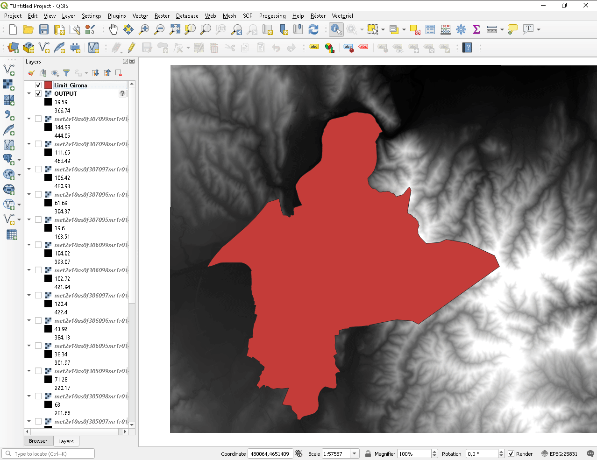

El resultat és una capa raster amb la forma del municipi de Girona. En realitat l'arxiu té una forma regular, simplement ha assignat valor **No Data** a aquells píxels que queden fora del límit municipal.

Construir piràmides
###################

Les capes ràster d'elevada resolució poden alentir la navegació en QGIS. Es pot millorar el rendiment de forma considerable creant còpies de menor resolució de les dades (piràmides), ja que QGIS selecciona la resolució més adequada depenent de el nivell de zoom. Sense les piràmides, l'ordinador intentarà renderitzar cada píxel d'una capa raster tant si es necessari mostrar-la al màxim detall com si no.

- Obriu les propietats de la capa **GiroMDE** i clic a **Pyramids**. Les resolucions disponibles apareixen a la banda dreta.

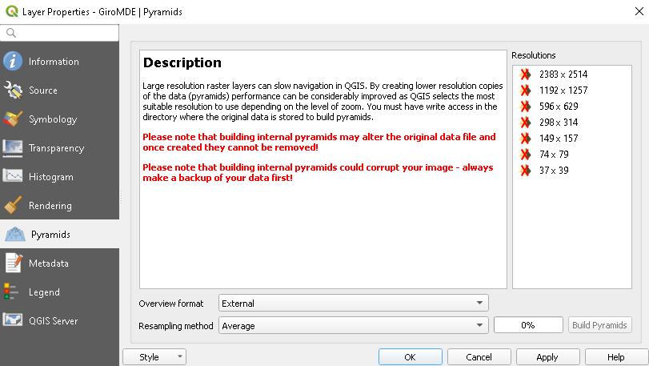

Les piràmides poden ser encastades dins de l'arxiu raster, o bé construïdes externament. És més segur construir-les externament per no alterar l'arxiu de dades original ja que un cop creades no es poden eliminar. El fitxer de piràmide externa sempre pot ser esborrat si no obtenim els resultats esperats.

- Seleccioneu totes les resolucions disponibles.
- A **Overview format** seleccioneu **External**
- A **Resampling method** escolliu **Cubic**
- Clic al botó **Build Pyramids**
- Clic **OK** per tancas la finestra de propietats.
- Feu **zoom in** i **zoom out** a la vista per comprovar com ha augmentat la velocitat de renderitzat de la capa raster a la vista.

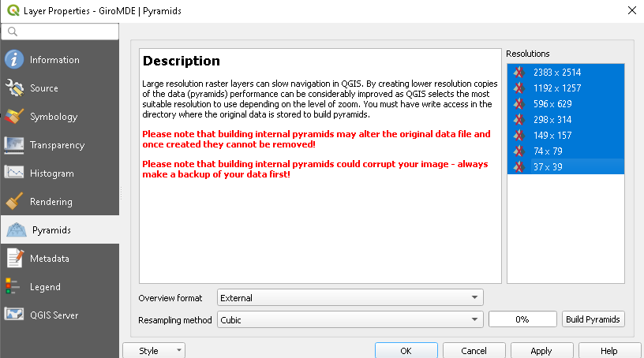

Aquesta capa és massa petita per poder notar la millora en la velocitat de renderitzat. Les piràmides resulten de gran utilitat quan treballem amb capes raster superiors a 1 GB.

- Torneu a obrir les propietats de la capa **GiroMDE** aneu a l'apartat **Information** i aneu a la secció **More information**. Veureu varies entrades indicant les resolucions a les que s'han creat la piràmide.

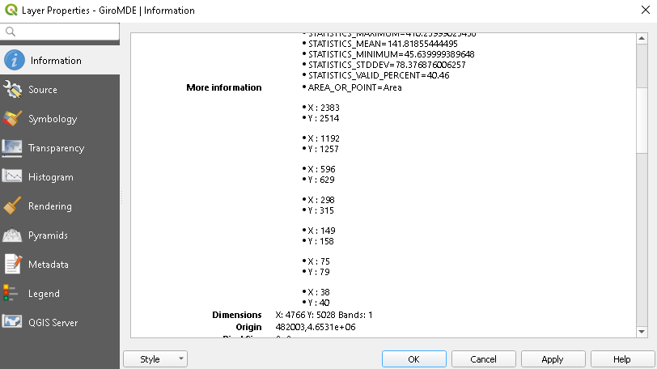

Obriu l'explorador de fitxers i navegueu a la carpeta de **GiroMDE**. Veureu l'arxiu **GiroMDEtif.ovr**. Aquest és l'arxiu que conté les piràmides.

Exportar a una nova capa raster
###########################

De la mateixa manera que passa amb les capes vectorials, també podem crear una nova capa raster a partir d'una altra.

- Centreu la vista en un àrea de **GiroMDE**.
- Activeu la capa **GiroMDE** i amb el botó dret seleccioneu **Export>Save as**
- Introduïu un nom pel raster de sortida **GiroMDE2**
- A l'apartat **Extent** clic sobre el botó **Map Canvas Extent**. Aquesta opció fa que l'extensió del raster de sortida sigui la extensió actual de la vista.
- A **Resolution** definiu la mida de cel·la del raster de sortida. Introduïu 5 metres d'amplada horitzontal i vertical.

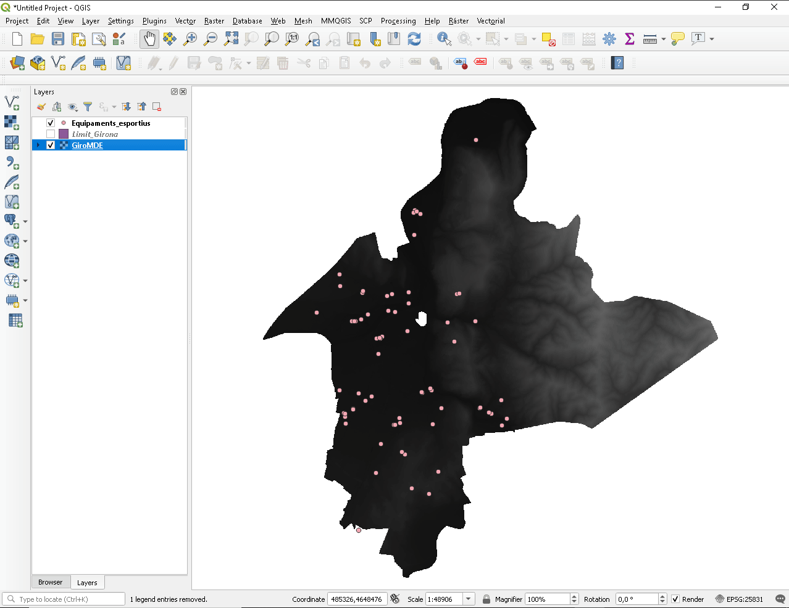

4.5. Geocodificació de coordenades X,Y
--------------------------------------

QGIS  permet dur a terme un procés de geocodificació utilitzant un fitxer de text que contingui coordenades X,Y.
A continuació geocodificareu els equipaments esportius de la ciutat de Girona que podeu obtenir de l'**OpenData**:
http://terra.girona.cat/opendata/dataset/equipaments-esportius

Per a fer-ho, utilitzeu l'eina **Add Delimited Text Layer** (menú **Layer>Add Layer**)
Haureu d'especificar els següents paràmetres:

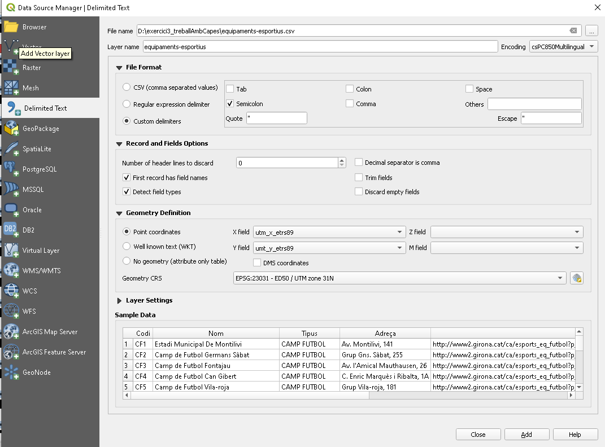

La capa de punts que s'ha creat és *virtual*, i únicament es guarda en el projecte de QGIS actual. Per a fer la capa definitiva, i poder-la utilitzar posteriorment, l'haureu d'exportar a **GeoJSON**.

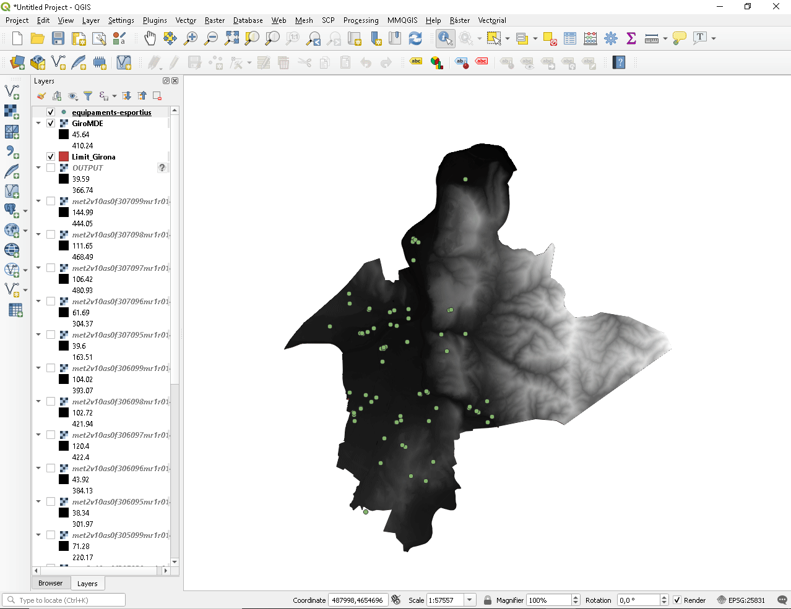

Proveu de repetir el procés amb les dades dels **equipaments culturals municipals** de la ciutat de Girona. Les podeu descarregar de:
http://terra.girona.cat/opendata/dataset/equipaments-culturals.

4.6. Connexions a serveis cartogràfics
--------------------------------------

Des de QGIS, podem carregar fàcilment capes en format WMS, WCS o WFS.

- Carregueu al projecte l’ortofotomapa 1:2500 de Catalunya utilitzant el WMS de l'ICGC. La URL del servei és:
http://geoserveis.icgc.cat/icc_mapesbase/wms/service?

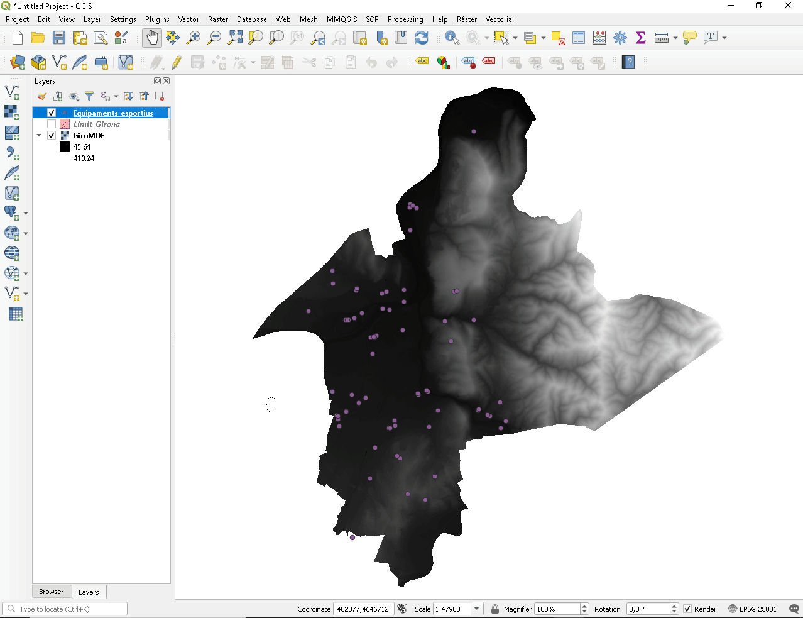

- Proveu de carregar altres bases cartogràfiques de l'ICGC utilitzant els geoserveis WMS disponibles.

- Ara carregueu a la vista de QGIS, la cartografia del cadastre, utilitzant el WMS del cadastre. La URL és:
http://ovc.catastro.meh.es/Cartografia/WMS/ServidorWMS.aspx

.. figure:: ./static/Exercici3_18.gif
   :align: center
   :scale: 75%

- A continuació connecteu-vos el servei de capes multibase de l'ICGC (http://geoserveis.icc.cat/icc_mapesmultibase/utm/wms/service?), carregueu qualsevol de les capes disponibles i feu diferents zooms per obtenir més o menys detall de la imatge. Que passa?

4.7. Creació de noves capes i repositoris de dades vectorials
-------------------------------------------------------------

Hem vist com crear capes noves a partir de capes ja creades, per exemple, quan seleccionem unes entitats i les exportem a una nova capa. Ara veurem com crear una capa des de zero.

QGIS permet crear noves capes en format **Shapefile**, **Geopackage**, **SpatialLite**, **GPX**, capes temporals i capes virtuals.

Per crear noves capes podem fer servir la barra d'eines **Data Source Manager Toolbar** (si no hi és, es pot activar a partir del menú **View>Toolbars**) o del menú **Layer>Create Layer**

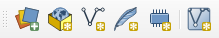

Geopackage
##########

Un Geopackage és un format d'arxiu geoespacial compacte i obert, basat en els estàndards de l'Open Geospatial Consortium i construït sobre la base de SQLite. Permet integrar diverses taules i capes tant raster com vectorials en un únic arxiu i és, en resum, una alternativa a altres formats vectorials i raster com ara el shapefile i el GeoTIFF. Per saber més sobre els avantatges d’ús del format Geopackage podeu consultar el següent enllaç `¿Por qué utilizar el formato Geopackage? <https://www.unigis.es/utilizar-formato-geopackage/>`_

Un Geopackage és, en realitat, un repositori de capes, taules i altres arxius (com els estils o les projeccions) relacionats entre sí. Podem crear un Geopackage des del  **Browser** o navegador d'QGIS, o fent clic al botó corresponent de la barra d'eines o del menú. Un cop creat el geopackage podem crear una nova capa o taula dins d'aquest.

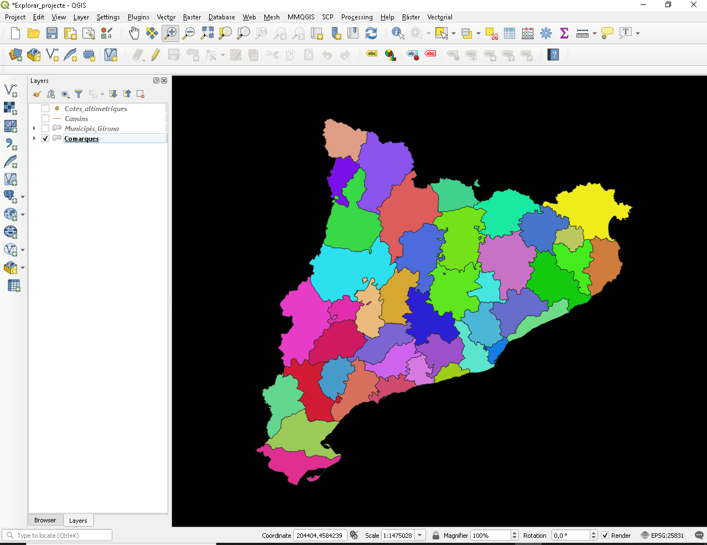

- Genereu un geopackage anomenat **Catalunya**

Un cop creat un fitxer Geopackage, la seva gestió pot realitzar-se enterament des del menú **Database> DB Manager**: crear, editar o eliminar qualsevol taula, buidar-la de contingut o exportar l'arxiu.

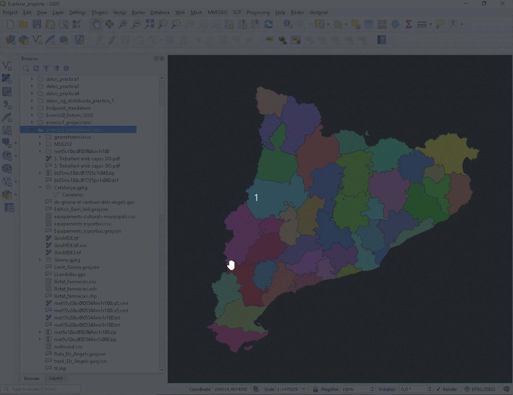

Hi ha diverses formes d'importar dades en qualsevol format a un fitxer Geopackage. Tot i això, una de les més senzilles es limita a arrossegar qualsevol capa present en el panell de capes fins a la connexió del Geopackage de treball o de destinació visible dins del navegador.

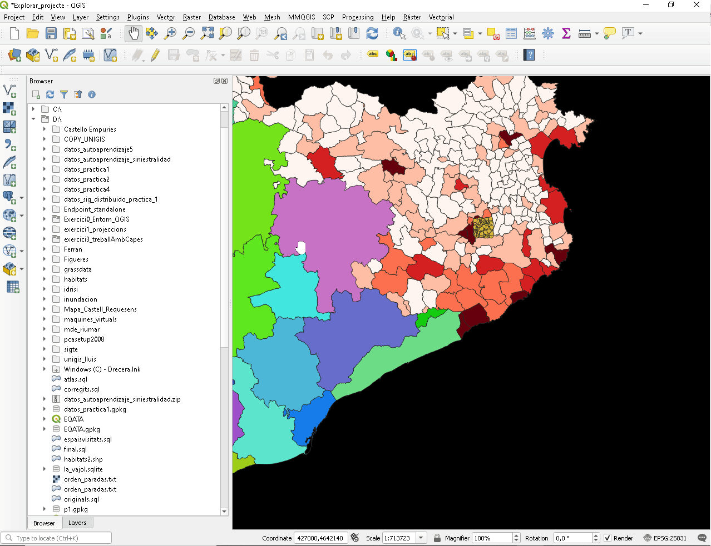

Exporteu les capes del projecte **Explorar-projecte.qgz** al geopackage **Catalunya**.

Shapefile
#########

És un format propietari de la companyia ESRI (ArcGIS) que s'ha convertit en un standard 'de facto'. Només emmagatzema un únic tipus de geometria (punt, línia o polígon). Es composa de tres fitxers amb el mateix nom i diferents extensions:

**.shp**: conté les geometries o entitats espacials
**.dbf**: conté la taula d'atributs
**.shx**: és el fitxer índex que manté la relació entre cada geometria i la seva corresponent fila a la taula d'atributs.

Aquests tres fitxers sempre han d'anar junts, en cas contrari QGIS no podria carregar la capa.

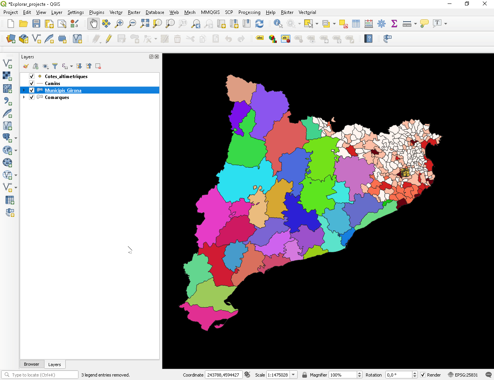

SpatiaLite
##########

El format **Geopackage** es basa en el format **Spatialite**. Es tracta també d'un repositori de dades on podem emmagatzemar taules i capes.

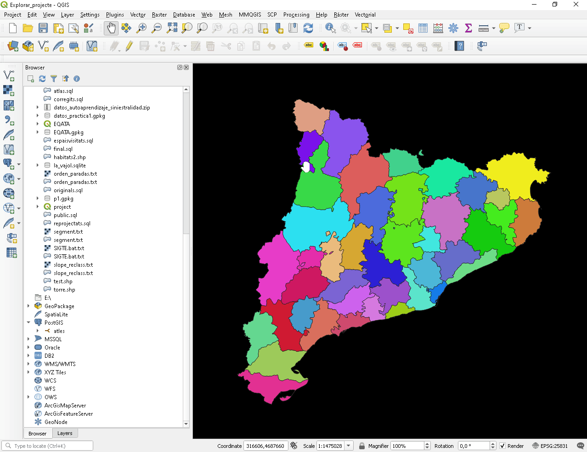

No permet guardar capes raster. Tampoc permet importar dades arrossegant-les des del **Browser** sinó que ho haurem de fer des del **Gestor de bases de dades** (haurem de fer doble clic sobre la capa per connectar-la).

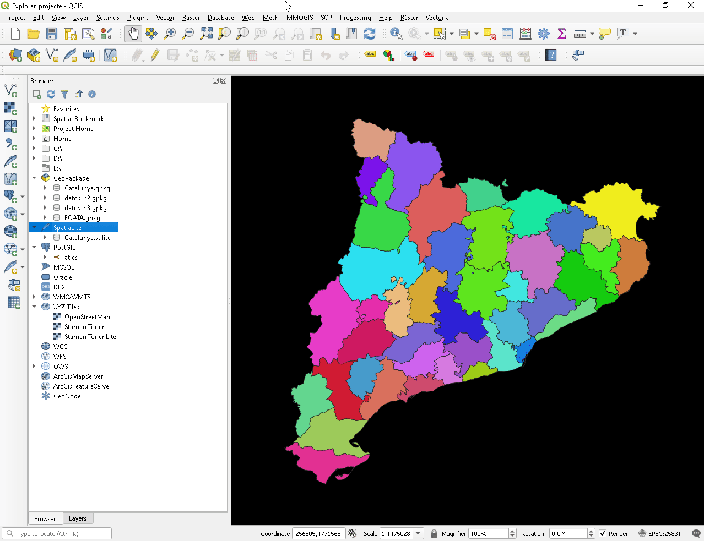

O bé fer un **Export Layer** des de la capa que volem importar.

GPX
###

És el format estàndard d'intercanvi d'arxius **GPS**. Per poder crear noves capes **GPX** hem d'activar primer el complement **GPS Tools**

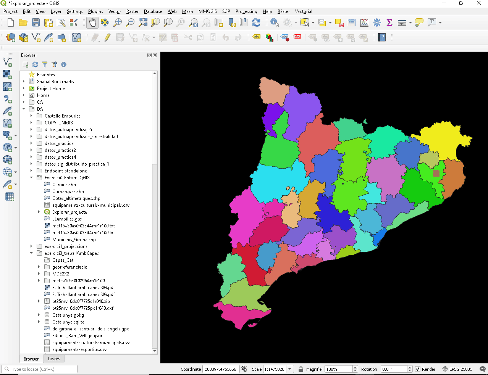

Quan el complement està carregat apareix a la barra d'eines **Data Source Manager Toolbar** i al menú  **Layer>Create Layer** l'opció per crear noves capes **GPX**.

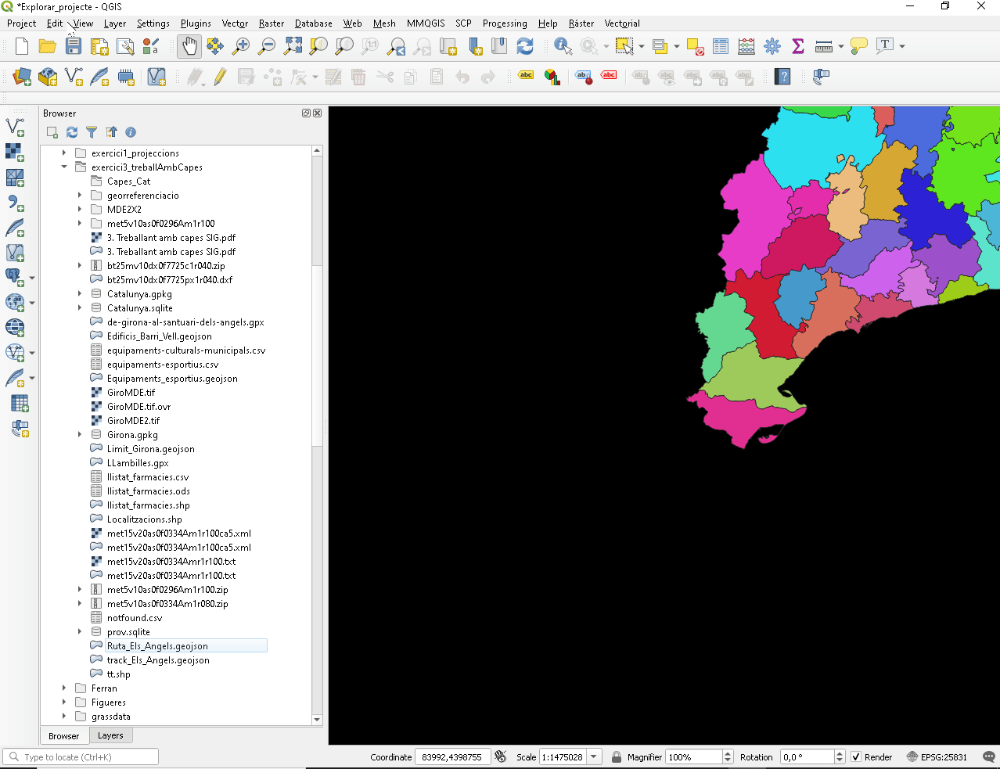

Al crear el nou **GPX** s'afegeixen tres noves capes a la taula de continguts o panell de capes: **waypoints**, **routes** i **tracks**

Capa temporal
#############

Les capes temporals són capes que es guarden a la memòria temporal, el que significa que no es desaran al disc i desapareixeran quan es tanqui QGIS (encara que es guardi el projecte). Poden ser útils com a capes intermèdies durant les operacions de geoprocessament.

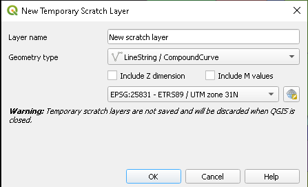

Capa virtual
############

Es tracta d'un tipus especial de capa vectorial que permet definir una capa com a resultat d’una consulta avançada, utilitzant el llenguatge SQL sobre una o més capes. Aquestes capes s’anomenen capes virtuals: no contenen dades per si mateixes, sinó que són visualitzacions d'altres capes.

Obriu el diàleg de creació de capa virtual fent clic a **New Virtual Layer** al menú **Layer>Create Layer** o a la barra d’eines corresponent.

El quadre de diàleg permet especificar una consulta SQL. La consulta pot utilitzar el nom (o l'ID) de les capes vectorials existents, així com el nom dels camps d'aquestes capes.

5. Treballant amb taules alfanumèriques
=======================================

En aquesta sessió aprendreu a realitzar les següents operacions amb taules d'atributs:

1. Explorar taules.
2. Crear, editar i modificar camps.
3. Afegir i actualitzar dades manualment.
4. Actualitzar dades amb la calculadora de camps.
5. Enllaçar i unir taules.

Aquests continguts es desenvoluparan a través de la realització d'un exercici pràctic que ens ha de permetre veure i conèixer el flux de treball propi de QGIS a l'hora d'operar amb taules i de realitzar seleccions i consultes de caràcter espacial.

.. note:: **Exercici pràctic**: La comarca de l'Alt Empordà presenta un dels índexs més elevats de producció de purins. A partir de les dades de producció de purins de les granges (m3.), haureu de determinar el grau de saturació de cadascun dels municipis de la comarca. Només es poden abocar purins en sols agrícoles de tipus:

 * Cultius herbacis
 * Cultius llenyosos
 * Cultius abandonats
 * Prats i herbassars
 * Vinyes

 * D'altra banda, haureu de tenir en compte que en aquestes zones només es podran abocar fins a 170 kg de nitrogen/ha l'any.

Totes les dades es troben dins del geopackage **Purins_Emporda.gpkg**.

5.1. Identificar la superfície de cada municipi disponible per a l'abocament de purins
--------------------------------------------------------------------------------------

1. Crearem un projecte nou de QGIS, amb el sistema de referència espacial **EPSG:25831**.

2. Carregarem la capa de **cobertes_sol** i la taula **cobertes_tesauro** a la vista de QGIS.

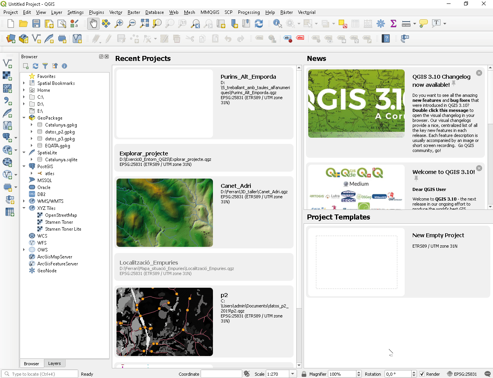

Unir taules (**Join**)
######################

La taula d'atributs de la capa **cobertes_sol** conté una columna amb el codi d'ús del sòl de cada polígon, però no sabem a quin ús correspon cada codi. Per altra banda, disposem d'una taula anomenada **cobertes_tesauro** que conté les equivalències de cada codi. Unirem la taula **cobertes_tesauro** a la capa de **cobertes_sol** mitjançant un **Join** de taules. D'aquesta manera la taula d'atributs de les cobertes del sòl identificarà a quina categoria d'ús del sòl correspon cada polígon de la capa. Caldrà obrir i explorar ambdues taules a fi d'identificar quin és el camp comú per dur a terme el procés d'unió. La unió de taules és virtual, no física i només existeix dintre del projecte actual.

Per eliminar una unió podem tornar a **Properties>Join**, seleccionar la unió que es vol esborrar i clic en el botó **-**  (**Remove selected join**) que hi ha a la part inferior de la finestra.

Seleccionar objectes per expressió
##################################

El següent pas és seleccionar aquells polígons de la capa **cobertes_sol** on es permit abocar purins (els quals estan llistats al principi d'aquest document).

Per fer aquest pas farem servir l'eina **Select features using an expression (Ctrl+F3)** que podem trobar a la barra d'eines **Attributes Toolbar**

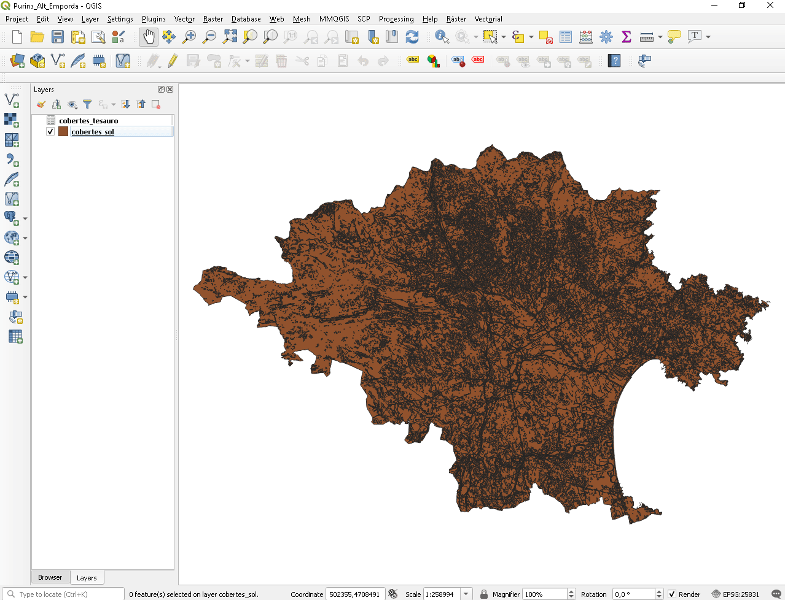

Seleccionem amb doble clic el camp que conté els usos del sòl **cobertes_tesauro_cast_niv_3** seguit de l'operador **IN** i entre parèntesi totes les categories d'usos del sòl que volem seleccionar separades per comes. Podem escriure manualment o fer doble clic sobre els camps i el valors fins construir tota l'expressió.

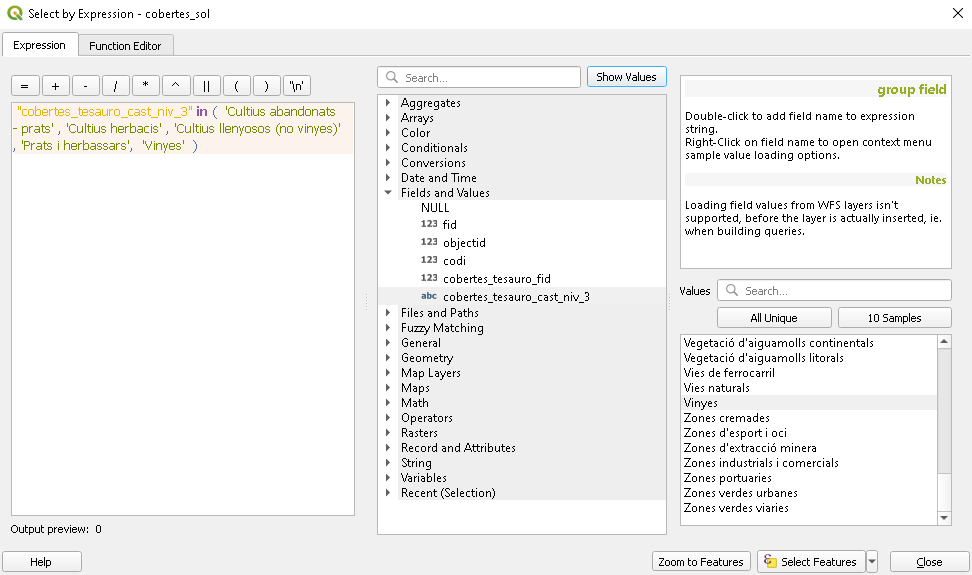

Executem **Select Features** i les cobertes del sòl indicades queden seleccionades tant a la vista com a la taula d'atributs.

Identificar a quin municipi pertany cada polígon
################################################

Tenim la superfície disponible per abocar purins de l'Alt Empordà, però necessitem saber la superfície disponible per a cada municipi. Per saber-ho el primer pas que hem de fer és saber a quin municipi pertany cada polígon de la capa **cobertes_sol** tenint en compte que un polígon es pot trobar repartit entre dos o més municipis.

Per fer aquesta operació podem fer servir l'algorisme **Intersection**. Aquest algorisme extreu les entitats (o parts d'una entitat) d'una capa (capa d'entrada) que es solapen (intercepten) amb una altra capa. Les entitats de la capa de sortida contindran els atributs de l'entitat de capa d'entrada i de l'entitat que es solapa.

En aquest cas la capa d'entrada serà **cobertes_sol** i la d'intersecció **municipis_Alt_Emporda**. Si per una entitat o polígon de **cobertes_sol** passa el límit de dos o més municipis, aquest polígon quedarà dividit a la capa de sortida en tants polígons com límits municipals passin sobre aquest. Cadascun dels polígons de la capa de sortida tindrà com atribut el municipi al qual pertanyen.

- Afegim a la vista la capa **municipis_alt_emporda.shp**.
- Al menú **Processing** obrim la caixa d'eines **Toolbox**.
- A la finestra de cerca busquem l'algorisme **Intersection**.
- A la finestra **Intersection** introduïm els següents paràmetres:

   + Input layer: **cobertes_sol**
   + Activar opció **Selected features only**
   + Overlay layer: **municipis_alt_emporda**
   + Input fields to keep: Són les columnes de la taula d'atributs de **cobertes_sol** que volem conservar a la capa de sortida. Deixem els paràmetres que hi apareixen per defecte.
   + Overlay fields to keep: Seleccionem el camp **NOM_MUNI** perquè és l'únic atribut de la capa de municipis que ens interessa obtenir.
   + Intersection: Aquí indicarem el nom de la capa de sortida. La capa la guardarem al geopackage **Purins_Emporda** i l'anomenarem **cobertes_aptes**.

- Cliquem a **Run** per executar l'algorisme. Aquesta operació pot trigar uns minuts.

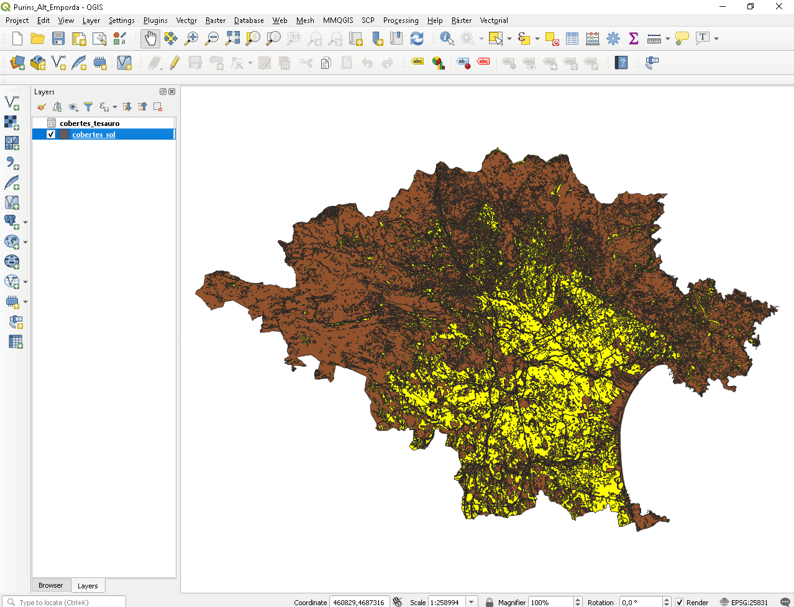

Si obrim la taula d'atributs veurem que ara hi ha més entitats de les que hi havia seleccionades a la capa **cobertes_sol**. Això es deu a que algunes entitats o polígons han quedat dividides en dos o més geometries si aquestes es trobaven repartides en més d'un municipi.

- Aprofitarem també per eliminar de la vista la capa **cobertes_sol** i la taula **cobertes_tesauro** que ja no necessitarem més (recordeu que només s'elimina de la vista, però encara hi són al geopackage i podem tornar-les a carregar quan ho necessitem).

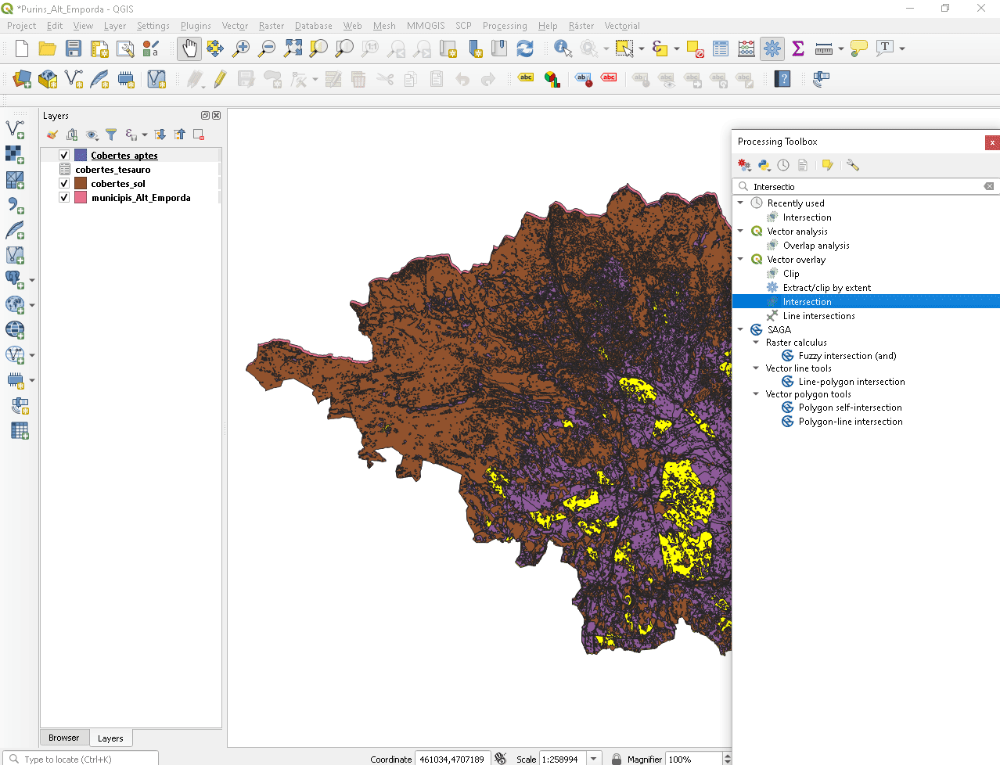

Pot passar que el procés s'interrompi perquè surt un missatge d'error indicant que hi ha geometries invàlides. En cas que passi això seguiu el procés de la imatge següent i torneu a executar l'algorisme.

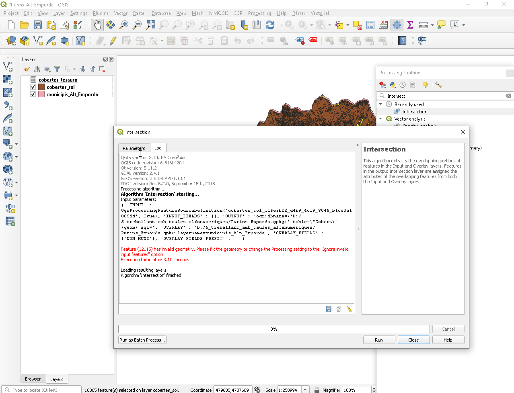

Calcular la superfície dels polígons
####################################

La calculadora de camps o **Field calculator** és una eina de QGIS que permet emplenar camps o columnes d'una taula de forma automàtica. En aquesta ocasió la farem servir per calcular la superfície en hectàrees dels polígons de la capa **cobertes_aptes**.

- Obrim el **Field calculator** (icona que representa un àbac i situada a la barra d'eines **Attributes Toolbar**):

   + Seleccionem **Create new field**
   + Output field name: **Area**
   + Output field type: **Decimal number (real)**
   + Row number: Seleccionem **Geometry** i dins d'aquesta fem doble clic sobre el paràmetre **$area**

- A la finestra **Expression** apareix l'expressió **$area** (també la podem introduir manualment) i afegirem **/10000** per obtenir la superfície en hectàrees.

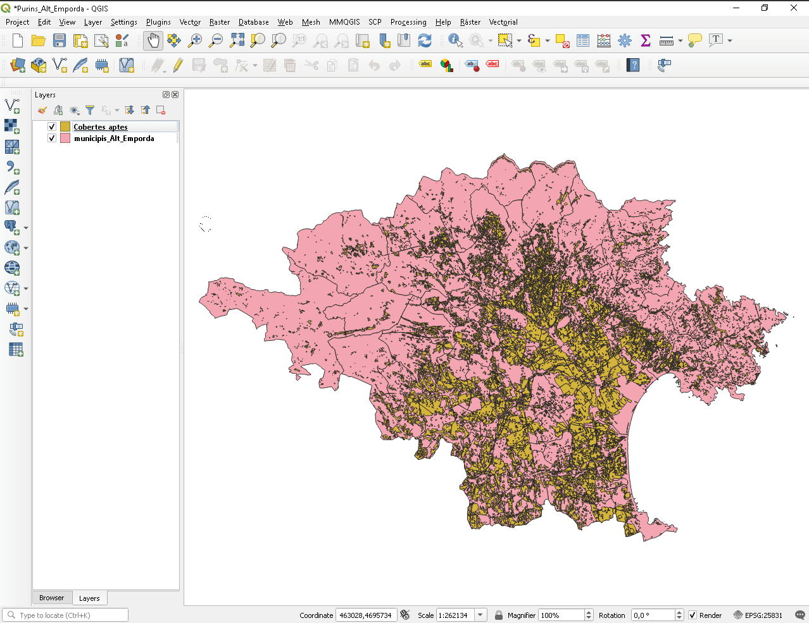

- Obrim la taula d'atributs per comprovar que el camp s'ha calculat correctament.
- Al realitzar l'operació, la taula d'atributs es posa automàticament en mode d'edició. Per confirmar els canvis haurem d'aturar l'edició fent clic al botó **Toogle editing mode** que trobem a l'esquerra de tot. També ho podem fer des de la vista situant-nos sobre la capa **cobertes_aptes** i amb el botó dret del ratolí seleccionar **Toogle Editing**.

Calcular superfície per municipis
#################################

Com que el que ens interessa és la superfície total de què dispossa cada muncipi per abocar purins, necessitarem sumar la superfície dels polígons de **cobertes_aptes** per cada municipi i obtenir una taula amb les Ha totals disponibles.

- Obrim la caixa d'eines de processament **Processing>Toolbox**
- A la caixa de cerca busquem l'eina **Statistics by Categories**
- L'obrim amb doble clic sobre ella i introduïm els següents paràmetres:

   + Input vector layer: **cobertes_aptes**
   + Field to calculate statistics: **Area**
   + Field(s) with categories: **NOM_MUNI**
   + Statistics by category: Donem un nom a la taula de sortida. Deixem per defecte **Create temporary layer**

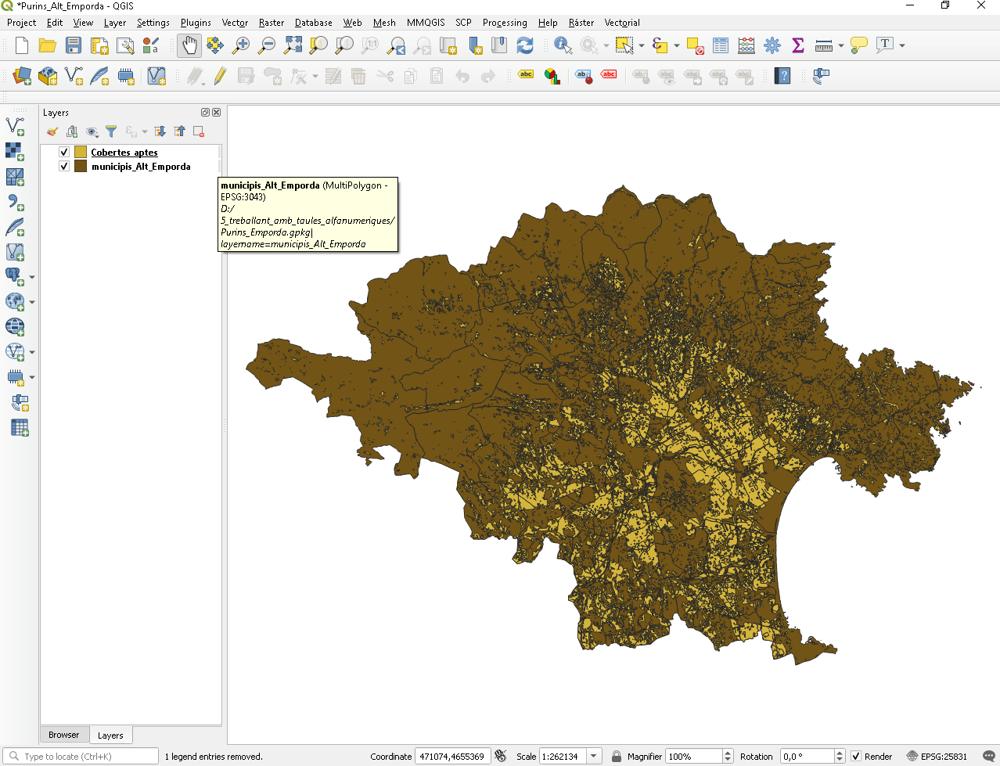

Al panell de capes apareix la taula **Statistics by category**. Si ens fixem, al costat hi té el símbol de capa temporal.

- Obriu la taula com si es tractés d'una taula d'atributs i observeu-la. Veureu que per a cada municipi s'han generat diverses estadístiques en relació al camp **Area**: mínim, màxim, mitjana, etc.... El camp **count** indica el número d'entitats (en el nostre cas polígons) de la capa **cobertes_aptes** que formaven part d'aquest municipi. De tots aquests camps, l'únic que ens interessa realment és **sum** que indica la suma del camp àrea per cada municipi.

Unir la taula d'estadístiques a la capa de municipis
####################################################

Amb el pas anterior ja hem aconseguit l'objectiu d'identificar la superfície de cada municipi disponible per a l'abocament de purins, però aquesta dada la tenim en una taula sense geometries i per tant no podem fer un mapa temàtic per representar els municipis en base a aquesta variable.

El que farem serà unir aquesta taula a la capa **municipis_Alt_Emporda** tal com hem fet a l'inici d'aquest exercici quan hem unit la taula **cobertes_tesauro.dbf** a la capa **cobertes_sol**.

Quan fem la unió indicarem que només volem unir el camp **sum** i descartarem la resta.

Com que aquesta unió és virtual, farem una unió física fent una exportació a una nova capa que emmagatzemarem al geopackage **Purins_Emporda.gpkg** amb el nom de **Munis_superficie_purins**.

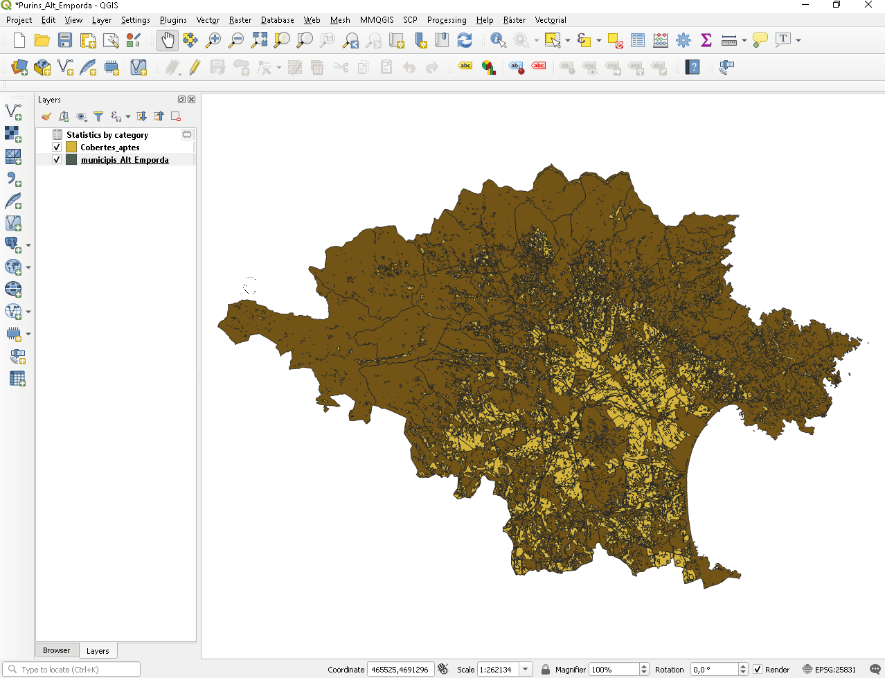

Deixem al projecte la capa que acabem de generar i esborrem la resta.

Representar els municipis segons la superfície disponible
#########################################################

Per finalitzar aquesta part de l'exercici simbolitzarem la capa **Munis_superficie_purins** amb una paleta de colors graduat en base a la superfície disponible.

- Doble clic a sobre **Munis_superficie_purins** per obrir les seves propietats i seleccionem **Symbology**. També podem pitjar **F7** per a obrir la finestra **Laer Styling** fixada al costat de la vista. A la imatge animada de sota s'ha seguit aquest segon sistema.
- Com a mètode de classificació seleccionem **Graduated**
- A **Value** indiquem el camp de representació que en aquest cas serà **Statistics by category_sum**
- A **Color ramp** escollim la rampa de colors que més ens agradi.
- A **Mode** seleccionem el mètode utilitzat per generar els intervals de forma automàtica. Escollim **Natural Breaks**.
- A **Classes** indiquem el número de intervals o classes amb què classificarem els valors.
- **Classify** executa la classificació de valors amb els paràmetres indicats anteriorment. Si volem, podem afinar-los manualment.

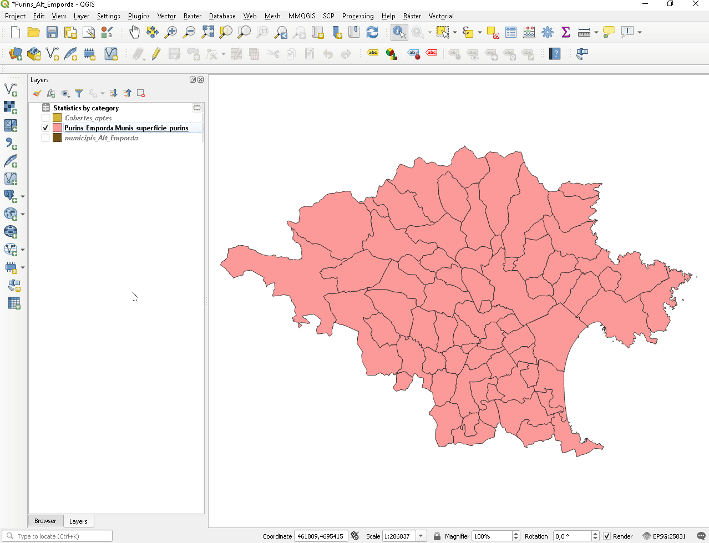

Guardarem aquest estil al nostre geopackage i indicarem que l'utilitzi per defecte. D'aquesta manera cada vegada que carreguem la capa a un nou projecte es mostrarà amb aquesta representació.

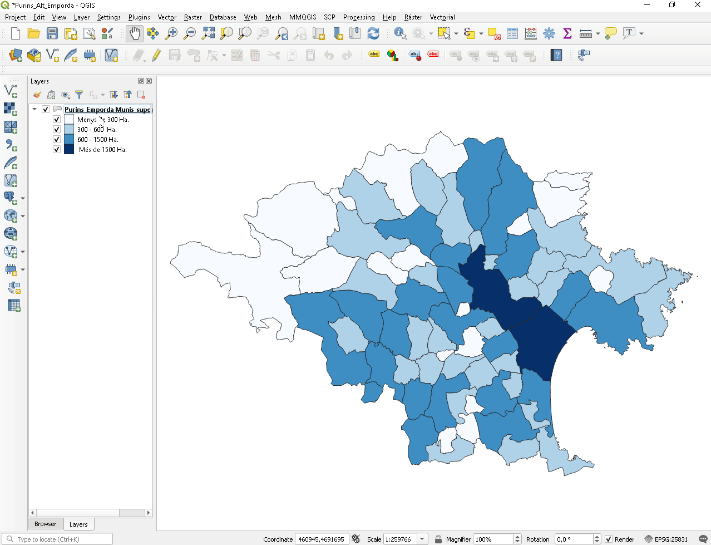

5.2. Calcular la producció de purins de cada municipi
-----------------------------------------------------

A la primera part d'aquest exercici hem calculat la disponibilitat de territori de cada municipi per abocar purins. En aquesta segona part calcularem la producció real de purins de cada municipi a partir de la quantitat de purins anuals (en metres cúbics) produïts per les granges porcines de la comarca. Posteriorment posarem en relació el resultat obtingut per cada municipi amb la superfície disponible tenint present que només es permet abocar un màxim de **170 kg de nitrogen/ha i any**.

Calcular la quantitat de nitrogen anual produït per cada granja
###############################################################

- Carregarem al projecte la capa relativa a les granges productores de purins (**granges**) que podeu trobar a dins de **Purins_Emporda.gpkg**. En la taula d'atributs d'aquesta capa, trobareu un camp amb el registre de producció de purins (m3) anual de cada granja.

- Fem servir la Calculadora de camps o **Field calculator** per calcular els **kg de nitrogen** anuals que produeix cada **granja**. Cal tenir present que cada **m3 de purins** conté de mitjana d'aproximadament **2 Kg** de nitrogen. Per tant, per saber els Kg de totals de nitrogen produïts haurem de multiplicar el valor de la columna **m3_purins** per **2**.

- Obrim la taula d'atributs de la capa **granges** i comprovem que el resultat és coherent.

- Representem la capa de granges segons la quantitat de nitrogen anual produït amb un símbol graduat.

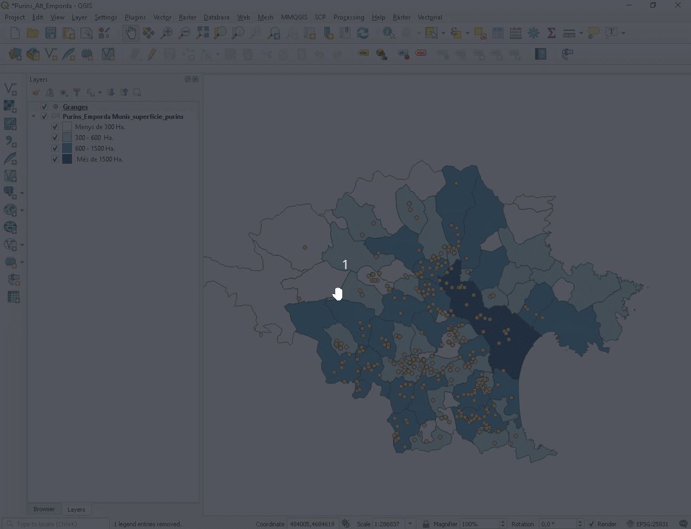

Calcular la quantitat de nitrogen anual produït per cada municipi
#################################################################

Ara que hem calculat la quantitat anual de nitrogen que produeix cada granja, calcularem el total produït per cada municipi de l'Alt Empordà. Per això, necessitem saber a quin municipi pertany cada granja i seguidament sumar la quantitat de Kg de nitrogen que produeixen les granges de cada municipi. Aquestes dues operacions les podem fer amb l'algorisme **Join attributes by location (summary)** (Unir atributs per localització). Aquesta operació ens permet afegir a una capa els atributs d'una segona capa. Seria similar al **Join** amb la diferència que no tenim un camp comú que serveixi per unir les dues taules, sinó que la unió es fa en base a una localització comú. A més, aquest algorisme fa un resum estadístic dels camps numèrics de la segona capa que seleccionem.

En concret, calcularem el número de punts (granges) que conté cada polígon (municipis - **munis_superficie_purins**) i hi sumarem els valors del camp **Kg_Nitro**.

L'algorisme requereix que especifiquem els camps sobre els volem fer el resum estadístic **Fields to summarise (leave empty to use all fields)**: seleccionem el camp **Kg_Nitro**.

A **Summaries to calculate** indiquem quines estadístiques volem obtenir. En aquest cas, només ens interessa **count** (indica el número de granges per cada municipi) i  **sum** que ens indicarà la quantitat total  de kilograms de nitrogen per cada municipi.

Com a capa de sortida indiquem que volem una capa temporal.

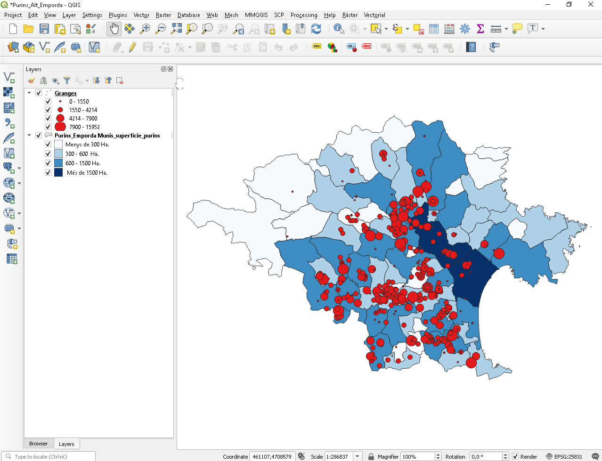

Com a resultat obtenim una nova capa de municipis de l'Alt Empordà que conté la quantitat de quilograms de nitrogen produïts per a les granges de porcs de cada municipi.

- Unirem aquesta taula a la capa **munis_superficie_purins** per tenir a la mateixa capa, tant la superfícies que necessiten per abocar purins com la producció total de purins.

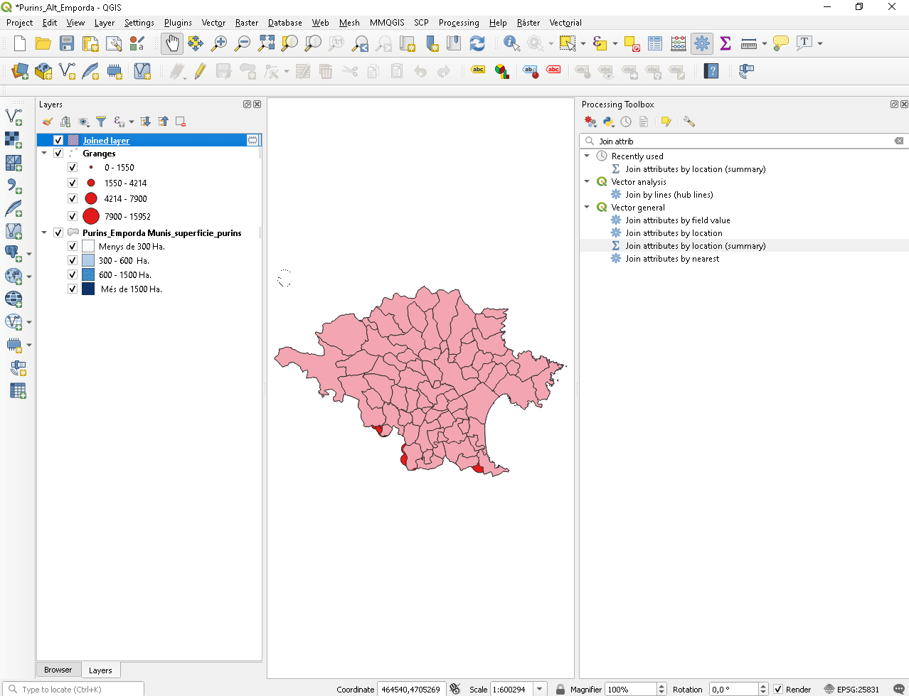

- Consolidem la unió virtual com una unió fixa fent un **Export** de la capa. La capa resultant l'anomenarem **Munis_Emporda_Purins**.
- Esborrem del projecte les capes **munis_superficie_purins** i **Joined Layer** i deixem només **Munis_Emporda_Purins** i **granges** i esborrem la resta.
- Per la capa **Munis_Emporda_Purins** podem recuperar l'estil que havíem definit per **munis_superficie_purins** i que havíem guardat com estil al geopackage.

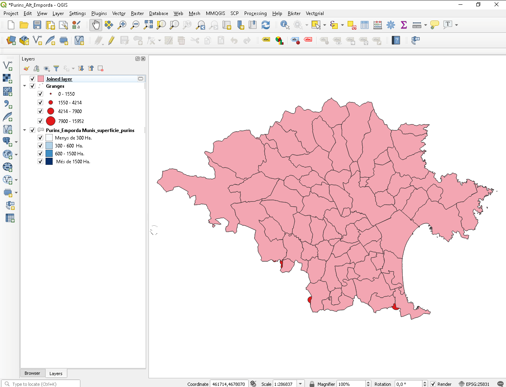

Reanomenar camps
################

Un cop fetes les operacions anteriors, la taula d'atributs de **Munis_Emporda_Purins** conté a banda del nom del municipi i els codis de municipi, comarca i província, els següents camps:

- **Statistics by category_sum**: Conté la superfície disponible per abocar purins a cada municipi.
- **Joined layer_Kg_Nitro_count**: Conté el número de granges porcines que hi ha a cada municipi (número de punts dins de cada polígon).
- **Joined layer_Kg_Nitro_sum**: Conté la quantitat total de nitrogen produït per les granges de cada municipi.

El nom d'aquests camps no deixa massa clar el seu contingut, per tant els reanomenarem.

- Obrim les propietats de la capa ****Munis_Emporda_Purins****.
- Clic a l'apartat **Fields**.
- Activem l'edició del camp fent clic al botó **Toogle editing mode**
- Fem doble clic sobre cadascun dels camps que volem reanomenar i introduïm els següents noms:

   + Statistics by category_sum = **Ha_diponibles**
   + Joined layer_Kg_Nitro_count = **Numero_Granges**
   + Joined layer_Kg_Nitro_sum = **Kg_Nitrogen**

- Cliquem al botó **Toogle editing mode** per desactivar l'edició i guardem els canvis.

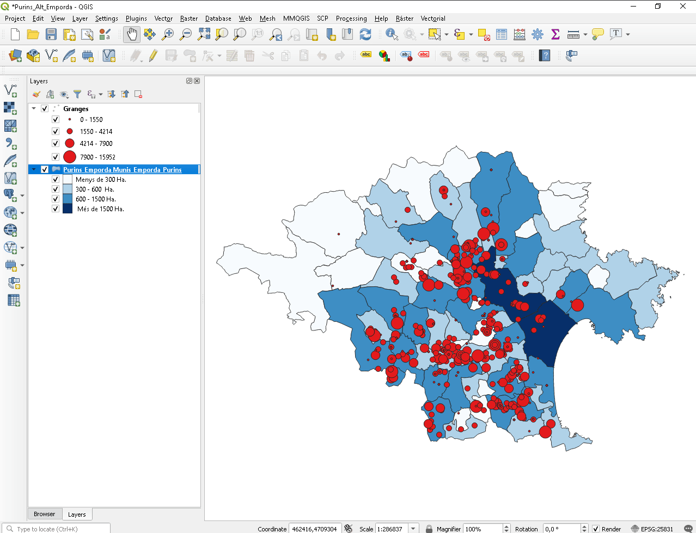

Fixeu-vos que han desaparegut els estils que teniem definits per aquesta capa. La raó és que l'estil estava definit en base al camp **Statistics by category_sum** el qual hem reanomenat i, per tant, ja no el reconeix. Podem provar de fer una nova representació dels municipis segons la quantitat de nitrogen produïts anualment. En aquest cas el camp de representació serà **Kg_Nitrogen**.

Calcular el nombre d'hectàrees necessàries per cada municipi per abocar purins
###############################################################################

Coneixent els Kg. de nitrogen produïts per cada municipi anualment i tenint en compte que es poden abocar un màxim de  **170 kg N/ha i any** és fàcil calcular la superfície mínima disponible per cada municipi per abocar purins.

- Obrim la calculadora de camps **Field calculator**
- Crearem un camp anomenat **Ha_necessaries** de tipus enter i a expressió dividirem el camp **Kg_Nitrogen** entre **170**

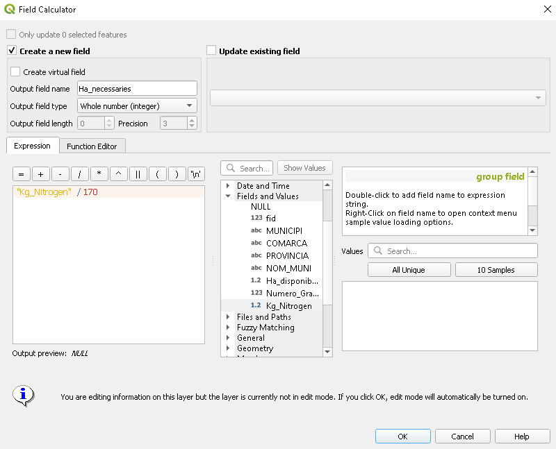

- Un cop creat el camp aturem l'edició fent clic al botó **Toogle editing mode**.

D'aquesta manera la taula d'atributs de la capa **Munis_Emporda_Purins** té, per una banda, un camp amb el número de hectàrees disponibles per abocar-hi purins en funció de les cobertes del sòl aptes i, per altre banda, un camp amb el número de hectàrees necessàries en funció del volum de purins que es produeixen anualment.

Finalment, podem tematitzar la capa resultant segons el camp **Ha_necessaries**

Balanç superfície disponible/superfície necessària
##################################################

Per últim, podem crear un camp que ens indiqui si el balanç entre la superfície disponible per abocar purins i la superfície necessària és positiu o negatiu. Ho farem novament amb **Field calculator**.

Definim un nou camp anomenat **Balanc_170** i com a expressió introduïm **Ha_disponibles - Ha_necessaries**

Veiem que amb un barem d'un màxim de **170 kg N/ha i any** hi ha un saldo positiu de superfície disponible en tots el municipis de l'Alt Empordà. Això és degut a que només hem aplicat un criteri (coberta del sòl). Per fer un anàlisi més acurat s'haurien d'introduir altres variables com la litologia, el pendent, la proximitat als cursos fluvials, les zones humides, els aqüífers, etc.

6. Tècniques i eines de digitalització i edició de dades vectorials
===================================================================

Digitalització bàsica amb QGIS: Generalitats
--------------------------------------------

Les eines de digitalització bàsica de QGIS es troben a la barra d'eines **Digitizing Toolbar**. Alternativament, aquestes mateixes eines es poden activar des del menú **Edit**. En realitat, des d'aquest menú es pot accedir a les eines bàsiques així com a les avançades. En qualsevol cas, considerant que resulta més pràctic treballar-hi des de les barres d'eines, en aquests exercicis hi farem constant menció.

	.. figure:: ./static/Exercici6_1.png
   	   :align: center

La barra d'eines de digitalització bàsica és **contextual**. Això significa que el seu contingut s'adapta a la naturalesa de la capa vectorial amb la qual s'està treballant: punts, línies o polígons.

	.. figure:: ./static/Exercici6_2.png
   	   :align: center

   	.. figure:: ./static/Exercici6_3.png
   	   :align: center

Digitalització bàsica amb QGIS: crear noves entitats
####################################################

1. Obrim un nou projecte de QGIS, amb el sistema de referència espacial **25831**, i a continuació carreguem el WMS del ICGC per tal de disposar de cartografia de referència sobre la qual digitalitzar les nostres noves entitats. Més concretament, carregarem l'ortofotomapa 1.000 i farem un zoom a l'extensió màxima de la capa.

2. En segon lloc, instal·larem un complement que ens resultarà segurament d'interès per a moltes tasques que puguem dur a terme i que implica efectuar zooms, ampliacions i desplaçaments a unes coordenades concretes: Lat Lon Tools Toolbar. Modifiquem els paràmetres de l'eina per tal d'adaptar-los al sistema de referència espacial del projecte (UTM).

3. A continuació, crearem tres capes temporals noves, una per a cada tipologia d'entitat a digitalitzar i les anomenarem per exemple, de la següent manera:

	* **capa_punt**
	* **capa_linia**
	* **capa_poligon**

4. Al panell de l'eina, escriurem les següents coordenades (X,Y), i farem un clic sobre el botó o icona **Zoom to coordinates**, i a continuació, sobre la barra relativa a l'escala de visualització, escriurem **1:300**::

   484624.85, 4647847.39

5. Ens situarem sobre la capa **capa_punt**, la posarem en edició i digitalitzarem els elements que formen part del mobiliari urbà de la zona: bancs, aparcaments de bicicletes, llums, contenidors,  etc...

6. Una vegada digitalitzats tots els punts, podem desar els canvis i obrir la seva taula d'atributs. Donat que està buida, el que podem fer és crear una nova columna (**[id]**) i assignar-li un valor únic a cada punt. Per a fer això obrirem la calculadora de camps, activarem la casella de creació d'una nova columna de tipus enter, li assignarem el nom acordat, i en l'apartat d'expressió teclejarem **@row_number**

   	.. figure:: ./static/Exercici6_4.png
   	   :align: center

7. Alternativament, podem aplicar, per exemple, un identificador únic de tipus **UUID** (*universally unique identifier*). En aquest cas, en comptes d'utilitzar **@row_number** utilitzarem **$uuid**, i definirem que la columna serà tipus text o string, de 50 caràcters de longitud. Desem i desactivem l'estat d'edició de la capa.

   	.. figure:: ./static/Exercici6_5.png
   	   :align: center

8. A continuació podem modificar l'escala de visualització a **1:500**, i activem la capa que duu per nom **capa_linia**. La posarem en edició (si no ho està ja) i digitalitzem els eixos de carrer que hi ha a l'entorn de les places Miquel de Palol i Prudenci Bertrana. Per digitalitzar un línia cal fer un clic sobre el vèrtex inicial de la línia, i afegir tants vèrtexs com siguin necessaris fins a digitalitzar el darrer punt (fi de la línia). Per indicar que el darrer vèrtex digitalitzat és un final de línia, fem un clic amb el botó dret del ratolí.

9. Digitalitzem l'eix de carrer de la Plaça Prudenci Bertrana i Miquel de Palol entre les cruïlles del Carrer de Pau Casals i Carrer de Bernat Boades.

   	.. figure:: ./static/Exercici6_6.png
   	   :align: center

10. A continuació, seguint el mateix procediment podem digitalitzar l'eix de carrer que va per l'altre costat de la plaça i, una vegada afegida aquesta nova línia, digitalitzarem el Carrer de Pau Casals des de Canonge Dorca fins a Remences. Per poder digitalitzar correctament aquesta línia de carrer, fent que la nova línia es connecti a la línia preexistent i per tant definir que existeix una relació entre aquestes línies, farem ús de les opcions que ens ofereix la **Snapping toolbar**.

   	.. figure:: ./static/Exercici6_7.png
   	   :align: center

11. Les eines que tenim disponibles en aquesta barra d'eines ens permet configurar en primer lloc, sobre quines capes volem establir una connexió entre entitats, sobre quina característica dels elements que conformen les capes, i amb quina tolerància. En aquest cas concret definirem les opcions **Active layer**, **Vertex**, i **10 metres**. Una vegada configurats aquests paràmetres podem digitalitzar l'eix esmentat anteriorment, tenint la precaució de capturar el vèrtex final o inicial de les línies ja existents.

    .. figure:: ./static/Exercici6_8.gif
   	   :align: center

12. A continuació podem repetir la mateixa operació per digitalitzar l'eix corresponent al Carrer del Riu Güell (que acaba dividint ambdues places) i l'inici el Carrer de Josep Viader i Moliner. En aquest cas, si no modifiquem el comportament de l'eina de **Snap** ens resultarà impossible digitalitzar el carrer del Riu Güell amb l'eix viari que envolta les places, pel que haurem de modificar l'opció **Vertex**, per l'opció **Vertex and Segment** o **Segment**.

    .. figure:: ./static/Exercici6_9.gif
   	   :align: center

13. Com en el cas anterior, podem crear una nova columna **[id]** a la taula d'atributs i omplir-la amb un identificador únic.

14. Activarem a continuació la capa **capa_poligon** i digitalitzarem les àrees de joc o recreatives que es poden veure al centre de la plaça, començant per la que es troba a l'extrem superior esquerre. Com en el cas anterior, la manera de digitalitzar una àrea consisteix en introduir el primer vèrtex de l'element a dibuixar, i anar introduint nous vèrtexs fins a conformar la totalitat de la figura. Una vegada introduït el darrer vèrtex, fem un clic amb el botó dret del ratolí per finalitzar la digitalització.

    .. figure:: ./static/Exercici6_10.gif
   	   :align: center

15. Podem digitalitzar el segon espai que es troba sota del primer, seguint la mateixa tècnica, i en acabat, crear un **[id]** per a cadascuna de les entitats abans de desar els canvis i desactivar l'edició.

    .. figure:: ./static/Exercici6_11.png
   	   :align: center

Digitalització bàsica amb QGIS: editar entitats ja existents
############################################################

16. Fins ara s'ha vist com crear noves entitats amb les eines bàsiques de digitalització. El que es mostrarà a continuació, és com editar entitats ja existents, a través del treball amb vèrtexs. L'eina per a l'edició d'entitats o, millor dit, de vèrtexs, es troba igualment a la barra d'eines de digitalització. Quan una capa, sigui de la naturalesa que sigui, està en mode d'edició, a banda d'activar-se la icona per crear noves entitats també s'activa l'eina d'edició de vèrtexs (cinquena icona de la barra d'eines).

17. En el cas de les entitats de punt, l'única edició possible és la de desplaçar-la a una nova localització. I aquesta edició la podem dur a terme de dues maneres:

	* **manualment**
	* **numèricament**

18. Per fer-ho manualment, tan sols cal fer un clic amb el botó esquerre del ratolí sobre l'entitat en qüestió, desplaçar el ratolí a la nova posició, i fer un nou clic amb el botó esquerre per confirmar el nou emplaçament:

    .. figure:: ./static/Exercici6_12.gif
   	   :align: center

19. Per fer-ho numèricament, ens recolzarem en el panell d'edició de vèrtexs que s'activa automàticament en seleccionar l'eina. En aquest cas, en comptes de fer un clic amb el botó esquerre del ratolí, ho farem amb el botó dret, per tal de veure les coordenades del punt (vèrtex) al panell, i editar-ne el valors. En fer un *Enter*, la posició del punt (vèrtex), s'actualitzarà automàticament.

    .. figure:: ./static/Exercici6_13.gif
   	   :align: center

20. Aquest tipus d'edició de vèrtexs, **manual** i **numèrica**, és aplicable a qualsevol tipus d'entitat sigui de la naturalesa que sigui. En el cas de l'edició de vèrtex a més, es dona la particularitat que aquests es poden editar o desplaçar de forma massiva

    .. figure:: ./static/Exercici6_14.gif
   	   :align: center

21. En el cas particular d'entitats lineals i poligonals, a part dels propis vèrtexs, es poden també editar les línies o arcs que els connecten. Així podem:

    * desplaçar un únic vèrtex
    * desplaçar 2 o més vèrtexs a la vegada
    * afegir un nou vèrtex al punt mig d'un arc i desplaçar-lo
    * desplaçar tot l'arc

    .. figure:: ./static/Exercici6_15.gif
   	   :align: center

Digitalització avançada amb QGIS
--------------------------------

22. Les eines avançades de digitalització es troben a la barra d'eines **Advanced Digitizing Toolbar**. Amb aquesta nova barra podem:

    * moure entitats
    * copiar i moure entitats
    * rotar entitats
    * simplificar entitats
    * afegir anells per crear polígons tipus *donut*.
    * afegir parts a una entitat ja existent
    * omplir anells
    * eliminar parts
    * modificar el contorn
    * augmentar o disminuir l'àrea
    * tallar entitats
    * ...

La funció «autocompletar» polígon
---------------------------------

23. Sovint, durant les tasques de digitalització, ens trobarem amb la necessitat de digitalitzar polígons (irregulars) adjacents, i per tal d'evitar el solapament entre entitats, caldrà fer ús de les eines i opcions presents a la barra d'eines **Snapping Toolbar**. En el cas de polígons regulars aquesta tasca podria fer-se més àgilment capturant els vèrtexs (pocs) necessaris però en el cas de polígons irregulars, on les entitats presenten més vèrtexs, aquesta tasca es podria tornar molt feixuga i problemàtica. Així doncs, en aquest cas podem adoptar dues solucions:

	* tracing
	* autocompletar polígon

24. En el primer cas, es tracta d'activar l'opció **Tracing** de la barra d'eines de snapping, i resseguir el contorn de l'entitat preexistent per tal de digitalitzar la nova entitat. Ens hi referirem més endavant. La segona opció, es tracta d'accedir a les opcions avançades de l'eina de **Snapping**, activar la casella evitar superposició (**avoid overlap**), fer un clic a l'interior de l'entitat sobre la qual basarem la nova entitat, capturar un node inicial i un node final, i fer novament un clic dins l'entitat preexistent per finalitzar la digitalització:

    .. figure:: ./static/Exercici6_15_bis.gif
   	   :align: center

25. En funció de la forma dels polígons, dels contorns, etcètera, ens pot convenir més utilitzar un sistema o mode, o altre.

Digitalització per coordenades, distàncies i angles
---------------------------------------------------

26. Una altra possibilitat de digitalització, és fer-ho mitjançant coordenades, distàncies i angles per tal de poder dur a terme tasques de digitalització amb precisió. Aquesta funció, és accessible a través d'un panell que permet controlar, modificar i fixar els valors relatius a les coordenades, a les longituds i els angles dels vèrtexs i arcs que conformen una entitat de línia o d'àrea.

27. Crearem una nova capa temporal, a la que anomenarem parcel·la i digitalitzarem un polígon que englobi la zona que volem parcel·lar i digitalitzar un nou edifici. Una vegada digitalitzada aquesta gran àrea, segmentarem el polígon per identificar les parcel·les individuals, crearem una nova columna tipus, i assignarem el valor **parcel·la** a aquestes i de **vial**, als espais continguts entre parcel·les.

28. Seleccionem l'eina de digitalització de polígons, i activem la icona on hi figura un regle i un cartabó. Automàticament apareixerà un nou panell des d'on controlarem totes les instruccions de digitalització. La primera operació que farem és identificar el punt concret on començarem a digitalitzar el nostre edifici. L'angle inferior esquerre d'aquest, es troba a 6 metres a l'interior de la parcel·la. Per tant, el primer que farem serà activar el mode de construcció (tecla **c**) que permet fixar la posició del cursor sobre la vista però sense digitalitzar cap vèrtex ni línia.

29. Havent activat del mode de construcció, amb el cursor cal capturar la posició de l'angle inferior esquerre de la parcel·la i a continuació, activar el valor de distancia (**d**), introduir el valor **6** i bloquejar aquest paràmetre. A continuació prémer la tecla (**p**) per seleccionar la opció paral·lel i tot seleccionant el límit inferior de la parcel·la, fer un clic per confirmar aquesta posició.

    .. figure:: ./static/Exercici6_16.gif
   	   :align: center

30. Comprovem que el punt inicial s'ha desplaçat 6 metres al llarg del límit inferior de la parcel·la i el que farem serà desplaçar-lo 6 metres cap a l'interior de la parcel·la, de forma paral·lela al límit esquerra de la mateixa. Caldrà en primer lloc, desactivar el mode de construcció (**c**) per tal de permetre la digitalització del següent vèrtex. A continuació caldrà prémer la tecla (**d**) per modificar el valor de distància a **6**, bloquejar-lo, i prémer a continuació la tecla (**p**) per seleccionar la opció paral·lel, tot fent un clic sobre el límit esquerre de la parcel·la i confirmar la posició del nou punt. Aquest serà el punt inicial del nostre edifici.

    .. figure:: ./static/Exercici6_17.gif
   	   :align: center

31. A continuació activem el valor de distancia (**d**), escrivim el valor **90** i el bloquegem, premem (**p**) per seleccionar la opció paral·lel tot indicant el límit inferior de la parcel·la i fem un darrer clic per confirmar la creació del primer arc amb la digitalització d'aquest nou vèrtex.

    .. figure:: ./static/Exercici6_18.gif
   	   :align: center

32. A continuació caldrà seguir les següents instruccions fins a digitalitzar completament l'edifici en qüestió::

	en un angle de 90 graus, un arc de 20 metres de longitud
	en un angle de 90 graus, un arc de 4 metres de longitud
	en un angle de 90 graus, un arc de 6 metres de longitud
	en un angle de 90 graus, un arc de 4 metres de longitud
	en un angle de 90 graus, un arc de 38 metres de longitud
	paral·lel al límit superior de la parcel·la, un arc de 89 metres de longitud

    .. figure:: ./static/Exercici6_19.gif
   	   :align: center

Altres eines de digitalització avançada
---------------------------------------

33. A banda de les opcions que ja hem vist, existeixen altres opcions per a dur a terme tasques de digitalització avançada. Aquestes es troben a la barra d'eines **Shape Digitizing Toolbar**.

34. Per veure algunes de les seves funcionalitats, digitalitzarem el contorn de l'illa que conté les tres parcel·les de treball. Seleccionarem doncs l'eina de digitalització de polígons i, des de l'angle superior dret, digitalitzarem l'àrea a una escala de 1:250, cap a l'esquerra. Anirem afegint vèrtexs tot resseguint el límit de la zona fins arribar a la cantonada superior esquerra on es pot observar que la cantonada és arrodonida. Sense deixar de digitalitzar, seleccionarem l'eina **Add circular string** de la barra d'eines de formes, farem un clic al centre de l'arc i en dibuixarem la resta. Una vegada digitalitzada la cantonada, seleccionarem de nou l'eina **Add features** i continuarem amb la digitalització fins a la cantonada inferior.

    .. figure:: ./static/Exercici6_22.gif
   	   :align: center

---

    .. figure:: ./static/Exercici6_21.gif
   	   :align: center

35. En arribar novament al vèrtex inicial, digitalitzarem la cantonada rodona, i farem un clic amb el botó dret del ratolí per finalitzar la digitalització de l'entitat.

    .. figure:: ./static/Exercici6_22.gif
   	   :align: center

36. En tenir totes les diferents categories d'entitat en una mateixa capa, el que podem fer és seleccionar cadascuna de les entitats que formen part d'una mateixa categoria, retallar-les i enganxar-les com una nova capa: **capa_illa**, **capa_parcela**, **capa_vial** i **capa_edifici**.

    .. figure:: ./static/Exercici6_23.gif
   	   :align: center

37. Una altra tècnica de digitalització avançada que ofereix QGIS és la de reutilitzar geometries preexistents per tal de construir noves geometries en una capa qualsevol. Aquesta funció és el que es coneix com a **Tracing** i es troba a la barra d'eines de **Snapping**. El seu funcionament és tan simple com activar la corresponent icona i deixar que faci la tasca.

    .. figure:: ./static/Exercici6_24.gif
   	   :align: center

38. També existeix la possibilitat, de digitalitzar una nova entitat basada en la existència d'una altra, però a una determinada distància de la segona:

    .. figure:: ./static/Exercici6_25.gif
   	   :align: center

39. La mateixa barra que conté l'eina per a digitalitzar arcs, conté un parell d'eines que ens poden resultar útils per tal d'agilitzar la tasca de crear entitats amb formes regulars. Aquest és el cas de les formes circulars com pot ser per exemple un conjunt de rotondes:

    .. figure:: ./static/Exercici6_26.gif
   	   :align: center

40. O bé en el cas d'edificacions o estructures de planta regular:

    .. figure:: ./static/Exercici6_27.gif
   	   :align: center

Edició de metadades
-------------------

41. Tota la gestió, edició i actualització de les metadades es fa a partir de les propietats de la capa en qüestió, apartat **Metadata**.

Codificació d'elements i registre d'atributs: disseny de formularis
-------------------------------------------------------------------

42. El treball amb formularis és la manera més còmoda i efectiva de codificar els elements digitalitzats o existents en una capa qualsevol. En el següent cas o exemple utilitzarem formularis per a la codificació dels atributs d'un conjunt d'elements. Per començar, crearem un nou projecte (**EPSG 25831**), amb el WMS de l'ICGC (**orto 1k**) i ens mourem a les coordenades (485669.39,4646431.59) a una escala de visualització de 1:1.500. Abans de començar, crearem un nou arxiu GeoPackage, i un conjunt de noves taules:

    .. figure:: ./static/Exercici6_28.png
   	   :align: center

43. A continuació, crearem una nova capa de polígons anomenada edificis amb la següent relació de columnes:

    * **general**
    * **detall**
    * **tipus_illa**
    * **data_construccio**
    * **revisat**

44. Abans de començar, podem desar el projecte dins del propi GeoPackage de treball, on emmagatzemarem les dades i ñles taules alfanumèriques de suport. El primer pas que farem serà configurar el formulari per a l'edició alfanumèrica de la columna **[general]**, que dictamina de quin tipus d'edificació o estructura és tracta. Cal accedir a les propietats de la capa, apartat **Forms** i seleccionar l'opció **Value Map**, tot seleccionant la corresponent taula, i columnes clau i de descripció.

    .. figure:: ./static/Exercici6_29.gif
   	   :align: center

45. A continuació podem procedir d'igual forma en el cas de la columna **[detall]** i **[tipus_illa]**, tot indicant que el tipus de formulari ha de ser **Value Map** i seleccionar novament les corresponents taules i columnes clau, i de descripció.

    .. figure:: ./static/Exercici6_30.gif
   	   :align: center

46. Com podem observar, per a la resta de columnes, no cal editar els formularis doncs en seleccionar la tipologia de columna o valor a emmagatzemar, QGIS ja identifica que son columnes amb valors particulars i n'adapta la seva edició. Per tant, tenint la capa en edició, tan sols cal fer un clic sobre l'entitat a editar i modificar-ne els valors que es creguin convenients. Alternativament, també és possible editar els atributs de qualsevol entitat si, tenint la capa en edició, seleccionem l'entitat en qüestió i es fa un clic sobre la icona de modificar atributs, a la barra d'eines d'edició.

    .. figure:: ./static/Exercici6_31.gif
   	   :align: center

    .. figure:: ./static/Exercici6_32.png
   	   :align: center

47. Com es pot veure, el camp que havíem definit com a **boolean**, en marcar la casella del formulari es converteix en un **true** a la taula d'atributs. Aquest comportament pot modificar-se mitjançant l'edició del formulari per tal d'indicar a QGIS que quan s'activi la casella, el valor que cal emmagatzemar a la taula d'atributs sigui un **si** o be un no, quan aquesta **no** es marqui. Però malgrat es pugui modificar aquest comportament, no ho podem fer un una columna originalment de tipus **boolean**, sinó que caldrà generar una nova columna virtual, de tipus **text/string**, i configurar una expressió que converteixi els valors **true/false** a **Si/No**.

    .. figure:: ./static/Exercici6_34.png
   	   :align: center

48. Les modificacions que hem fet per a condicionar el comportament del formulari en el cas de la categoria general i de la detallada, encara poden refinar-se una mica més. Tenint en comptes que determinats valors de la categoria detallada depenen del valor de la categoria general, podem programar el formulari per tal que en el desplegable de la categoria detallada únicament ens mostri els valors possibles tenint en compte el valor que prèviament s'hagi seleccionat en a la categoria general. Així, caldrà modificar el formulari de **Value Map** a **Value Relation** i afegir una expressió a mode de filtre::

    codi_cat_general=current_value('general')

7. Eines de geoprocessament i anàlisis de capes i entitats vectorials
=====================================================================

Dades
-----

`Dades sobre geoprocessament <static/dades_processing.zip>`_.

	* CLC2018 -> Instituto Geográfico Nacional (CC-BY 4.0)
	* Xarxa viària -> OpenStreetMap (ODbL)
	* Resta de dades -> Generalitat de Catalunya (CC-BY 4.0)

Introducció a la pràctica
-------------------------

L'objectiu d'aquesta activitat és practicar amb algunes de les operacions i geoprocessos vectorials d'anàlisis espacial que formen part de la caixa d'eines de processament de QGIS.

El primer dels resultats que cal obtenir és la localització o emplaçament òptim per a la construcció d'una planta de gestió de residus ramaders, i que haurà de complir amb un seguit de condicionants que es detallen a continuació. El segon resultat serà el disseny d'una ruta circular que connecti un grup conjunt d'explotacions ramaderes que possibiliti una recollida eficient dels residus generats. Per últim, el tercer resultat serà la determinació de les àrees de captació de recursos de tres potencials plantes de gestió de residus.

a) **Localització òptima de la planta de gestió de residus**

**L'emplaçament** o **localització òptima** de la planta de gestió de residus animals haurà de complir amb els següents requisits:

	- La planta de gestió no podrà instal·lar-se a menys de 200 metres d'una zona d'especial protecció.
	- La planta no podrà situar-se a menys de 500 metres d'una zona d'aiguamolls.
	- La planta no podrà projectar-se sobre cap aqüífer.
	- La planta no podrà trobar-se a menys de 150 metres de un curs fluvial principal, i a 75 metres d'un curs fluvial secundari.
	- La planta només podrà instal·lar-se sobre sòls de mínima permeabilitat (codi 1).
	- La planta no podrà ubicar-se en pendents de valor superior al 5%.
	- La planta únicament podrà aixecar-se sobre les següents cobertes del sòl: terres de cultiu en secà, pastures, herbassars naturals, landes i matollars, matollar boscós de transició, pedregars, i espais amb vegetació escassa.
	- La planta ha de instal·lar-se sobre una superfície superior a les 4 hectàrees.

Amb relació als valors de permeabilitat de les diferents geologies que té la zona, podem prendre com a referència la següent taula de valors, en la que el codi 3 significa màxima permeabilitat i 1, màxima impermeabilitat:

**Tabla 1: Taula de classificació de la geologia, segons els seus valors de permeabilitat**

+----------------------------------------------------------+-------------------+
| **Categoria**                                            | **Permeabilitat** |
+==========================================================+===================+
| Sorres, gres, conglomerats, bretxes, còdols, graves,     |        3          |
| gredes, sauló.                                           |                   |
+----------------------------------------------------------+-------------------+
| Basalts, calcàries, calcàries diverses, dolomies,        |        2          |
| granodiorites, margo-calcàries, metaconglomerats.        |                   |
+----------------------------------------------------------+-------------------+
| Amfibolites, argiles, cornubianites, esquistos diversos, |        1          |
| gneis diversos, fil·lites, granitoides, grauvaques,      |                   |
| leucogranits, llims, latites, marbres, margues,          |                   |
| metabasites, metavulcanites, microconglomerats,          |                   |
| migmatites, monzonites, ortogneis, pegmatites,           |                   |
| pissarres diverses, pòrfirs diversos, quars, quarsites,  |                   |
| tranquiandesites.                                        |                   |
+----------------------------------------------------------+-------------------+

Obtenció de les zones aptes
---------------------------

1. Obrir un nou projecte definint el **sistema de referencia espacial 25831**

2. Establim una nova connexió amb el geopackage de treball i carreguem les diferents capes d'informació a excepció de la xarxa viaria, explotacions, plantes de gestió i planta 1.

3. Començarem a solucionar cadascun dels condicionants o requisits de l'emplaçament òptim. Podem començar per organitzar el contingut del panell de capes, i per a fer-ho crearem tres nous grups: **DADES ORIGINALS**, **ÀREES PERMESES** i **ÀREES NO PERMESES**.

4. Arrosseguem totes les capes que tenim carregades al panell de capes de QGIS, dins el grup que hem anomenat **DADES ORIGINALS**.

5. El primer condicionant que solucionarem és el que fa referència a la prohibició a l'entorn de les àrees d'especial protecció. Així, a la barra de cerca teclejarem **buffer** i seleccionarem l'eina per tal de generar un **buffer** de 200 metres a l'entorn d'aquests espais, tot indicant que s'apliqui un **dissolve** d'entitats que estiguin en contacte.

6. Una vegada creada la capa (temporal), l'arrosseguem a l'interior del grup **ÀREES NO PERMESES** i en modifiquem el nom a **buffer_proteccio_especial**.

7. A continuació, farem el mateix però en aquest cas, amb la capa d'aiguamolls, tot definint una banda de protecció de 500 metres. Arrosseguem la capa temporal resultant al grup anterior i li assignem el nom **buffer_aiguamolls**.

8. La tercera condició, guarda relació amb l'aqüífer. En aquest cas, per tractar-se d'una capa que no necessita cap tipus de processament, directament podem arrossegar-la al grup **ÀREES NO PERMESES**.

9. La següent condició, fa referència als cursos fluvials. En aquest cas, hem de generar un *buffer* de diferent amplitud en funció de la tipologia de riu. Existeixen diferents vies de solucionar aquest requisit. Podem utilitzar l'eina **buffer**, de dues maneres diferents. Abans d'utilitzar qualsevol de les dues formes, crearem un nou camp (**[dist]**) que emmagatzemarà el valor de *buffer* que s'ha de generar en cada cas, segons la tipologia de curs fluvial. Així, obrirem la taula d'atributs, posarem la capa en edició i crearem el nou cap que serà del tipus *Integer*.

10. A continuació, podem actualitzar el camp **[dist]** de diverses maneres:

	* Mitjançant una selecció per atributs
	* Mitjançant un filtrat d'entitats

11. Una vegada actualitzat el camp **[dist]**, obrim novament el quadre de diàleg de l'eina **buffer**, seleccionem la capa **hidrografia** com a capa d'entrada i pel que fa a la distancia del *buffer*, en comptes d'escriure un valor de *buffer*, seleccionarem el camp **[dist]**.

12. Repetim ara la mateixa operació però aquesta vegada, en comptes d'emprar el valor emmagatzemat en un camp qualsevol de la taula d'atributs, utilitzarem una expressió per definir quina és la distancia que cal aplicar en cada cas. Obrim doncs el quadre de diàleg de l'eina **buffer**, i en l'apartat *Distance*, seleccionem l'opció **Edit** i formulem la següent expressió:

	.. code-block:: sql

		CASE
		WHEN "CAT" = 1 THEN 150
		WHEN "CAT" = 2 THEN 75
		END

13. En aquest cas concret en que tenim dos valors de categoria, també funcionaria correctament la següent expressió:

	.. code-block:: sql

		CASE
		WHEN "CAT" = 1 THEN 150
		ELSE 75
		END

14. Observa novament el resultat a la finestra de mapa i comprova com és exactament igual en ambdós casos. Arrossega la capa de sortida al grup ÀREES NO PERMESES i modifica el nom a **buffer_hidrografia**.

15. Ara disposem de 4 capes que contenen àrees on sabem que no es pot ubicar la planta de gestió. El que podem fer a continuació, és fusionar totes aquestes capes en una única capa que dugui per nom **anp** i que contindrà els polígons de totes les capes. Per a dur a terme aquesta operació podem utilitzar l'eina **Merge vector layers**. A la capa de sortida temporal, li assignarem el nom **anp** i la col·locarem si no ho està ja, al grup **ÀREES NO PERMESES**.

16. Per a dur a terme aquesta tasca de fusió o unió de capes, també disposem de l'eina MMQGIS > Combine > Merge Layers. En aquest cas, la diferència rau en que no es genera cap capa temporal, sinó que el resultat serà una capa física en format *shapefile*.

17. A continuació, dissoldrem totes les entitats d'aquesta nova capa en un únic polígon que els englobi a tots. Per a dur a terme aquesta tasca disposem de l'eina **Dissolve**. Tenim dues possibilitats, l'eina pròpia de QGIS, o l'eina de GDAL, que ofereix més paràmetres a considerar en el cas que aquests siguin necessaris. A la capa de sortida li assignem el nom **anp_dissolve**.

18. La següent condició que hem de solucionar, és la que fa referència o guarda relació amb la geologia i la permeabilitat. En aquest cas, el que farem és una senzilla selecció per atributs i desarem les entitats seleccionades en una nova capa (**geologia_apta**), arrossegant-la al grup **ÀREES PERMESES**::

     "litologia" in ( 'amfibolita' , 'argila' , 'cornubianita' , 'esquist' , 'esquist ampelític' , 'esquist corniànic' , 'esquist verd' , 'gneis' , 'gneis ocel·lat' , 'fil·lita pigallada' , 'granitoide' , 'grauvaca' , 'leucogranit' , 'llim' , 'latita' , 'marbre' , 'marga' , 'metabasita' , 'metavulcanita' , 'microconglomerat' , 'migmatita' , 'monzonita' , 'ortogneis' , 'pegmatita' , 'pissarra' , 'pissarra pigallada' , 'pòrfir granític' , 'pòrfir leucocrític' , 'quars' , 'quarsita' , 'traquiandesita' )

19. Per a solucionar el requisit següent, les cobertes del sòl on es pot instal·lar una planta, procedirem com en el cas anterior: selecció per atributs, i exportació del resultat a una nova capa (**cobertes_permesa**)::

	"code_18"  in ('211',  '231' , '321', '322' , '324' , '332' , '333')

20. Les condicions de geologia i de cobertes del sòl, són condicions que s'han de donar a la vegada i per tant, per obtenir aquelles àrees o zones que compleixen amb les dues condicions, farem ús d'una intersecció espacial. A la barra cerca, escriurem **intersection** i seleccionarem l'eina **Intersect**. A la capa temporal de sortida li podem assignar el nom **cobertes_geologia**.

21. Havent obtingut la capa anterior, necessitem eliminar totes aquelles zones que coincideixen amb una zona no permesa. Per a dur a terme aquesta operació farem ús de l'eina **Difference**, que podem activar teclejant **difference** a la barra de cerca de QGIS. A la capa temporal li podem assignar el nom **cobertes_geologia_aptes**.

22. Abans de donar per bo el resultat obtingut, hem de solucionar encara un parell de condicionants els primer dels quals, es el relatiu al pendent del terreny. Carregarem doncs el **mde** al panell de capes de QGIS i escriurem **slope** a la barra de cerca de QGIS. Recordem que la capa del pendent que hem de calcular, ha d'estar mesurada en percentatge.

23. Una vegada obtinguda la capa del pendent, caldrà reclassificar-la per assignar valor 1 a tots els píxels amb un valor inferior a 5, i valor 0 a tota la resta. Per a dur a terme aquesta operació escriurem **reclass** a la barra de cerca, i seleccionarem l'eina **Reclassify by table**.

24. A continuació, vectoritzarem la capa raster obtinguda en el procés anterior, a partir del valor de reclassificació (0/1). Per a dur terme aquesta operació, farem ús de l'eina **Polygonize (raster to vector)** que convertirà el raster en vector, i emmagatzemarà el valor de cada píxel en una nova columna anomenada **[DN]**.

25. Una vegada obtinguda la capa en qüestió, procedirem a seleccionar tots aquells polígons el valor dels quals sigui 1 (Select by attributes (DN=1)), i desarem la selecció com una nova capa temporal a la que podem assignar el nom **pendents_aptes**

26. Com que és més que possible que aquesta capa contingui errors de geometria i de topologia fruit del procés de vectorització, farem ús de l'eina **Fix geometries**. A la capa temporal de sortida li podem assignar el nom **pendents_aptes_valiodes**

28. Arribats a aquest punt, ja només ens quedarà realitzar una nova intersecció entre aquesta darrera capa i la capa **cobertes_geologia_aptes** per quedar-nos únicament amb aquells polígons que compleixen totes i cadascuna de les condicions inicials.  A la capa de sortida li podem assignar el nom **zones_aptes_parcial**.

29. Ja només resten dos passos finals per donar per definitiu el procés de selecció de l'emplaçament òptim per a la instal·lació d'una planta de gestió de residus ramaders. En aquest cas, aplicarem de manera consecutiva dues eines: **Multipart to singleparts** per individualitzar cadascun dels polígons de la capa, i la calculadora de camps i l'expressió **$area/10000**, per tal de calcular l'àrea (en hectàrees), de cadascun d'aquests polígons, i desar aquest valor en una nova columna.

30. Havent actualitzat o calculat el valor d'àrea de cada polígons, només restarà fer una selecció per atributs (**area>4**) i desar el resultat com una nova capa: **zones_aptes_final**.

	.. figure:: ./static/zones_aptes.png
   	   :align: center

Anàlisi de xarxes
-----------------

En aquesta segona fase de l'exercici, havent decidit que l'emplaçament òptim vindrà marcat per la ubicació de la capa **planta_1**, caldrà dissenyar una ruta circular que, de la manera més efectiva possible, recorri cada una de les explotacions que conformen el llistat de primers clients de la planta de gestió. Per a la definició de la ruta circular, caldrà assignar a cada tram de la via un cost de desplaçament, amb l'objectiu de potenciar l'ús de les vies més ràpides (a excepció de l'autopista, per on caldrà evitar la circulació). Així, com a pas previ al disseny de la ruta, caldrà assignar un valor de cost a cadascuna de les tipologies de via:

	* Categoria 1 -> Autopista
	* Categoria 2 -> Carreteres nacionals
	* Categoria 3 -> Carreteres comarcals
	* Categoria 4 -> Carreteres locals i camins rals

A continuació, es mostra la relació (valors del camp **gid** de la taula d'atributs de la capa **explotacions**) de les explotacions on cal dur a terme la recollida de residus:

+---------------------------------------------------------------------------------+
| Id de l'explotació                                                              |
+=================================================================================+
| 8116,8039,8152,7792,8206,7948,7953,8211,7949,7685,7707,7682,7695,7669,8421,8163 |
+---------------------------------------------------------------------------------+

31. L'estat inicial d'aquest anàlisis, serà amb la capa de la xarxa viaria, la planta #1 i les explotacions, carregades al panell de capes de QGIS i visibles (podem simbolitzar-les segons les nostres preferències). El primer pas que farem, serà seleccionar de totes les explotacions, aquelles que han de formar part de la nova ruta circular. Així, mitjançant **Select by attributes** executarem la següent selecció::

    gid in (8116,8039,8152,7792,8206,7948,7953,8211,7949,7685,7707,7682,7695,7669,8421,8163)

32. Desem el resultat de la selecció com una nova capa **explotacions_seleccio**.

33. El següent pas consistirà en preparar la xarxa per dur a terme l'anàlisi de xarxes. Així, les passes que caldrà seguir són:

    * segmentar la xarxa en les interseccions.
    * calcular la longitud de cada arc.
    * assignar una velocitat màxima a cadascun dels arcs en funció de la tipologia de via.
    * calcular el cost: temps que es triga a recórrer un arc en funció de la seva longitud i la velocitat màxima permesa de la via.

34. Començarem per segmentar la xarxa per cadascuna de les interseccions. En aquest cas, la capa ja està relativament ben segmentada però en el cas que no fos així, es podria fer ús combinat de dues eines independents per aconseguir-ho: **dissolve** per categoria de via, seguit d'un **v.clean (break)**, havent eliminat prèviament la columna **fid** de la capa anterior. A la capa de sortida, li podem assignar el nom **xarxa**

35. A continuació, crearem un nou camp (amb dos decimals) o columna anomenat **[long]** i amb ajuda de la calculadora de camps, i de la funció **$length**, calcularem la longitud de cadascun dels arcs.

36. El següent pas serà assignar una velocitat teòrica a cada arc en funció de la tipologia de via. Aquesta informació la desarem en una nova columna (**[veloc]**) de valors enters:

	.. code-block:: sql

		CASE
		WHEN "cat_via" = 1 THEN 120
		WHEN "cat_via" = 2 THEN 80
		WHEN "cat_via" = 3 THEN 50
		WHEN "cat_via" = 4 THEN 30
		END

37. Ja per finalitzar aquesta tongada d'operacions encadenades, crearem un nou camp de cost, que emmagatzemarà el temps en segons que es trigarà a recórrer cadascun dels arcs de la xarxa en funció de la longitud del mateix i la velocitat màxima de la via:

    .. code-block:: python

    	round("long" / ("veloc"*(1000/3600)),2)

38. Havent obtingut aquest valor de cost, ja estem en disposició de començar a realitzar els primers càlculs o anàlisi de xarxes. Abans però, haurem d'integrar en una mateixa capa, la selecció de les explotacions amb la planta de gestió. Aquesta tasca la podem fer de diverses maneres tot i que la més senzilla de totes, passa per copiar la geometria de la capa **planta_1** i enganxar-la posteriorment, a la capa de les explotacions seleccionades per a l'anàlisi.

39. Finalment executem l'eina **v.net.salesman** i acabarem per obtenir la ruta circular més ràpida en termes de temps empleat. Podem comparar la ruta obtinguda utilitzant columna de cost, o no.

	.. figure:: ./static/ruta_cost.png
   	   :align: center

	.. figure:: ./static/ruta_no_cost.png
   	   :align: center

8. Eines d'anàlisis de capes raster
===================================

Dades
-----

`Dades sobre incendis <static/dades_incendis.zip>`_.

Model d'anàlisis del risc d'incendi i propagació del foc:

	.. figure:: ./static/auto4_1.png
	   :align: center

	   Diagrama del model de risc associat als incendis forestals.

Selecció de les variables
--------------------------

**Les variables topogràfiques**:
	Partint d'un MDE, poden extreure's les variables relatives a la **insolació**, **altitud**, **pendent** i **orientació**. De totes elles, es considera que l'altitud i la insolació tenen incidència directa sobre la possibilitat d'**ignició** (a més altitud, més humitat; i a major insolació, major probabilitat d'ignició per l'energia solar -temperatura i dessecació de la vegetació-). En relació al comportament o **propagació** del foc una vegada iniciat, l'altitud té incidència novament en termes d'humitat relativa del sòl i de l'ambient. La variable relativa al pendent, aquest influeix directament sobre la velocitat de propagació. Per acabar, l'orientació té una relació directa amb l'exposició als vents.

**Les variables relacionades amb la vegetació**:
	Es pretén determinar amb aquesta variable, el tipus i l'estat de les comunitats vegetals de la zona d'estudi. De la capa inicial de cobertes del sòl, se'n poden derivar dues noves capes molt interessants: la primera d'elles sobre la vegetació relacionada amb la **ignició** (probabilitat de que s'iniciï un foc); la segona, sobre la vegetació relacionada amb el **comportament** del foc una vegada iniciat.

**Les variables relacionades amb el factor humà**:
	La mà de l'home és causa comú de molts incendis. La cartografia de risc associada a l'activitat humana estarà estretament relacionada amb les **xarxes de comunicació** i les diferents àrees de lleure i oci. Les carreteres i camins, representen les habituals línies de penetració de l'home en zones forestals. La seva influència i existència resulten especialment significatives. També s'ha detectat una alta relació entre les àrees d'afluència de visitants i el lloc on s'originen alguns dels incendis.

Resolució guiada de la pràctica
-------------------------------

1. Obrir una nova vista i configurar-la en el sistema **EPSG:25831**.

	.. figure:: ./static/incendi_1.png
	   :align: center

	   Vista inicial de QGIS.

2. Carregar al panell de capes el **mde** de la comarca del Gironès.

	.. figure:: ./static/incendi_2.png
	   :align: center

		Aspecte de la capa raster.

3. Modificar la paleta de colors des de les propietats de la capa.

	.. figure:: ./static/incendi_3.png
	   :align: center

	   Aspecte de la capa raster con la nova paleta de colores.

4. La capa d'orientacions del relleu. Per obtenir la capa d'orientacions, cal accedir a l'eina *Aspect* de GDAL, i omplir els paràmetres visibles al quadre de diàleg.

	.. figure:: ./static/incendi_4.png
	   :align: center

	   Aspecte de la capa d'orientacions.

5. Sobre els diferents valors d'orientació presents a l'àrea d'estudi, aquesta variable es considera vital ja que suposarà un punt de partida per a la ponderació de la influència del vent en cas d'incendi. D'aquesta manera, es poden considerar quatre grans orientacions dels pendents, que condicionaran la major o menor exposició del territori als vents dominants en la comarca. Així doncs, es ponderarà la capa d'orientacions en funció dels següents condicionants:

	- **Orientacions NW a NE**: vents extremadament secs i forts, amb cops que poden superar els 100 km/h. **Valor = 20**
	- **Orientacions SW a NW**: vents de caràcter marcadament continental, generalment de tipus càlid i sec. **Valor = 15**
	- **Orientacions SE a SW**: vents generalment càlids amb cert grau d'humitat. **Valor = 10**
	- **Orientacions NE a SE i zones planeres**: vents de fort caràcter mediterrani, generalment humits. **Valor = 0**

6. Per poder ponderar correctament la capa, es farà ús de la tècnica de **reclassificació de valors** sobre una capa raster, seguint les següents normes o regles de reclassificació:

	.. figure:: ./static/incendi_5.png
	   :align: center

	   Regles de reclassificació de la capa d'orientacions.

7. Aplicant l'eina *Reclassify by table*, s'obté la capa d'orientacions reclassificada segons els valors indicats anteriorment.

	.. figure:: ./static/incendi_6.png
	   :align: center

	   Aspecte de la capa d'orientacions reclassificada.

8. El següent pas consisteix en l'obtenció d'una capa de pendent calculada en percentatge. Cal utilitzar l'eina *Slope* de GDAL, i omplir els paràmetres visibles al quadre de diàleg.

	.. figure:: ./static/incendi_7.png
	   :align: center

	   Aspecte de la capa del pendent.

9. A continuació es pondera o reclassifica la capa del pendent en funció de dos aspectes fonamentals. En primer lloc, a major valor del pendent, major velocitat de propagació del foc una vegada que aquest ja s'hagi iniciat. En segon lloc, a major valor del pendent, més difícil es tornen les tasques d'extinció de l'incendi. La reclassificació haurà de seguir les següents normes o regles:

	- **Pendents inferiors al 10%**: baix risc. **Valor = 0**
	- **Pendents entre el 10% i el 20%**: risc moderat. **Valor = 5**
	- **Pendents entre el 20% i el 30%**: risc mig. **Valor = 10**
	- **Pendents entre el 30% i el 40%**: risc alt. **Valor = 15**
	- **Pendents superiors al 40%**: risc extrem. **Valor = 20**

10. Com en el cas anterior, cal emprar l'eina *Reclassify by table* per a reclassificar la capa del pendent.

	.. figure:: ./static/incendi_8.png
	   :align: center

	   Aspecte de la capa del pendent reclassificada.

11. La següent capa d'informació necessària és la que fa referència a la insolació. La insolació condicionarà la temperatura ambiental així com el major o menor grau d'humitat en la superfície terrestre. Per obtenir aquesta capa, és necessari disposar de la següent relació de capes: **mde**, **orientació en graus**, i **pendent en graus**. Així, com a pas previ, a partir del **mde**, es calcula novament una capa del pendent però aquesta vegada, **graus**.

12. A continuació, s'executa l'eina *r.sun.insoltime* i s'omplen tots els paràmetres tenint en compte que la capa d'insolació, es calcularà per al dia 22 o 23 de juliol, que estadísticament, és el dia més calorós de l'any. Aquest dia, és el **204**.

	.. figure:: ./static/incendi_9.png
	   :align: center

	   Aspecte de la capa d'hores d'insolació.

13. La capa **insolació**, ofereix informació sobre la quantitat d'hores de sol rebudes durant un dia concret (*204*), en cada píxel de la imatge. Abans de reclassificar aquesta capa, es necessari fixar-se en els valors mínims i màxims de la mateixa. En aquest cas, els valors mínims i màxims son **8** i **15** hores, respectivament.

14. Per tal de dur a terme una reclassificació el més objectiva possible, les regles es basaran en el valor mig (**13.53**) de la capa, i el valor de la desviació estàndard (**1.09**) per tal de definir quatre rangs, tal i com es mostra a continuació:

	.. figure:: ./static/incendi_10.png
	   :align: center

	   Aspecte de l'arxiu de reclassificació de la capa insolació.

	.. figure:: ./static/incendi_11.png
	   :align: center

	   Aspecte de la capa insolació, reclassificada.

15. Per obtenir la darrera de les capes derivades del **mde**, la que fa referència als rangs altitudinals, es reclassifiquen els diferents valors d'altitud a partir novament del valor de la **mitjana** i la **desviació estàndard**.

    .. figure:: ./static/incendi_12.png
	   :align: center

	   Valors estadístics de la capa.

16. Amb aquestes dades, cal preparar un arxiu de reclassificació com el que es mostra a continuació:

	.. figure:: ./static/incendi_13.png
	   :align: center

	   Aspecte de l'arxiu de reclassificació.

17. Una vegada efectuada la reclassificació de la capa, aquesta es mostra de la següent manera:

	.. figure:: ./static/incendi_14.png
	   :align: center

	   Aspecte de la capa d'altituds reclassificada.

18. El següent pas consisteix en valorar de forma adequada cadascuna de les categories presents en la capa de cobertes del sòl, en funció del seu potencial d'**ignició**. És a dir, la major o menor possibilitat que s'iniciï un foc donada la naturalesa i composició de cada coberta. Cal generar un arxiu de reclassificació que representi les següents realitats:

	- **Màxima probabilitat d'ignició**: agrupa a totes aquelles espècies arbòries de fulla perenne i matollars més inflamables. **Valor = 20**
	- **Moderada probabilitat d'ignició**: formada por aquelles classes en las que predomina un herbassar o matollars de menor inflamabilitat. **Valor = 15**
	- **Baixa probabilitat d'ignició**: són principalment àrees de pastures i espècies caducifòlies (amb major grau d'humitat durant el període estival). **Valor = 10**
	- **Sense interès per a la ignició**: compostes per làmines d'aigua i espais cultivats. **Valor = 0**

19. A continuació cal carregar la capa de les cobertes del sòl al panell de capes. Aquesta capa compta amb dues columnes: **[CODI]** i **[CAT_NIV_3]**. Del que es tracta és d'assignar a cadascuna de les categories el seu corresponent valor d'ignició, informació que s'emmagatzema en una taula sense geometria anomenada **ignicio**. Per tal que cadascun dels polígons de la capa de cobertes tingui el seu corresponent valor d'ignició, cal fer un *join* de taules.

20. A continuació, una vegada configurat el *join*, cal rasteritzar la capa a partir precisament d'aquests valors d'ignició.

21. La capa obtinguda representa el potencial d'ignició (possibilitat de que es declari un foc) basat en les cobertes del sòl existents en l'àrea d'estudi.

	.. figure:: ./static/incendi_15.png
	   :align: center

	   Capa raster sobre el potencial d'ignició.

22. La següent capa que cal derivar de la mateixa capa de cobertes del sòl, es la capa de **combustible** que determinarà el comportament del foc, una vegada aquest s'hagi iniciat. Per obtenir aquesta nova capa cal seguir el mateix procés anterior però, aquesta vegada, configurant un nou *join* de taules amb la taula **combustible**, que segueix les següents directius:

	- **Molt alt grau de combustibilitat**: el propagador principal del foc és un matollar alt o arbrat. **Valor = 20**
	- **Alt grau de combustibilitat**: el propagador principal del foc és un matollar d'altura mitja. **Valor = 17**
	- **Grau moderat de combustibilitat**: el propagador principal del foc és un matollar baix. **Valor = 13**
	- **Grau Mig-baix de combustibilitat**: el propagador principal del foc són pastures. **Valor = 10**
	- **Grau baix de combustibilitat**: el propagador principal del foc és la fullaraca sota arbrat. **Valor = 5**
	- **Sense interès per a la combustibilitat**: **Valor = 0**

	.. figure:: ./static/incendi_16.png
	   :align: center

	   Capa raster sobre el combustible potencial.

23. La nova capa d'informació que cal generar per seguir completant tots els requisits que es desprenen de la figura inicial, és la que hauria de mostrar el risc associat a les vies de comunicació. Una vegada carregades al panell de capes, les rasteritzarem i aplicarem sengles *buffer*.

24. Una vegada aplicat el buffer de 50 metres a banda i banda de cadascuna de les carreteres, només caldrà reclassificar els valors originals pel seu corresponent valor de reclassificació:

	- **Traçat de les carreteres principals**. **Valor = 20**
	- **Zones d'influència de la carretera principal**. **Valor = 15**
	- **Traçat de les carreteres secundàries**. **Valor = 10**
	- **zones d'influència de les carreteres secundàries**. **Valor = 5**

25. La tècnica de la reclassificació es pot aplicar amb l'eina *Reclassify by table* o bé, per exemple, amb *r.reclass*:

	.. figure:: ./static/incendi_17.png
	   :align: center

	   Carreteres rasteritzades i reclassificades

26. A continuació, fusionarem ambdues capes tot respectant els valors de cadascuna de les capes, amb *r.series* o *r.patch*.

	.. figure:: ./static/incendi_18.png
	   :align: center

	   Capa conjunta de carreteres reclassificades

27. Arriba el moment d'integrar totes les variables que s'han obtingut, per tal de generar una nova capa que representi l'index corresponent al risc d'ignició (RI). Aquest índex contempla la integració de les variables **insolació**, **altitud**, **risc humà** associat a la presència de carreteres i **vegetació**, a través de la següent formula:

	RI = (4*H)+(3*V)+(2*I)-A

28. Abans però, cal solucionar el contratemps que pot comportar la gestió dels valors nuls presents a la capa de carreteres:

	.. note:: **Qualsevol tipus d'operació algebraica entre capes raster que impliqui la interacció amb un píxel nul present en qualsevol de les capes que intervenen en l'operació, acabarà retornant un píxel amb valor nul en la capa resultant**.

29. Cal emprar l'eina *r.null* per convertir massivament els valors nuls en valors 0.

30. Ara si, amb totes les capes a punt i preparades cal utilitzar la calculadora raster per aplicar la formula.

	.. figure:: ./static/incendi_19.png
	   :align: center

	   Aspecte de la capa RI.

31. una vegada obtinguda la capa RI (risc d'ignició), mitjançant idèntic procediment cal obtenir la capa relativa al risc associat al comportament del foc, una vegada iniciat, mitjançant l'aplicació de la següent formula:

   	RC = (5*V)+(3*P)+(3*O)-A-FH

32. La V en aquest cas, fa referència a la capa de combustible, la P al pendent, la O a la orientació, la A a l'altitud i la FH, a les carreteres

	.. figure:: ./static/incendi_20.png
	   :align: center

	   Aspecte de la capa RC.

33. Per finalitzar, i amb l'objectiu d'aconseguir un índex sintètic que agrupi ambdós índexs (RI i RC), es dura terme una tabulació creuada. Abans però, a fi de simplificar la lectura de la capa final, caldrà reescalar les capes RI i RC a només 5 valors. Per a dur a terme aquesta operació cal conèixer els valors mínims i màxims de capa capa, i indicar el nou rang de valors.

9. Simbolització i etiquetatge d’entitats vectorials i raster
=============================================================

QGIS, a cada nova versió, acostuma a oferir noves eines i possibilitats tant pel que fa a la simbolització de capes (vectorials i raster), com als processos d'etiquetatge d'elements. Al llarg de les següents pràctiques i exercicis anirem veient de manera detallada les possibilitats que ens ofereix QGIS en aquest camp.

Podem accedir a la simbologia (**Symbology**) i a l'etiquetatge (**Labels**) des de les propietats de la capa (doble clic sobre la capa) o fent clic a la tecla de funció **F7**. Si fem servir aquesta segona opció, la finestra apareix fixada a la part dreta de la interfície d'usuari.

9.1. Aplicació de tècniques de simbolització directa per a capes vectorials
---------------------------------------------------------------------------

Les capes vectorials, precisament per la seva naturalesa diversa (punts, línies i polígons) en ofereix un ample espectre de possibilitats estètiques, des d'una simbologia única simple, fins a una simbologia complexa fruit de la combinació de diversos elements.

Per defecte, QGIS carrega les capes mitjançant la simbologia única (un punt, línia o polígon amb un color aleatori), tot i que des de **Project>Properties>Default Syles** es pot indicar una simbologia per defecte per cada tipus de geometria.

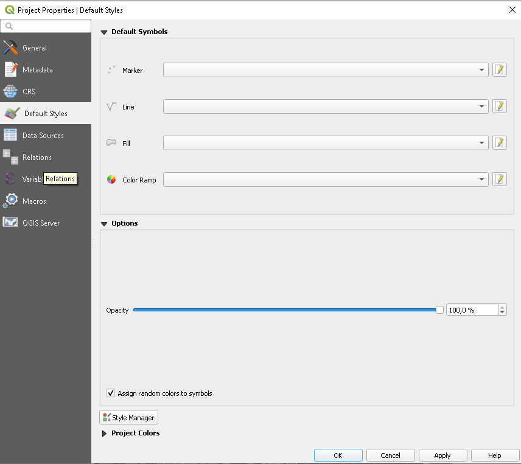

- Carreguem les capes **granges** i **Munis_Emporda_Purins** del geopackage **Purins_Emporda** que vam fer servir per al tema 4 d'aquest curs.

- Obrim el **Layer Styling** amb la tecla F7.

Vegem alguns exemples de simbolització:

Símbol únic
###########

Amb el símbol únic o **single symbol** totes les entitats de la capa (en aquest cas punts) es representaran amb el mateix símbol. Poden canviar la forma, el color, la mida, la rotació i altres propietats al nostre gust.

- Representem les granges porcines amb un diamant de mida 4 i una orientació de 60º amb el color que decidiu.

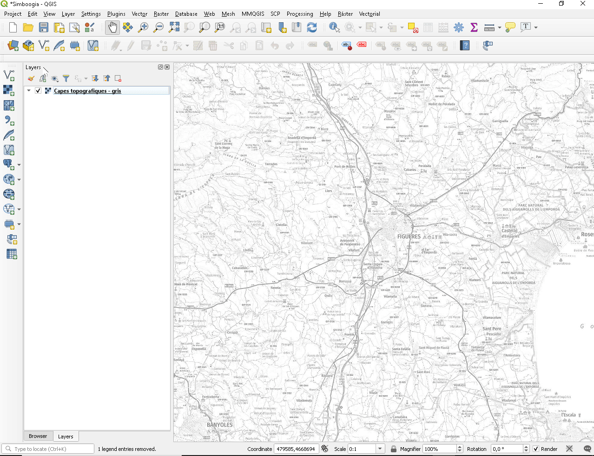

Categoritzat
############

A banda de l'assignació d'icones de simbologia única, també podem utilitzar els valors presents en alguna de les columnes de la taula d'atributs de la capa. Quan volem representar valors qualitatius farem servir una simbolització per categories o **Categorized** en la qual a cada valor o categoria se li assigna un símbol.

- Simbolitzem la capa **Granges** en base al municipi on es troben. Per fer això farem servir el camp **NOM_MUNI**

  + A l'apartat **Symbol** escollim el símbol que farem servir per representar les granges.
  + Posteriorment classifiquem per classes.

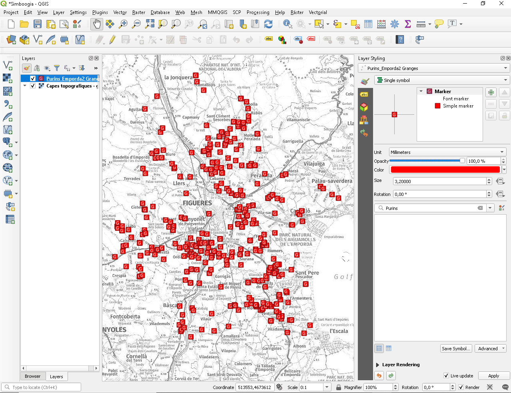

Si el color d'una categoria no ens agrada o es pot confondre amb un altre, es pot canviar individualment fent doble clic sobre el símbol en qüestió.

Graduat
#######

Quan volem representar un atribut quantitatiu o numèric farem servir **Graduated**. Aquesta tècnica ens permet classificar els valors numèrics en classes o intervals. Aquests intèrvals es poden definir manualment o fent servir un mètode de classificació

Mètodes de classificació de valors numèrics per símbols graduats
~~~~~~~~~~~~~~~~~~~~~~~~~~~~~~~~~~~~~~~~~~~~~~~~~~~~~~~~~~~~~~~~

Pel que fa a les tècniques o mètodes de classificació de valors numèrics, QGIS ens ofereix les següents opcions:

**Equal interval**
    Com el seu propi nom indica, aquest mètode el que farà és generar classes de la mateixa mida o rang de valor. Així, si el rang de valor de la nostra capa va de 0 a 100 i definim 10 classes, amb aquest mètode se'ns crearan classes de 0-10, 10-20, 20-30... fins a 90-100 mantenint per a cada classe una mida de 10 unitats.

**Equal count (Quantile)**
    Aquest mètode, al contrari del que acabem de veure, basant-se en el nombre d'elements a classificar i el nombre de classes a crear, definirà l'amplitud d'aquestes classes amb l'objectiu que a cadascuna d'elles hi hagi el mateix nombre d'elements.

**Natural breaks**
    Aquest algorisme de classificació el que intenta és trobar agrupacions naturals de les dades, amb l'objectiu de generar un nombre determinat de classes o rangs de valors.

**Logarithmic scale**
  Utilitza el logaritme d'una quantitat en lloc de la mateixa quantitat. Un exemple senzill d'escala logarítmica mostra divisions igualment espaiades en l'eix vertical d'un gràfic marcades amb 1, 10, 100, 1000, en comptes d'1, 2, 3, 4. En aquest cas, el sistema defineix el número d'intervals necessaris per cobrir tots els valors. Per exemple, si el rang de valors va de 50 a 3000 es generaran tres classes: 50-100 (10^2); 100-1000 (10^2-10^3) i 1000-10000 (10^3-10^4). L'usuari podrà reduir el número de classes, però no augmentar-lo.

**Standard deviation**
    Aquest mètode, calcula la mitjana de cada conjunt de dades, i genera un determinat nombre de classes o rangs de valors basats en el valor de la desviació estàndard de la mitjana.

**Pretty breaks**
    Aquesta classificació es basa en el *pretty algorithm* del paquet estadístic R. Aquest és un algoritme es basa a generar classes, categories o rangs de dades basats en nombres enters.

En funció de la informació que vulguem transmetre, és aconsellable utilitzar una o altra tècnica.

- Experimentarem  amb les diferents tècniques de classificació dels valors d'una mostra, a fi i efecte de veure les diferències existents a l'hora de mostrar una informació, i com pot variar el missatge que se'n desprèn. Per a la present pràctica, farem servir la capa **Munis_Emporda_Purins**. Què succeeix quan mostrem la informació relativa als kilograms de nitrogen produïts per cada municipi (**Kg_Nitro**) segons **Equal intervals**, **Equal count**, o segons la **Logarithmic scale**?

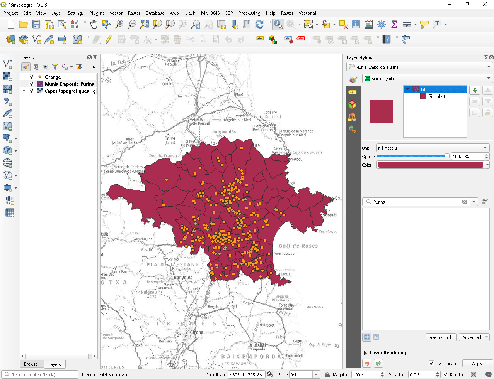

Mètodes de representació de símbols graduats
~~~~~~~~~~~~~~~~~~~~~~~~~~~~~~~~~~~~~~~~~~~~

Quan treballem amb capes de **punts** i de **línies** podem fer servir dos mètodes per representar un valor numèric de forma graduada: **Color** i **Size**. Amb el primer, totes les entitats es representen amb una paleta de colors graduats tal com hem vist en el exercici anterior. En el segon cas, els símbols augmenten la seva grandària de forma gradual en funció de l'intèrval de valors en el que es trobin.

- Representem les granges segons els Kg de nitrogen produïts anualment i les classifiquem en 4 classes segons el mètode de **ruptures naturals** amb un símbol graduat.

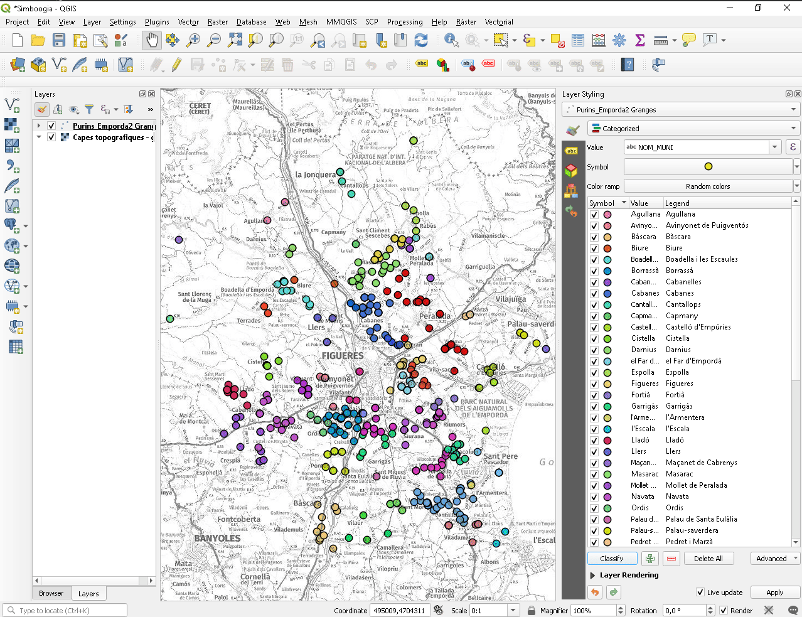

Basat en regles
###############

QGIS ens ofereix, a banda d'aquestes tècniques de classificació predefinides, l'opció de definir les nostres categories en funció d'un conjunt de regles o normes. Així doncs, podrem per exemple, definir una categoria en funció dels valors existents en dos o més camps de la nostra taula d'atributs.

- En el següent exemple es representaran les granges del municipi de Cabanes que produeixen més de 5000 Kg. de nitrogen anual i aquelles del mateix municipi que produeixen menys de 500 Kg.

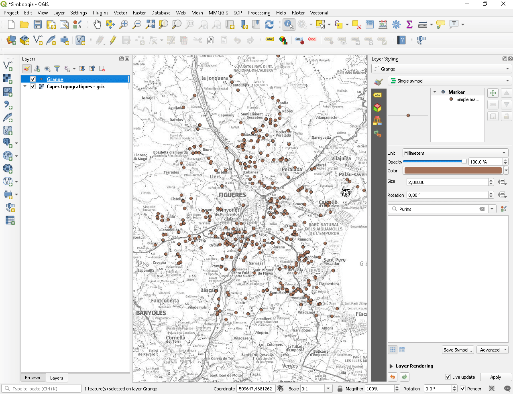

Desplaçament de punts
#####################

Com el seu nom indica, es tracta d'un mètode de representació exclusiu per capes de punts. Permet desplaçar els punts a una distància especificada per l'usuari de forma que no se solapin entre ells.

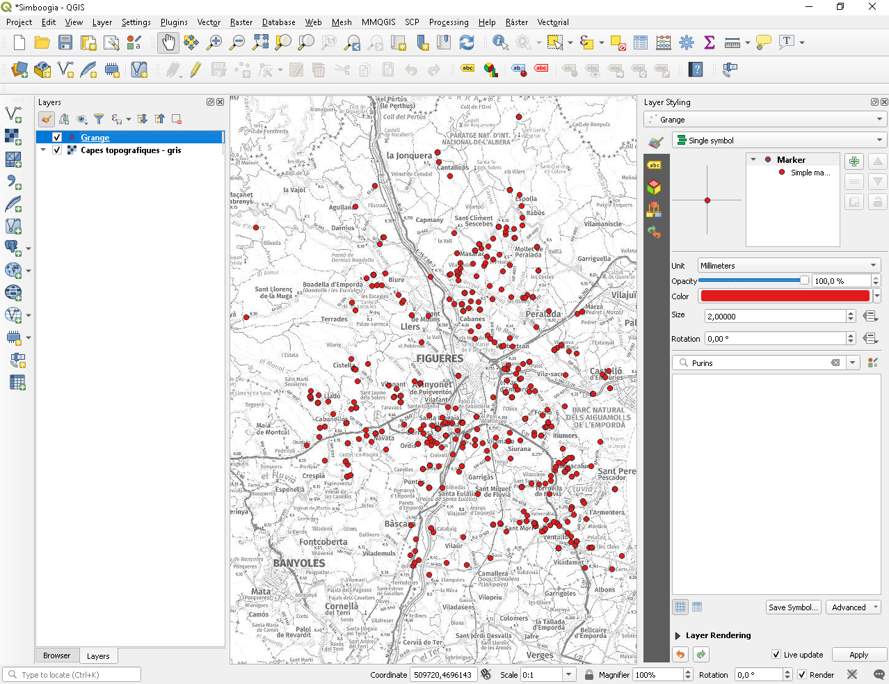

Agrupaments
###########

Com l'anterior, també és un mètode exclusiu per capes de punts. Amb aquest mètode de representació podem fer *clusters* o agrupaments de punts que es trobin a menys d'una distància específica. Això permet que quan estem a una escala petita, els punts que estan molt propers entre ells es visualitzin com un de sol millorant d'aquesta manera la visualització del mapa. A mesura que augmentem l'escala de la vista els punts s'aniran desagrupant en funció de la distància entre ells. Quant hi ha dos o més punts agrupats, el símbol mostra un número amb el nombre de punts que representa.

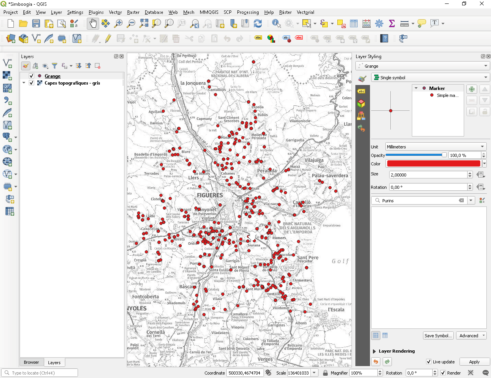

Mapa de calor
#############

També només serveix per a capes de punts. Representa la capa com un mapa d'intensitat on les àrees amb una major densitat de punts es mostraran amb un color més intens.

.. figure:: ./static/Exercici9_11.gif
   :align: center
   :scale: 75%

Inverted polygons
#################

Aquest mètode de representació pinta amb el color definit per l'usuari tota l'àrea de la vista que no queda coberta per l'extensió de la capa de polígons. A més, podem indicar que no mostri els límits entre els polígons. Pot resultar molt útil per generar una màscara d'un mapa de forma que només es mostrin els elements que hi ha dins d'una àrea.

- Exercici: Representem les capes **granges** amb un símbol únic i **Munis_Emporda_Purins** amb un color graduat (natural breaks) segons la quantitat de Kg de nitrogen produïts anualment. Dupliquem la capa **Munis_Emporda_Purins** i la representem amb **Inverted polygons** (amb el color que més us agradi).

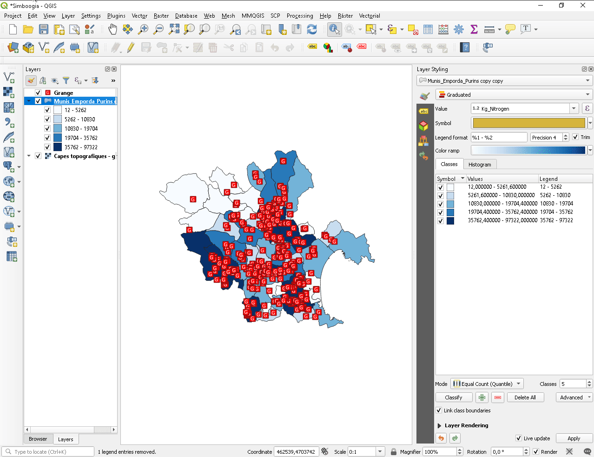

2,5 D
#####

Mètode de representació exclusiu de les capes de polígons. Permet visualitzar els polígons en relleu. Com que el procés de renderitzar és molt lent, s'aconsella utilitzar aquest mètode amb capes de pocs polígons.

- Exercici: representem la capa **Munis_Emporda_Purins** amb una rampa de colors graduats segons la producció anual de nitrogen i li donem a cada municipi una alçada en funció del balanç entre les hectàrees disponibles i les hectàrees necessàries per a abocar purins (**Balanc_170**).

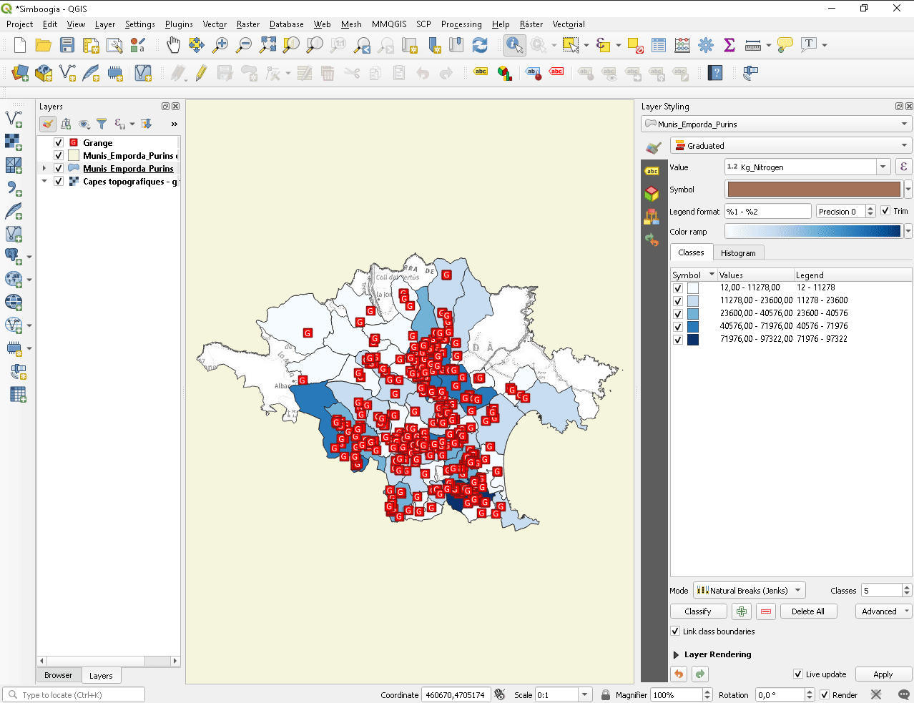

9.2. Elaboració i disseny d’estils, símbols, i gestió de les galeries d’estils
------------------------------------------------------------------------------

Canviar el tipus de simbolització i aplicar efectes
###################################################

A més del mètodes de representació de les capes, QGIS ens ofereix eines i recursos estilístics que permeten millorar la representació de les nostres capes. Per una banda, podem aplicar diferents tipus de simbolització que variaran segons els tipus de geometria amb la que estem treballant (punt, línia o polígon). Per altra banda, podem aplicar efectes que permeten realçar la visualització de les nostres capes.

**Aplicar un efecte**

A continuació aplicarem un efecte a una capa de polígons que representa les illes d'edificis de Barcelona per donar-li un efecte de fals volum.

- Obrim un projecte nou amb EPSG: 25831 i carreguem a la vista la capa **BCN_illes**.
- Modificarem la simbologia única de les illes de cases tal i com es mostra a la imatge animada.

.. figure:: ./static/Exercici9_15.gif
   :align: center
   :scale: 75%

**Canviar el tipus de símbol**

Per defecte QGIS fa servir el tipus de símbol (**symbol layer type**) senzill: **Simple marker** (per punts), **Simple line** (per línies) i **Simple fill** (per polígons) als quals podem donar una mida, gruix, forma, color, efecte, etc. al nostre gust. A més, QGIS ofereix altres tipus de símbols més complexos que es poden ajustar segons diferents paràmetres (color, forma, gruix, distància, etc.). D'aquesta manera podem fer servir trames, diferents tipus de farcit, caràcters, imatges, línies, gradients de colors, etc...

Continuant amb l'exercici anterior, simbolitzarem la capa **BCN_illes** en base al nom del barri al que pertanyen fent servir el mètode **Categorized** i escollint el camp **MAP_ILLA_NOM_BARRI**. Com a tipus de símbol aplicarem **Shapeburst fill**. Posteriorment, li tornarem a aplicar el mateix efecte de volum que li hem donat a l'exercici anterior.

.. figure:: ./static/Exercici9_16.gif
   :align: center
   :scale: 75%

Proveu a representar la mateixa capa amb diferents tipus de símbols i efectes.

Disseny de simbols
##################

QGIS permet, a més, dissenyar la nostra pròpia simbologia mitjançant la combinació de dos o més tipus de símbols. Si a això li afegim que podem importar imatges raster i SVG per crear símbols personalitzats, les combinacions són pràcticament infinites. D'aquesta manera, podem crear el nostre propi catàleg de símbols personalitzats i exclusius.

- A continuació dissenyarem un nou símbol per representar les **granges** amb la combinació de dos tipus de símbols. En aquest cas, combinarem un **Simple marker**  per representar un quadrat amb un **Font marker** per representar un caràcter que serà la lletra **G**.  El símbol resultant el pintarem de color vermell clar amb un contorn vermell fosc i la lletra en color blanc.

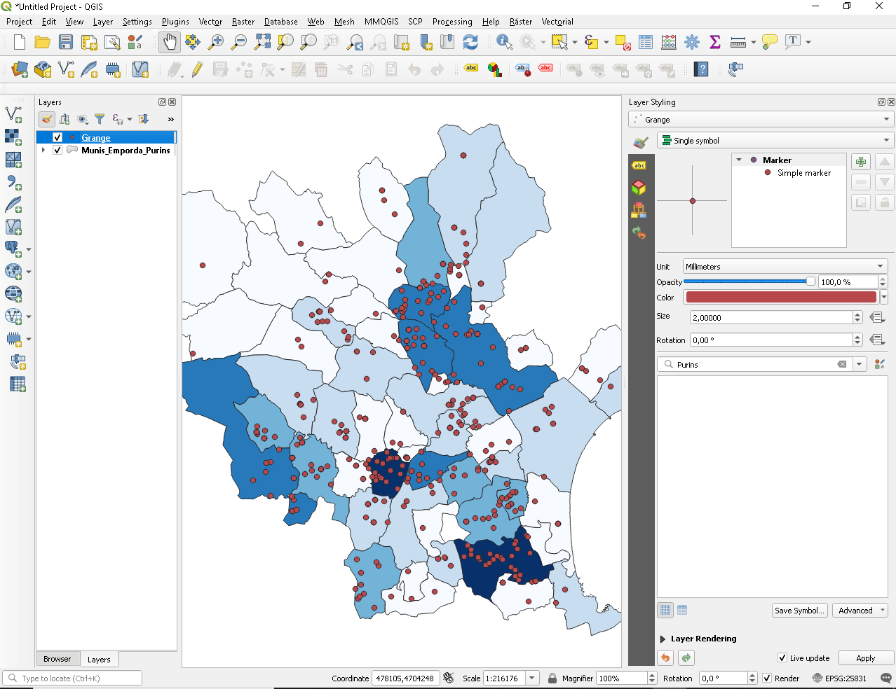

- Ara dissenyarem un nou símbol amb la combinació d'un **Simpler marker** que representi una circumferència amb un **SVG marker** (imatge vectorial)

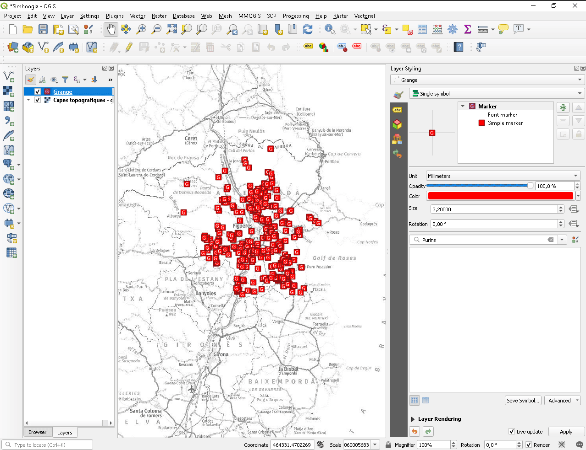

Guardar simbologia
##################

El disseny de trames, icones, tipologies complexes de simbologia personalitzada és sempre una tasca que consumeix temps i que, per tant, paga la pena desar-la amb l'objectiu de poder-la reaprofitar. En aquest sentit, hi ha un parell d'aspectes que convé tenir presents: **on i com guardem la nostra simbologia**.

Una vegada dissenyada la nostra simbologia, ja sigui una simbologia de línia, de punt o de polígon, podem desar-la al sistema per tal que aquesta estigui sempre disponible al QGIS que estigui instal·lat al nostre PC. Així, podem guardar símbol a símbol quan es tracta de simbologia única, o bé podem guardar paletes de simbologia i rangs de classificació en format **SLD** (*Styled Layer Description*), en el format propi de QGIS (**QML**) o si treballem amb un Geopackage podem guardar la simbologia definida per a cada capa dins d'aquesta.

- En el següent exemple guardem la simbologia que acabem de crear per a les granges a dins del geopackage al qual es troba la capa.

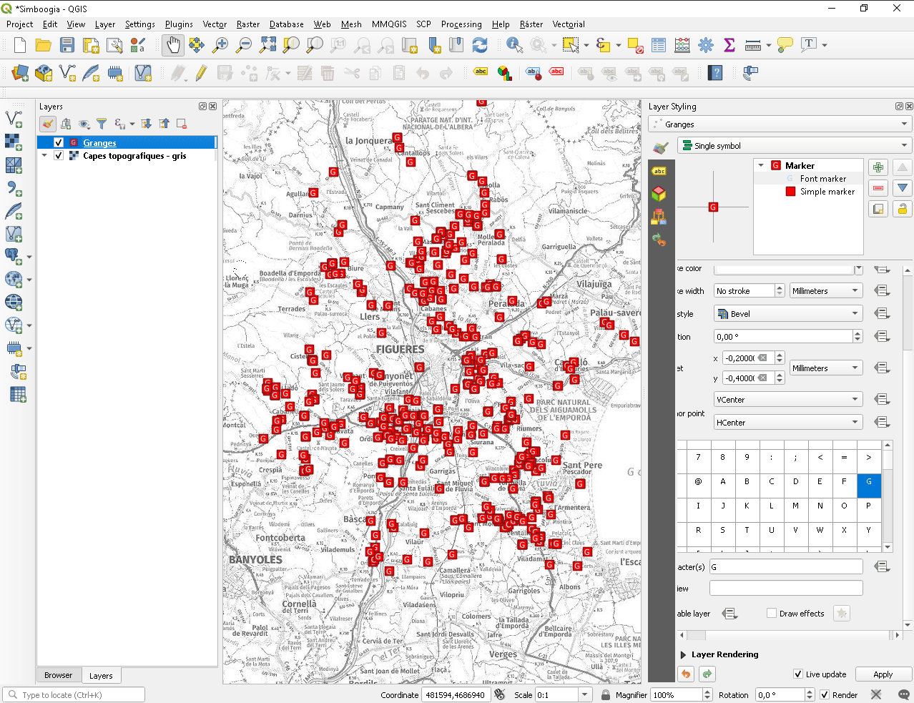

Podem guardar tants estils diferents com vulguem per a cada capa. Si a la finestra **Save Layer Style** activem l'opció **Use as default style for this layer**  (a la part inferior), la capa farà servir aquest estil per defecte cada vegada que la carreguem a un projecte.

A banda d'això, podem gestionar tota la nostra simbologia organitzant-la en grups o categories (per projecte, per entitat, per organització, ...) mitjançant el **Style Manager** de QGIS.

- Guardem el símbol creat fent clic al botó **Save Symbol...**. Li donem un nom (**granges**) i l'assignem una etiqueta (**Purins**) que pot ser una ja existent o una creada de nou. D'aquesta manera, podem crear una col·lecció de símbols per un projecte o un tema en concret. També podem activar **Add to favorites** de forma que aquest símbol aparegui sempre a la nostra biblioteca de símbols.

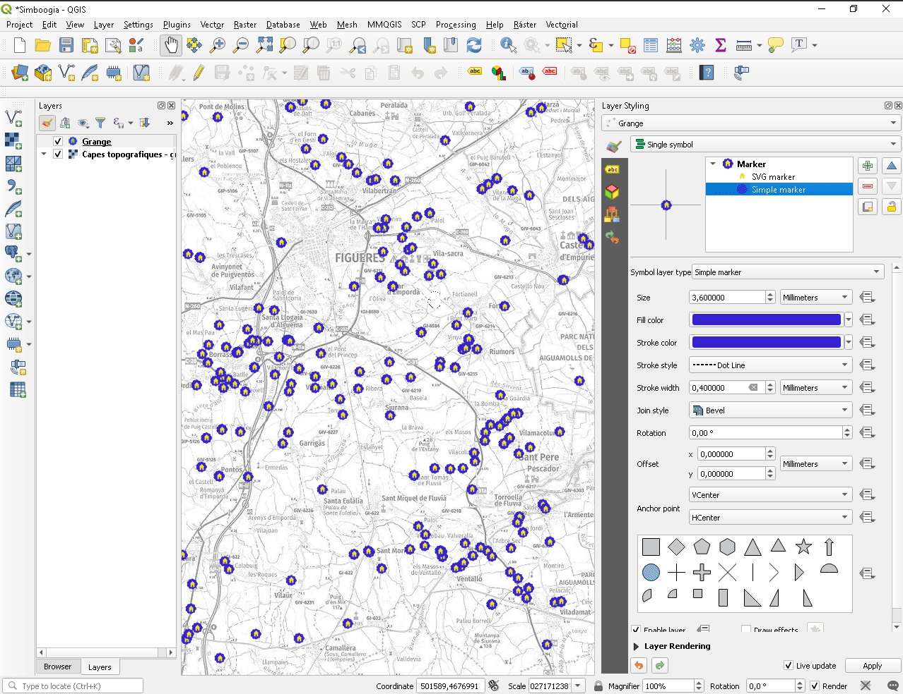

9.3. Aplicació de tècniques d’etiquetatge directe per a capes vectorials
------------------------------------------------------------------------

Igual que succeeix amb les simbolitzacions i tematitzacions, QGIS compta amb una potent eina d'etiquetatge. Per accedir a les opcions d'etiquetatge només cal obrir les propietats de la capa, i dirigir-se a la pestanya **Labels** o obrir el **Layer Styling** amb la tecla **F7** i clicar a la pestanya **Labels**. Des d'aquest apartat, podem configurar:

    * El camp que volem etiquetar
    * La font, l'estil i la mida de la lletra
    * El color i el valor de transparència
    * El format del text
    * El buffer o contorn per a les etiquetes
    * El marc geomètric a les etiquetes
    * L'ombra de les etiquetes
    * La ubicació de les etiquetes
    * L'escala de visualització de les etiquetes

En el següent exercici practicarem l'etiquetatge amb la capa **Munis_Emporda_Purins**

- Carreguem la capa **Munis_Emporda_Purins** del geopackage **Purins_Emporda** i la representem amb un color graduat en base al camp **Kg_Nitro**
- A **Layer Styling** seleccionem **Labels**
- A la finestra d'etiquetatge seleccionem:

  + La capa que volem etiquetar: **Munis_Emporda_Purins**
  + Tipus d'etiquetatge: **Single labels**
  + Camp de la taula d'atributs que conté les etiquetes: **NOM_MUNI**

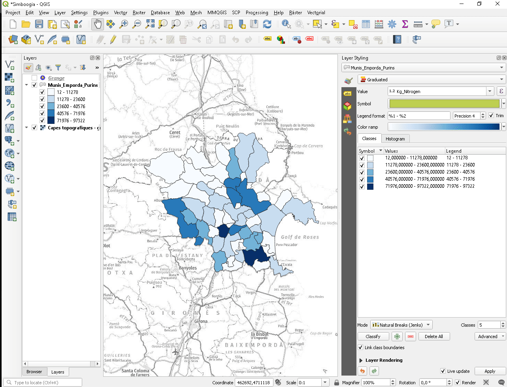

La capa **Munis_Emporda_Purins** mostra una etiqueta amb el nom de cada municipi, amb la font, la mida, el color i les regles de posicionament definides per defecte. A partir d'aquí, podem canviar molts paràmetres per millorar-ne la qualitat de l'etiquetatge.

- Podem configurar la ubicació automàtica de les etiquetes. Aquesta configuració s'aplicarà per a totes les capes amb etiquetes que tinguem al nostre projecte. Les opcions de configuració són:

  + Permetre que les etiquetes que queden parcialment fora de la vista quedin fragmentades.
  + Mostrar totes les etiquetes per a totes les capes (incloses aquelles que se solapin).
  + Mostrar etiquetes que no s'han pogut ubicar (en el cas que tinguem desactivada l'opció de dalt).

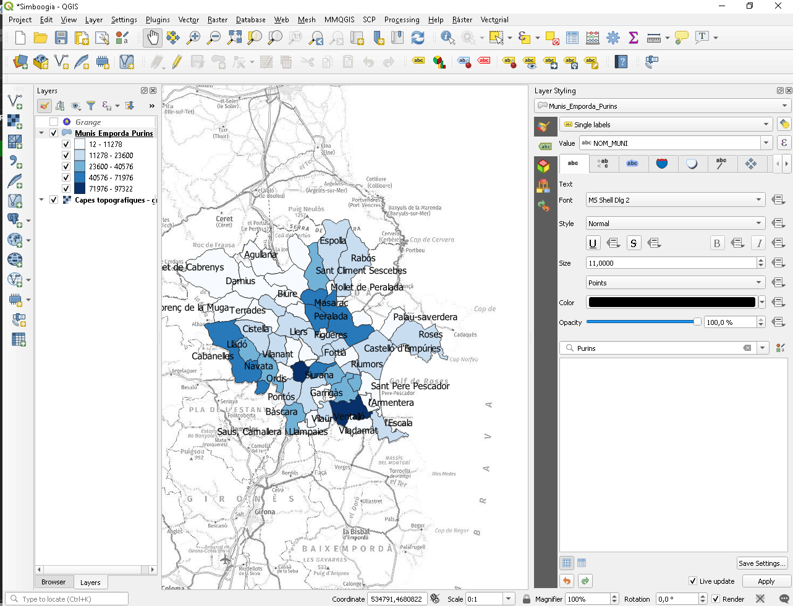

- Ara canviarem l'aspecte del text de les etiquetes.

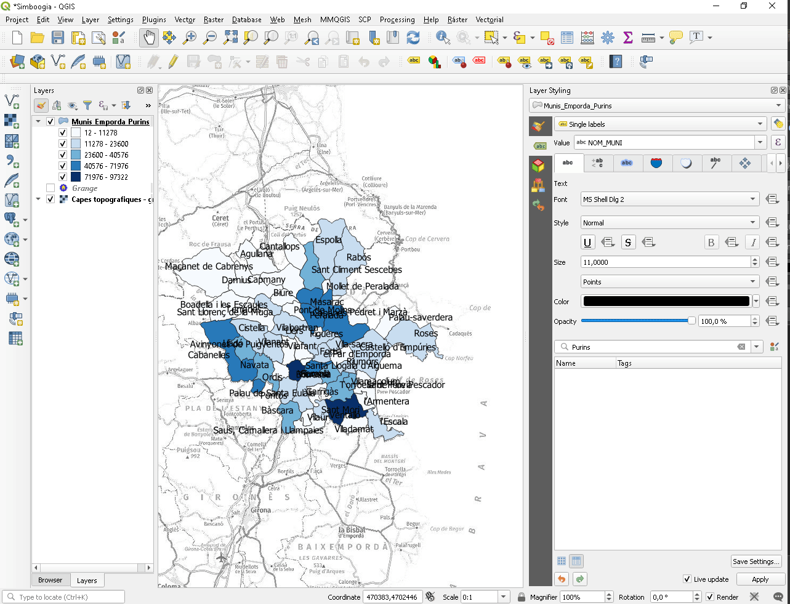

- A continuació anirem a la pestanya **Formatting** i reduirem l'espai entre caràcters, entre paraules i truncarem les etiquetes que tenen dos o més paraules per tal que es mostrin en diferents línies, reduint d'aquesta manera la seva extensió.

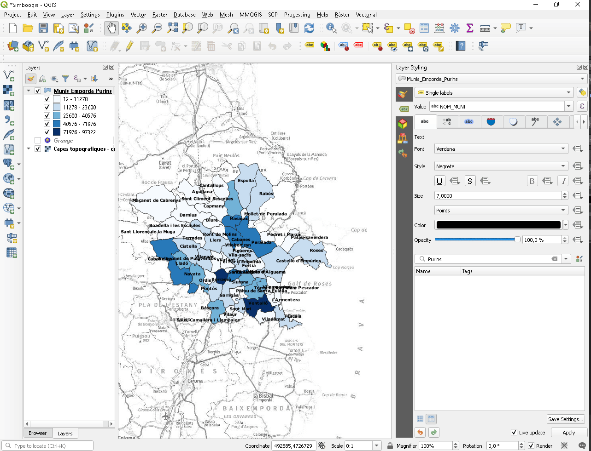

- També podem substituir el text d'una etiqueta total o parcialment per reduir la mida d'aquesta. Per exemple, podem fer que totes aquelles poblacions que comencin amb **'Santa'** es mostrin com **Sta.**

.. figure:: ./static/Exercici9_25.gif
   :align: center
   :scale: 75%

- Per millorar l'aspecte de les etiquetes i diferenciar-les de les etiquetes d'altres capes li podem posar un contorn (**buffer**), un fons o una ombra. Provarem amb un contorn.

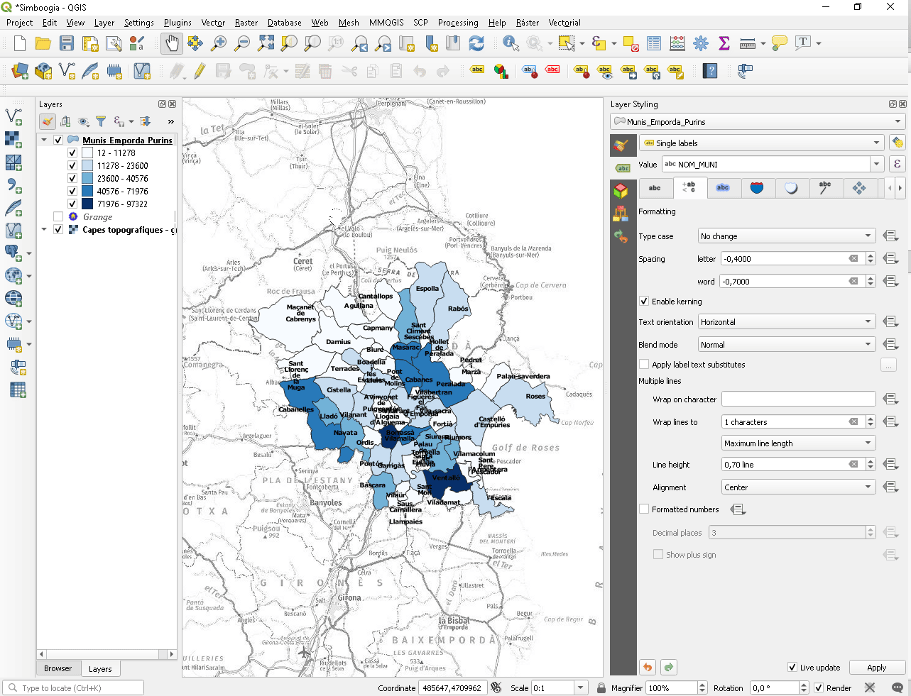

- Depenent del tipus de geometria amb què treballem, tenim diferents opcions d'ubicació automàtica de les etiquetes. Per exemple, si etiquetem una capa de rius (línies) podem definir que les etiquetes segueixin el curs fluvial.

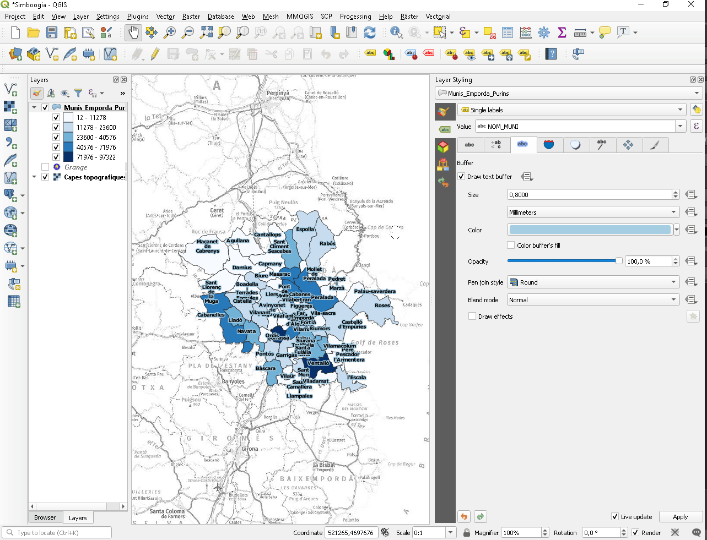

- Per últim podem definir algunes regles de representació de les etiquetes com per exemple:

  + Definir una escala de visualització mínima i màxima.
  + Etiquetar tots els polígons multipart (dos o més polígons que comparteixen un únic registre) o només un.
  + Mostrar totes les etiquetes de la capa, encara que se solapin entre elles.
  + Limitar el número de etiquetes.
  + En el cas de les capes de polígons, mostrar únicament aquelles que estan completament dins del polígon.
  + Eliminar etiquetes menors d'una mida específica.

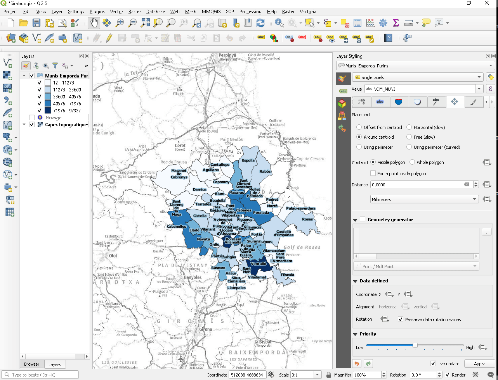

Barra d'eines d'etiqueta
########################

Encara que la majoria de les etiquetes quedin correctament ubicades, és habitual que algunes necessitin certs retocs. Per fer això, QGIS ofereix la possibilitat d'editar cada etiqueta individualment a partir de les opcions que ens ofereix la barra d'eines d'etiqueta.

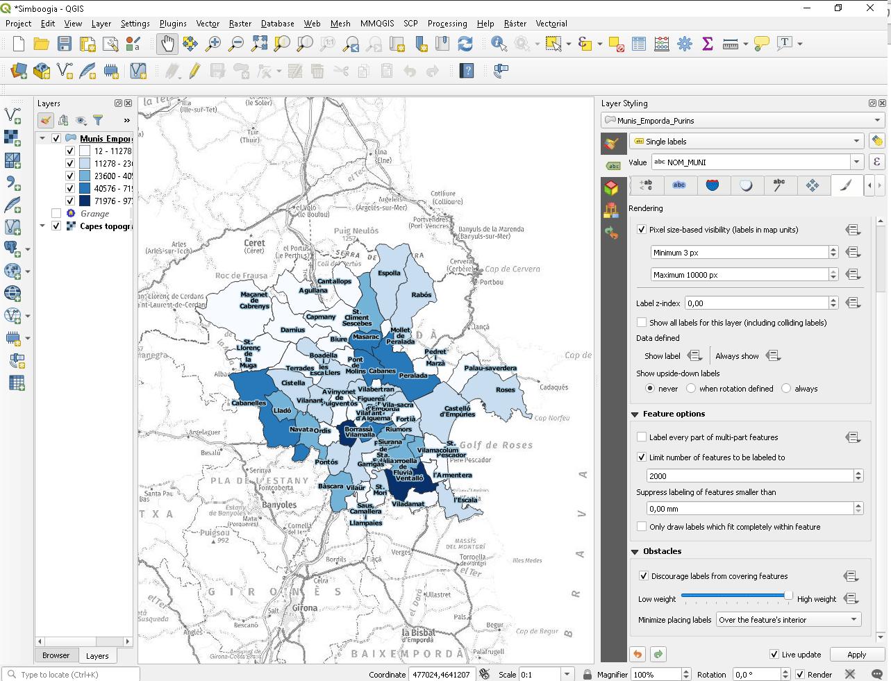

**Canviar propietats d'una etiqueta**

Aquesta opció permet editar una etiqueta de forma individual. Un cop seleccionada aquesta eina només hem de fer clic sobre l'etiqueta que volem modificar per obrir la seva corresponent finestra de propietats. Si prèviament hem posat la capa en mode edició també podem modificar el text de l'etiqueta. S'ha de tenir present que canviar el text de l'etiqueta implica canviar el corresponent valor a la taula d'atributs.

**Fixar etiquetes**

Quan una etiqueta està fixada no es veu afectada per les propietats d'ubicació que s'apliquin a partir d'aquest moment per a les etiquetes d'una capa. Si, per exemple, en la pestanya **Ubicació** modifiquem la ubicació general de les etiquetes d'una capa, aquelles etiquetes fixades romandran en la ubicació que tenien en aquell moment, i no en la seva ubicació original.
Mitjançant aquesta funció podem seleccionar aquelles etiquetes que voleu fixar fent clic sobre aquesta. Per treure la fixació d'una etiqueta mantingueu premuda la tecla **Shift** al mateix temps que feu clic sobre l'etiqueta.

**Resaltar etiquetes fixades**

Fent clic amb aquest botó permet destacar les etiquetes fixades.

**Amagar etiquetes**

Un cop seleccionada aquesta eina podem amagar una etiqueta fent clic sobre aquesta. Per tornar-les a mostrar, haurem de tornar a fer clic sobre l'entitat o geometria corresponent a l'etiqueta.

**Desplaçar l'etiqueta**

Es tracta d'una eina molt interessant perquè permet modificar la ubicació de les etiquetes individualment i ajustar les que se solapen. Un cop seleccionada l'eina, només hem de fer clic sobre l'etiqueta i arrossegar-lar a la seva nova ubicació. Si tenim activada la funció **Resaltar etiquetes** podem veure que un cop reubicada, l'etiqueta queda fixada.

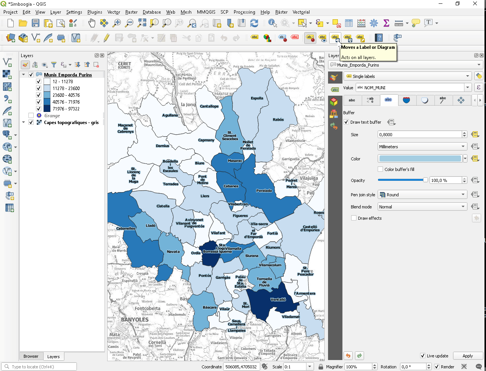

**Rotar l'etiqueta**

Permet modificar l'angle de l'etiqueta. Per rotar una etiqueta es necessari fixar-la prèviament.

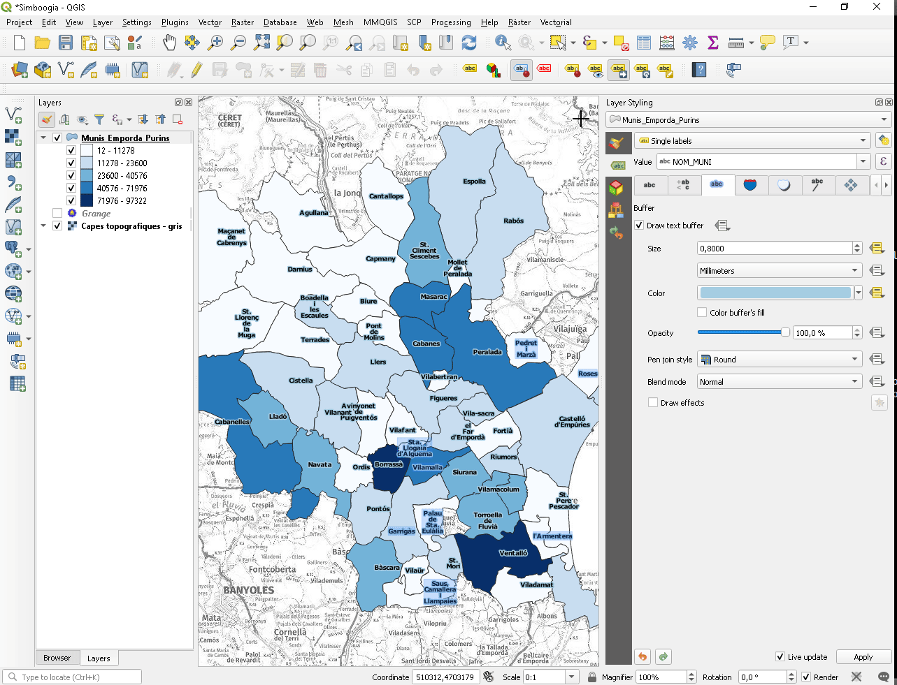

**Mostrar o amagar etiquetes no ubicades**

Si a la configuració d'ubicació automàtica de les etiquetes **Automated placement settings (applies all layers)**, tenim desactivada l'opció **Mostrar totes les etiquetes per totes les capes (incloses les que se solapen)**, les etiquetes que es solapen no es mostren al mapa. Amb aquesta funció es mostraran al mapa aquestes etiquetes i podrem editar-les o moure-les a una millor ubicació.

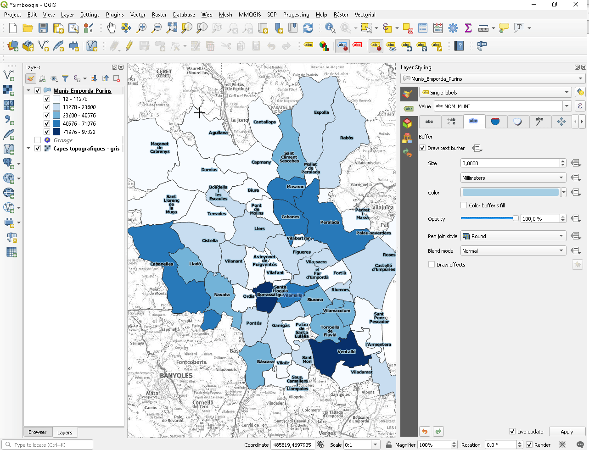

Etiquetatge basat en regles
###########################

En el pas anterior hem etiquetat una capa amb el mateix tipus d'etiqueta per a tots els elements, el que no permet diferenciar entre categories diferents i dificulta la correcta lectura i interpretació del mapa. A continuació, veurem com es poden etiquetar capes que contenen categories diferents. En aquest exemple, afegirem una etiqueta amb el nombre de granges que té cada municipi. Definirem una mida d'etiqueta en funció de la producció de nitrogen de cada municipi. A més a més, afegirem a l'etiqueta el text **Nº Granges** per saber a què es refereix la xifra de l'etiqueta. Crearem tres regles per definir tres mides d'etiqueta:

        - Municipis que aboquin més de 50.000 Kg de nitrogen.
        - Municipis que aboquin entre 15.000 i 50.000 Kg de nitrogen.
        - Municipis que aboquin menys de 15.000 Kg de nitrogen.

- Accedim de nou a la finestra d'etiquetatge i al desplegable de la part superior seleccionem l'opció **Etiquetatge basat en regles**.

- A la finestra **Rule-based labeling** fem clic al signe **+** per afegir una o més regles.

- Per defecte, apareix definida una regla general que afecta totes les etiquetes de la capa i que és la que hem fet servir per etiquetar els municipis.

- Afegim una nova regla i fem doble clic per editar-la. A l'apartat **Description** podem anomenar aquesta regla com **Granges més de 50.000 Kg. de nitrogen**.
- Seguidament fem clic a **Filter** per seleccionar mitjançant una expressió SQL que entitats s'etiquetaran en base a aquesta regla.

.. code-block:: sql

  "Kg_Nitrogen" > 50000

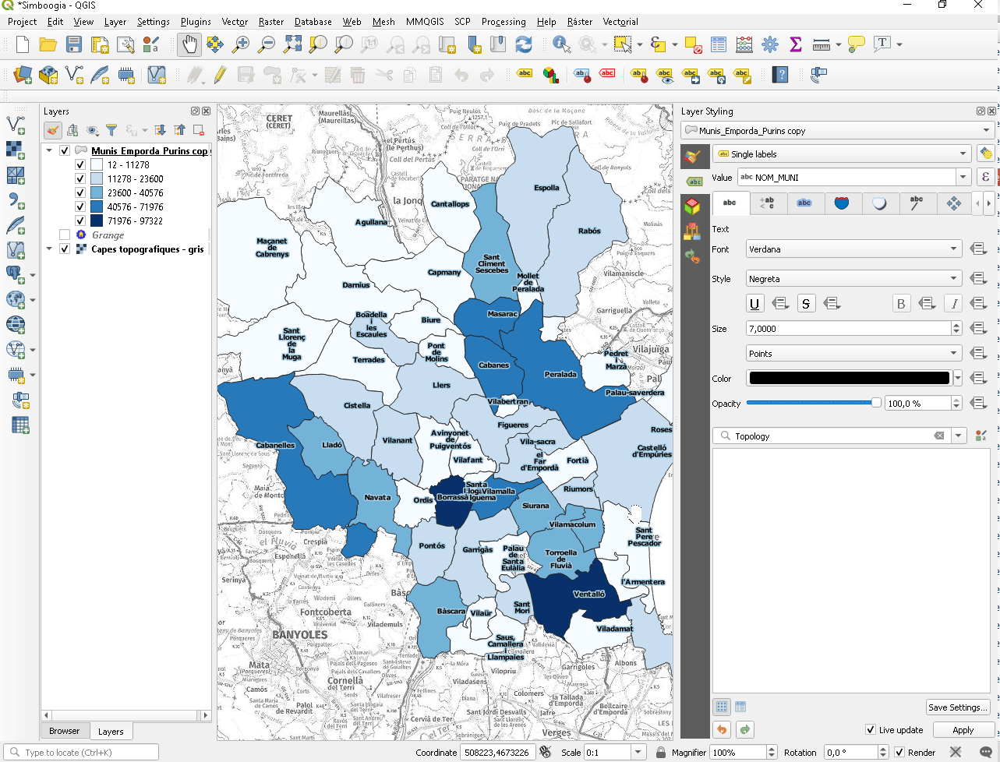

- Un cop filtrades les etiquetes a l'apartat **Labels** definirem com es mostraran tal i com hem fet amb l'etiquetatge simple. Això ho farem dins l'apartat de **Label**.
- Primer de tot, seleccionarem el camp que conté el text de les etiquetes **Nombre_granges**. A més, afegirem el text **Nº Granges**.
- Seguidament, definirem la font, la mida, el color, el fons del text, així com altres paràmetres de visualització i ubicació, tal i com hem vist anteriorment.

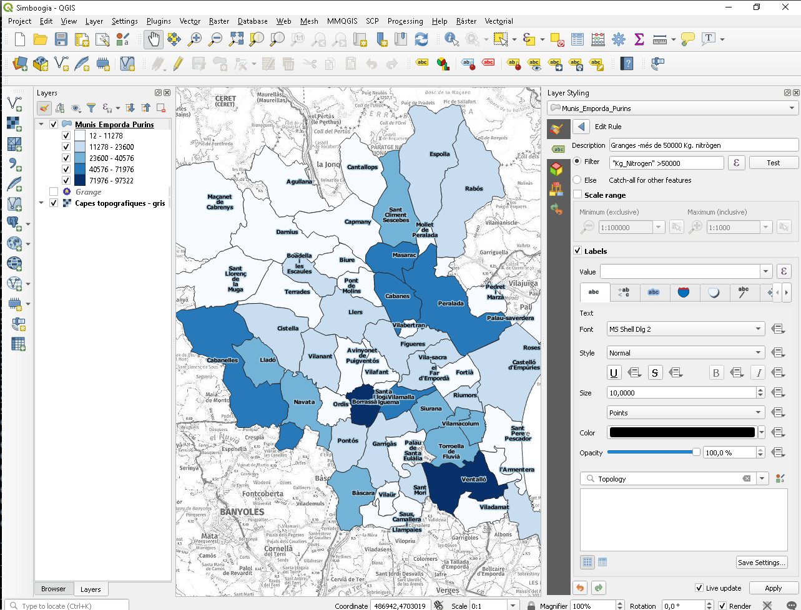

Afegim les regles que falten i fem que l'etiqueta sigui més petita i/o tingui un altre color, o que només es mostri a partir de determinada escala. També podrem editar les etiquetes de forma individual, tal i com hem vist anteriorment.

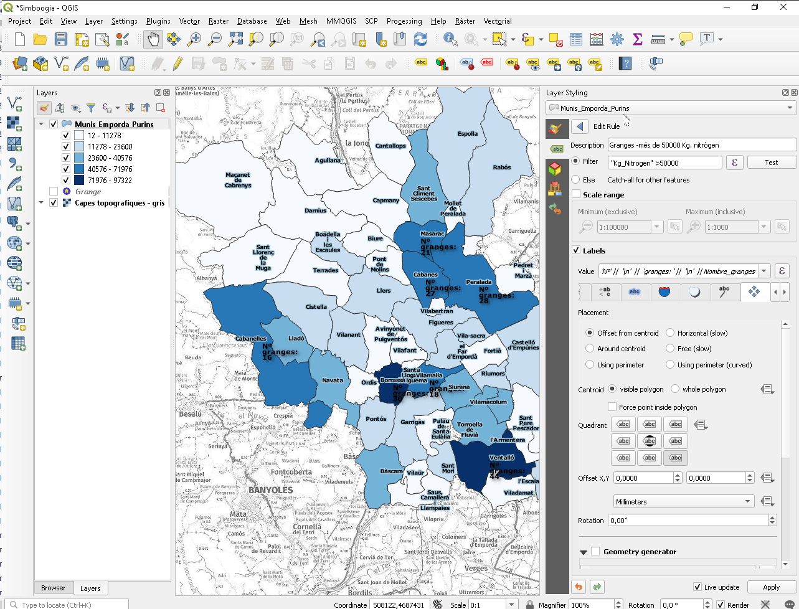

9.5. Aplicació de tècniques de simbolització de dades raster
------------------------------------------------------------

QGIS ens ofereix la possibilitat de carregar i tematitzar capes raster (ja siguin superfícies de dades contínues, com discretes) mitjançant l'aplicació de diferents paletes de colors.

Tots els aspectes relatius a la tematització de capes raster, en QGIS, es gestionen des de les propietats de la capa a les quals hi podem accedir, bé des del menú **Layer >Layer properties...**, o bé clicant **F7** per obrir **Layer Styling**.

- Obrim el MDE de Girona que van generar en un exercici anterior: **GiroMDE**

Per defecte, a QGIS les capes raster es mostren mitjançant una paleta d'escala de grisos, ajustada als valor mínims i màxims de la imatge. En el cas de que la imatge tingui valors excepcionals extrems pot passar que la major parts dels píxels del raster es concentrin en una petita franja de valors i, per tant, es representin amb el mateix color. Seria el cas del MDE de Girona de la imatge següent la qual té com valors mínim i màxim -13274 i 9228, respectivament. Com que pràcticament tots els píxels es concentren a la franja de 0 a 400 m., aquests valors es mostren amb el mateix color. Per evitar això, podem ajustar els valors mínim i màxim per deixar fora de la visualització els valors extrems.

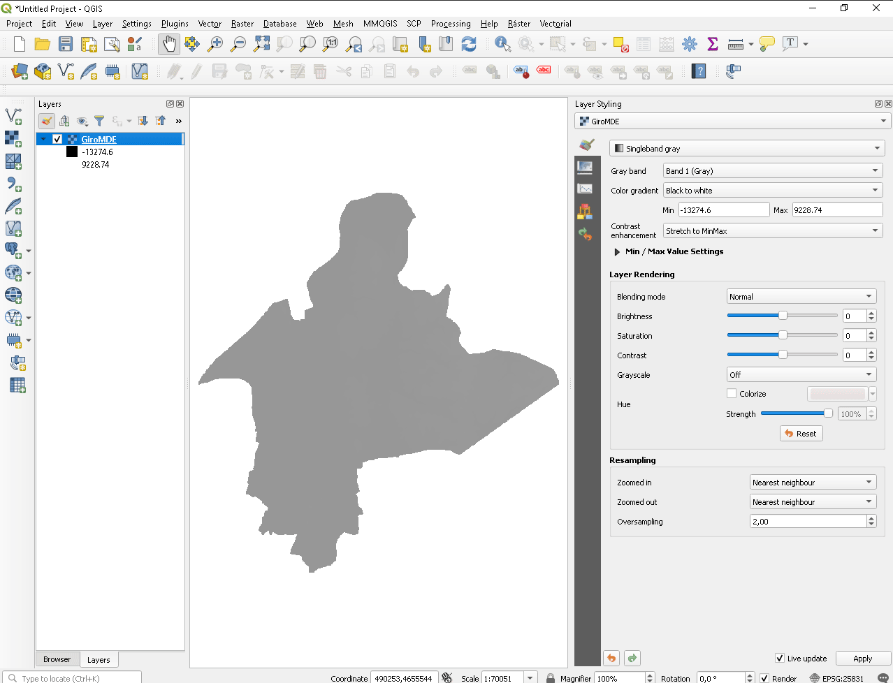

La paleta que apareix per defecte es pot modificar en funció de les nostres preferències.

.. note:: **Exercici pràctic**: Carregarem una capa raster a QGIS i li aplicarem una paleta de gradient de colors de les que ens apareixen per defecte.

- A continuació, representarem amb una paleta de colors. Per fer això, seleccionarem l'opció **Singleband pseudocolor**. A continuació, obrirem el desplegable de l'apartat **Generate new color ramp** i podrem accedir a un conjunt de paletes de colors predefinides. Seleccionarem la paleta que duu per nom **RdYlGn**, activarem la casella **invert** per indicar que els valors mínims del MDE es mostrin en tons verds mentre que els valors màxims, es mostraran de color vermell i els valors intermedis ho faran amb tons groguencs.

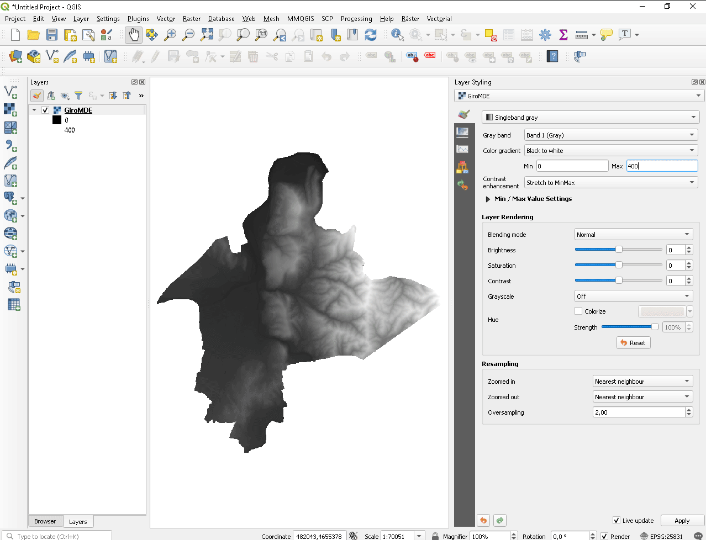

També podem canviar el tipus de representació de les dades a l'apartat **Interpolation**.

- Si seleccionem **Discrete**, el salt de colors d'un interval a un altre no es fa de forma gradual com a **Linear**, sinó que hi ha un salt. Encara que visualment no es tan agradable, aquesta representació permet visualitzar exactament a quin interval es troba cada píxel.

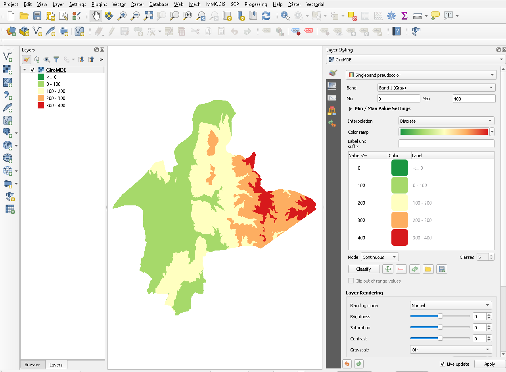

- El mètode d'interpolació **Exact** només mostrarà aquells píxels que tenen un valor exactament igual al dels intervals. En aquest cas, pot ser que no es visualitzi res.

- Una altra representació molt interessant en el cas d'un MDE és el **Hillshade** que mostra el raster en forma de relleu amb ombres. Des d'aquí podrem canviar alguns paràmetres com són l'azimut, l'orientació, l'altitud, etc.

.. figure:: ./static/Exercici9_40.gif
   :align: center
   :scale: 75%

A banda d'aquestes opcions inicials que acabem de veure, també podem modificar algun paràmetre addicional en relació a la paleta de colors seleccionada, com per exemple el valor de **contrast**, la **brillantor** o la **saturació**.

A més, en el cas que vulguem que la capa raster superior (per exemple, un model digital del terreny) es fusioni amb la capa raster que té immediatament per sota, les noves versions de QGIS ens ofereixen un bon assortit d'opcions de **blending**.

.. figure:: ./static/Exercici9_41.gif
   :align: center
   :scale: 75%

Pel que fa les paletes predefinides, a banda de les que originalment veiem per defecte, podem accedir a una col·lecció extra de paletes si ens dirigim a l'apartat *New color ramp* des d'on podrem definir les nostres pròpies paletes de colors (**Gradient**, **Random**, **Color Brewer**), o bé accedir a la galeria de paletes de colors **cpt-city**.

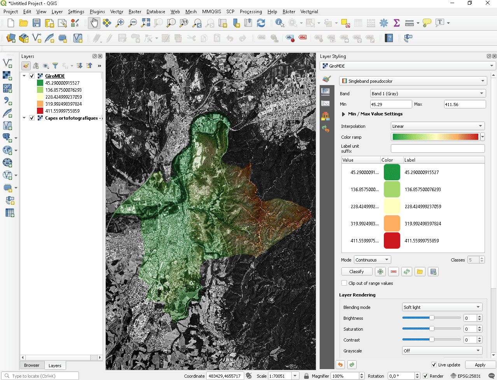

10. Disseny i visualització de dades
====================================

El mòdul de disseny de mapes de QGIS ens ofereix un ampli ventall de possibilitats en el camp del disseny mapes i plànols. Al llarg dels següents punts veurem, de forma resumida, algunes de les tasques i eines més interessants des del punt de vista del disseny de mapes.

10.1. Disseny de composició de mapes
------------------------------------

Per poder accedir a la finestra de composició de mapes amb QGIS cal, en primer lloc, dirigir-nos al menú **Project > New Print Layout** o bé al menú **Project > Layout Manager** per tal de crear una composició nova (**primer_mapa**).

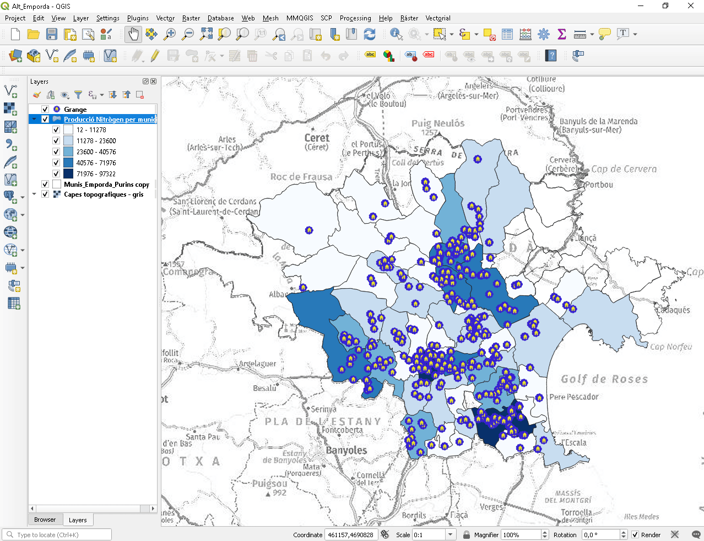

Una vegada s'accedeix a la finestra pròpia del dissenyador de mapes, el primer aspecte que haurem de modificar és els paràmetres generals relatius a la composició, dins el menú **Layout>Page Setup...**. Entre d'altres aspectes, caldrà definir la mida de la nostra composició (p.e. **DIN A4**), l'orientació (**vertical** o **horitzontal**), i la resolució de l'exportació dels nostres dissenys a imatges (p.e. **300 ppp**). Una vegada configurats aquests aspectes, podem definir també l'espaiat (p.e. **5,00 mm**) de la **grid** que ens servirà de referència per a la col·locació dels elements del mapa, i que podem fer visibles des del menú **View>Show grid**. Al menú **View** també hi activarem l'opció **Snap to grid** que permetrà ajustar la col·locació dels elements a la grid.

Inserir un mapa
###############

El següent pas a realitzar és la inserció dels elements que tinguem presents a la nostra vista de mapa. En el cas que es presenta aquí, es vol representar un mapa sobre la producció anual de Kg. de nitrogen procedents de les granges porcines de l'Alt Empordà. Així doncs, a la nostra finestra de mapa tindrem carregada la capa de municipis de l'Alt Empordà, simbolitzada en base a aquesta dada, i el WMS del ICGC amb el topogràfic en blanc i negre. Per inserir aquests elements a la vista podem fer-ho, o bé mitjançant la icona **Add new map**, o bé a través del menú **Add Item> Add Map**.

Una vegada seleccionada l'eina en qüestió, situarem el cursor prop de l'angle superior esquerre de la composició, realitzarem un clic i sense deixar anar el botó esquerre del ratolí dibuixarem el quadre/rectangle que contindrà en nostre mapa. En deixar anar el botó esquerre del ratolí, dins l'espai que acabem de definir, es dibuixarà el contingut del mapa.

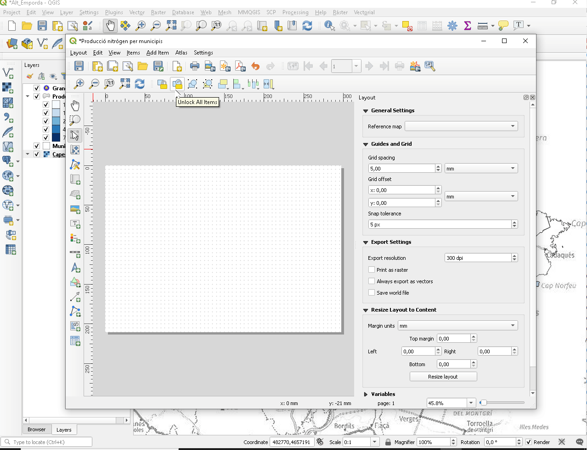

Una vegada inserit el nou mapa, dins la pestanya **Item properties** podem controlar tots els aspectes relatius al mapa, entre els quals convé destacar:

    * **Escala de visualització**
    * **Quadrícula de coordenades** (**Grid*)
    * **Coordenades al marge del mapa**

En cas de no tenir visible la pestanya **Item Properties**, podem activar-la des del menú **View>Panels**.

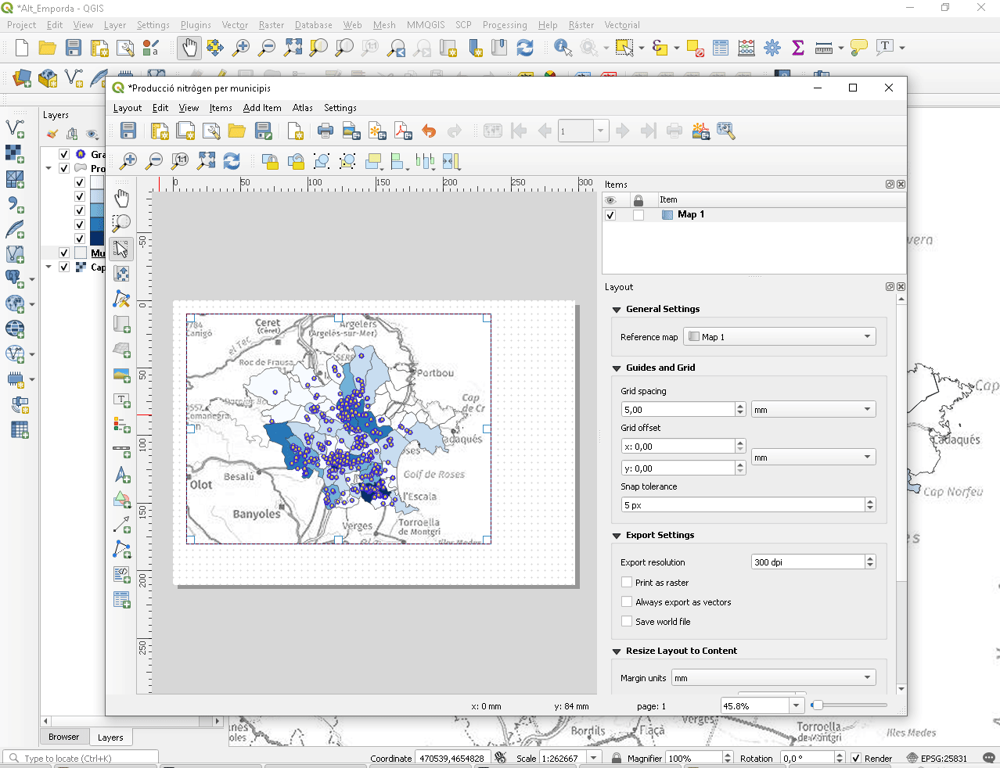

A banda del control que podem exercir sobre el mapa mitjançant la combinació de valors dels paràmetres **Escala de visualització** i **Extents**, amb la icona **Move item content** podem desplaçar (**pan**) el contingut del mapa per tal d'enquadrar-lo.
Amb el botó **Select/Move item** també podem modificar la mida i la posició de l'ítem seleccionat, en aquest cas el mapa.

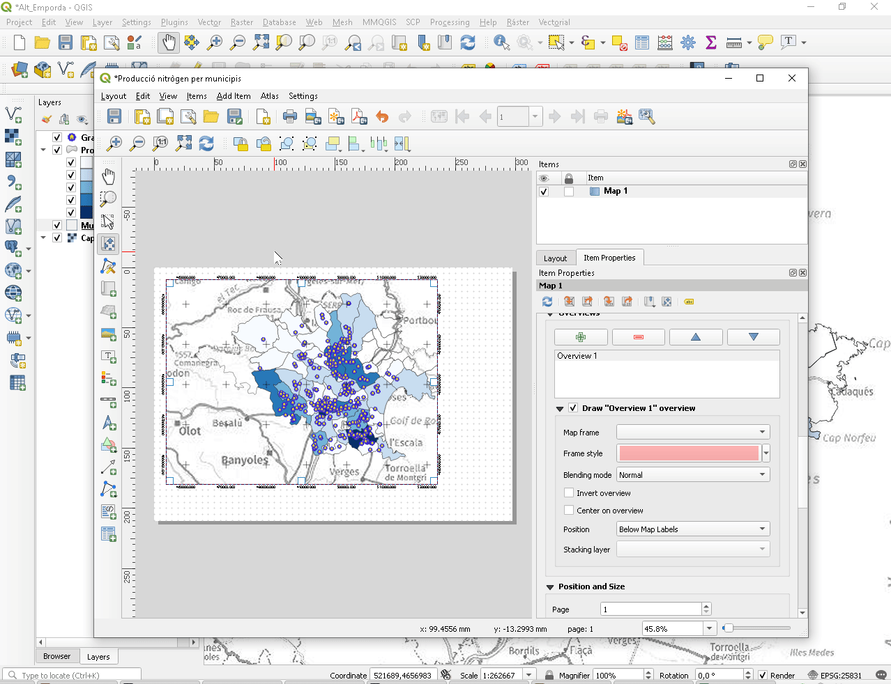

Podem canviar el color i gruix del marc del mapa .

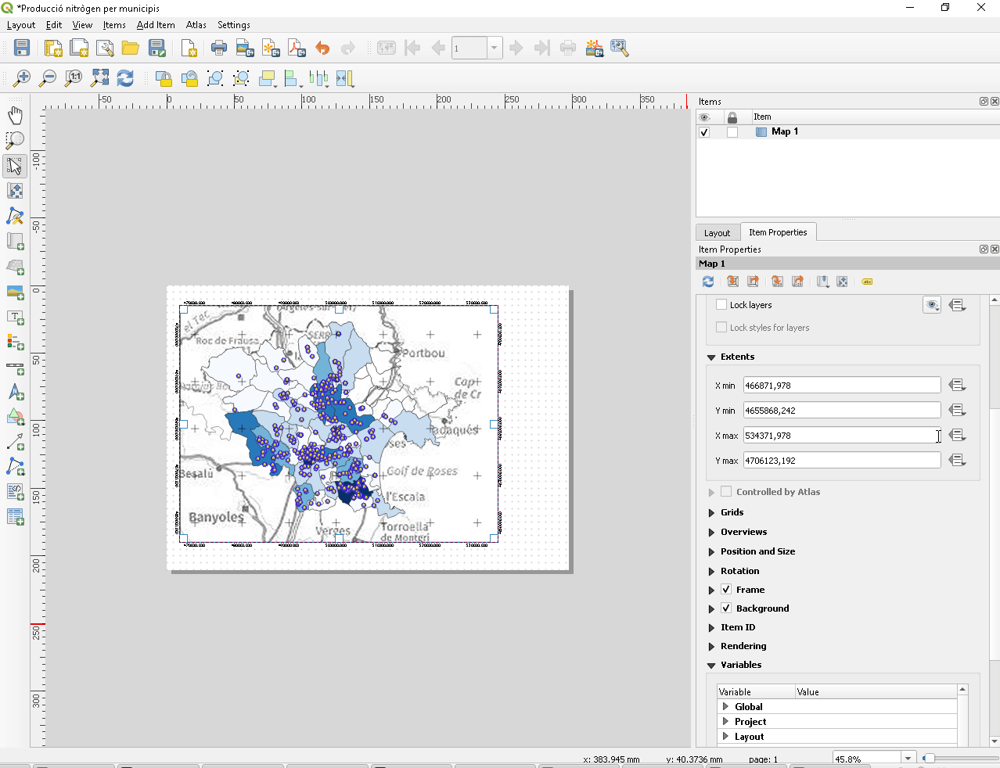

Podem fer servir la **barra d'eines de navegació** (**Navigation Toolbar**) per ampliar o reduir la visualització del mapa, així com per veure-la al 100%. Aquesta darrera opció permet veure com es visualitzarà el mapa a mida real un cop imprès.

Inserir elements marginals del mapa
###################################

Entenem com a "elements (**Item**) marginals del mapa" la llegenda, l'escala del mapa, la fletxa de nord, les icones, els textos... La inclusió de tots aquests elements es duu a terme de la mateixa manera que en el cas del mapa principal. Així, només cal seleccionar l'eina adequada en cada cas (**Adds a new Legend to the Layout**, **Adds a new a Scale Bar to the Layout**, **Adds a new picture to the Layout**, **Adds a new Label to the Layout**...). Una vegada inserits cadascun d'aquests elements, els podrem anar seleccionant un a un, clicant prèviament sobre la icona **Select/Move item**. Cada tipus d'element té unes propietats que podem canviar des de la pestanya **Item Properties**. Quan seleccionem un element, el contingut de **Item Properties** canvia.

Amb l'eina seleccionada, farem un clic sobre cadascun dels elements del mapa a fi de situar-los correctament, modificar i ajustar-ne els seus paràmetres des de la pestanya **Item properties**.

**Inserir llegenda**

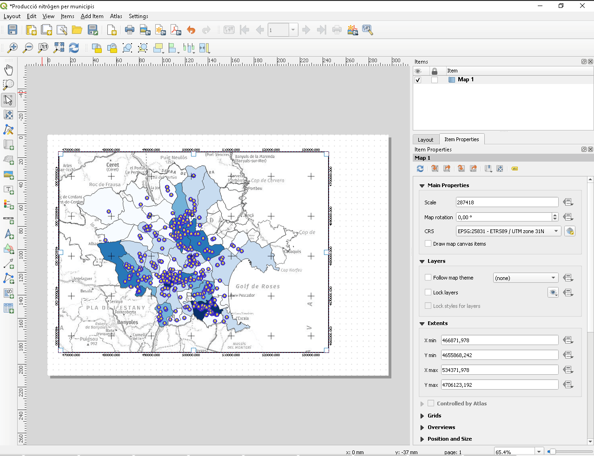

**Inserir escala**

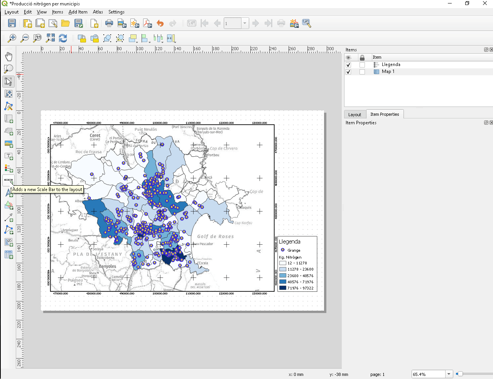

**Inserir fletxa indicadora del nord**

**Inserir marc a la composició**

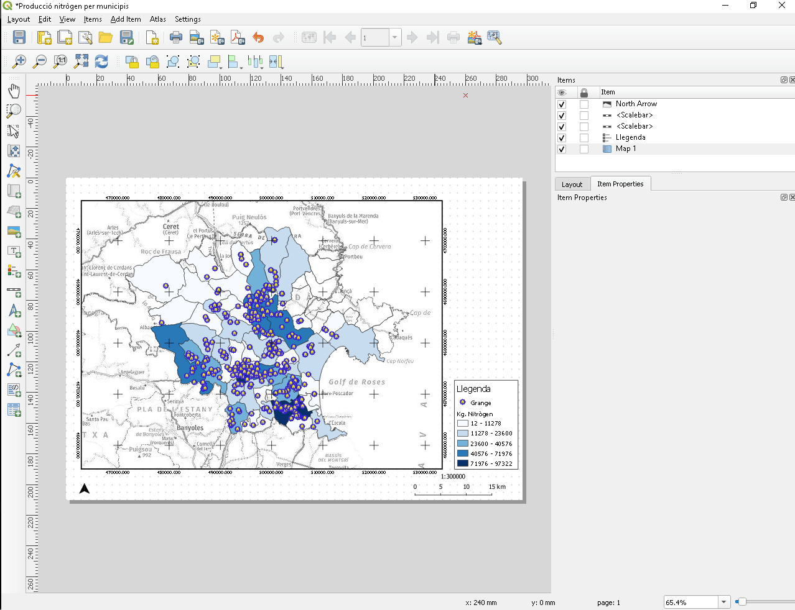

**Inserir títol**

**Inserir un logo**

.. figure:: ./static/Exercici10_14.gif
   :align: center
   :scale: 75%

Inserir un mapa de vista general
################################

Els mapes de vista general, són mapes de suport a la cartografia principal de la composició i que a grans trets, mitjançant un requadre, mostren i situen la part de mapa que s'està representant al mapa principal, en relació a una extensió concreta més gran (per exemple, el terme municipal).

Per incerir un mapa de vista general cal seguir diversos passos:

- Com que el mapa ítem **Map1** està vinculat a la vista del mapa, bloquejarem les capes del mapa per tal que aquest no s'actualitzi amb els canvis que farem a la vista.

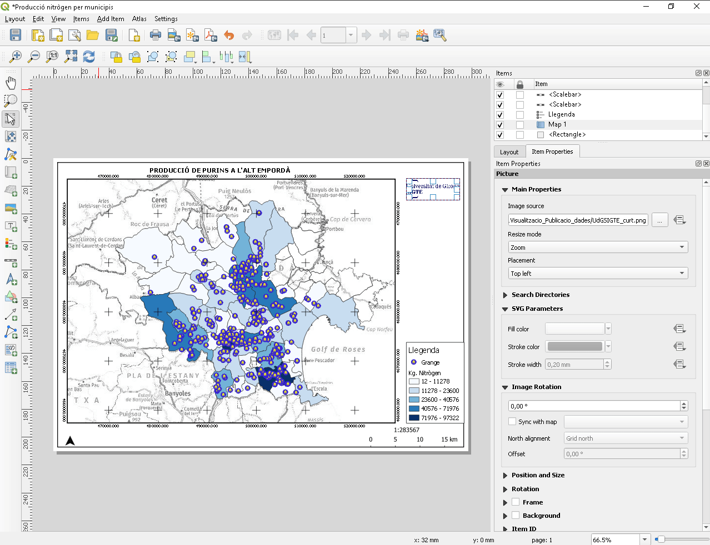

- Tornem a l'aplicació principal de QGIS. Carregarem una capa que ens serveixi de marc general territorial, com pot ser, per exemple, la capa amb els límits comarcals de Catalunya **Comarques.gjson**, i li donem l'estil que ens agradi, desactivem la resta de las capes de la vista i fem un zoom general. Seguidament, obrim l'administrador de composicions **Layout manager** i tornem al nostre mapa.

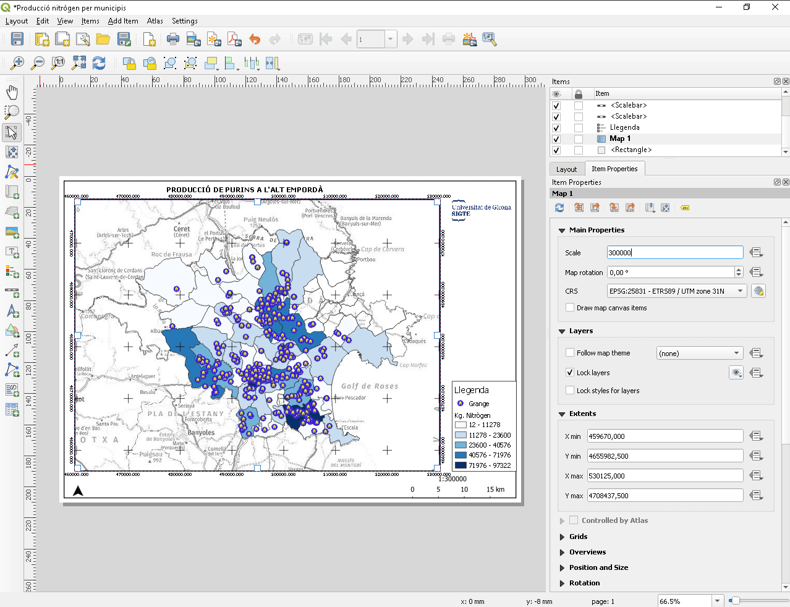

- Seleccionarem l'eina **Add new Map** i definirem un requadre petit a l'espai en blanc situat a l'extrem dret de la nostra composició. Automàticament es dibuixarà el contingut del nou mapa amb allò que tinguem visible a la finestra de mapa de QGIS. Ajustarem l'escala de visualització i enquadrarem el contingut. A la pestanya **Item properties** ens desplaçarem fins a l'apartat **Frame** i activarem la casella de verificació.

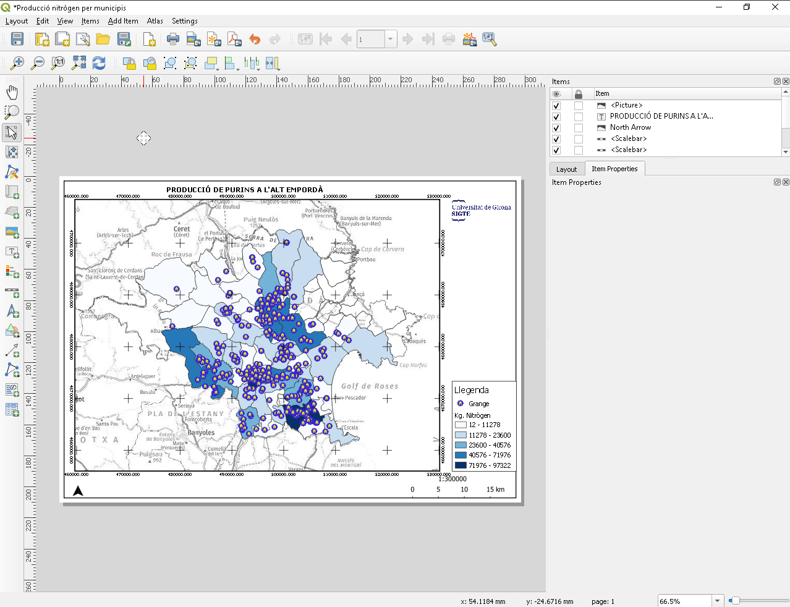

A continuació anirem a l'apartat **Overviews**, farem un clic sobre el botó **Add a new overview** (signe més "+" de color verd), ens assegurarem que tenim activada la casella **Draw "Overview 1" overview** i, en el paràmetre **Map Frame**, seleccionem el mapa que volem vincular amb el nostre **overview**: **Map 1**.

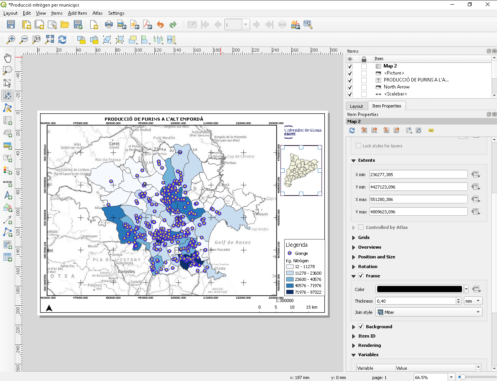

Barra d'eines d'accions
#######################

La barra d'eines d'accions o **Actions toolbars** proporciona eines que ens permeten ajustar i millorar la distribució dels diferents elements o **ítems** dins del mapa:

- **Bloquejar/desbloquejar** els elements per que no es puguin seleccionar per tal de no modificar-los desintencionadament. També podem bloquejar o desbloquejar elements de forma individual des del panell **Items** a la part dreta de la finestra del mapa. En cas de no estar visible el panell el podem activar des de **View>Panels**.
- **Agrupar/desagrupar** ítems. Això permetrà desplaçar-los o redimensionar-los a la vegada mantenint les distàncies entre ells. Per contra, mentre estiguin agrupats no podrem accedir a les propietats específiques de cadascun.
- **Elevar elements seleccionats**. Permet posar un ítem a sobre o a darrera d'altres. Això pot resultar útil quan un ítem està a sobre d'un altre i necessitem seleccionar el de sota. Per fer-ho, haurem de posar-lo a sobre. Un exemple seria l'element **marc del mapa** que ocupa tota l'extensió del mapa. Si aquest està a sobre de tot, no deixarà seleccionar la resta d'elements ja que sempre quedarà seleccionat aquest. Per evitar això podem seleccionar el marc i portar-lo darrera de tot.
- **Alinear elements seleccionats a l'esquerra**.
- **Distribuir els costats esquerre dels elements de forma equidistant**.
- **Canviar l'amplada dels elements en base a l'element seleccionat més estret**.

Sortida de resultats
####################

Un cop finalitzada la composició de mapa, a banda de la sortida per impressora, podem exportar el material com una imatge, un SVG o un PDF.

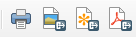

Administrar composicions
########################

En un projecte QGIS podem tenir tantes composicions com vulguem. Per administrar-les disposem del **Layout manager** al qual hi podem accedir, tant des de la vista del projecte, com des de la finestra de la composició.

Des d'aquí podem:

- Obrir la composició amb la que volem treballar.
- Fer un duplicat d'una altra composició que serveixi com a punt de partida per fer una versió modificada de l'anterior.
- Esborrar una composició.
- Reanomenar la composició seleccionada.
- Crear una nova composició ja sigui buida o fent servir una plantilla.

10.2. Generar un atles
----------------------

Quan l'extensió d'un mapa és excessivament gran per visualitzar-lo en una sola composició, podem dividir-lo en una sèrie de fulls. Una opció seria fer-ho de forma manual afegint fulls a la composició mitjançant el botó **Add pages..**.

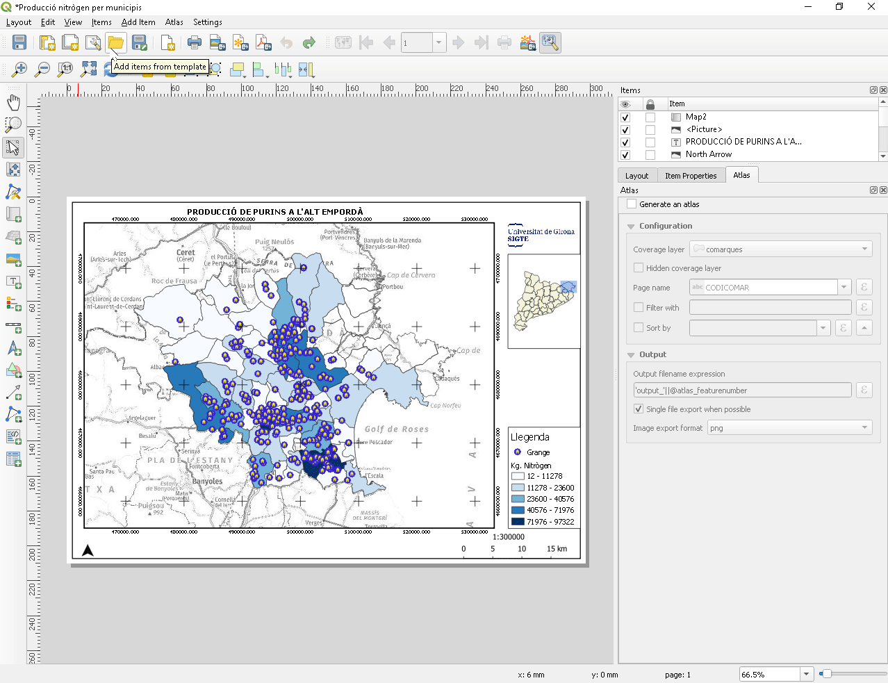

Això significa tornar a repetir tots els passos fets anteriorment per cada full.

Per estalviar-nos de repetir tot els passos, QGIS disposa de l'opció **Atlas** que permet generar una sèrie de fulls a una determinada escala que cobreixi la totalitat de la nostra àrea de treball.

- Anem a la pestanya **Atlas** i activem la casella **Generar Atlas**. Si no està visible la pestanya, la podem activar des del menú **View>Panels**, o bé des del botó **Atlas settings** a la part superior dreta de la barra d'eines.

- A **Coverage Layer** escollim la capa que conté els elements que faran de tall, en aquest cas farem servir la mateixa capa **Municipis_Emporda_Purins** que conté els municipis de l'Alt Empordà. També podríem fer servir una capa que tingués una quadrícula amb els talls dels mapes com per exemple la quadrícula dels talls 1:5.000.

- A **Page name** escollim el camp que conté el nom que rebrà cada full de l'atles. Seguint l'exemple anterior, aquest camp serà el codi del municipi **NOM_MUNI**.

- Podem filtrar quins elements de la capa volem que es cartografiïn, per exemple, podríem indicar que només faci un mapa dels municipis que tinguin com a mínim una granja porcina.

.. code-block:: sql

  **"Nombre_granges" >= 1**

- Seguidament seleccionem la vista del mapa i a **Item Properties** activem la casella **Controlled by Atlas**.

Podem escollir entre que tots els mapes tinguin una escala fixa, que s'ajusti a una escala predefinida o be que s'ajusti a l'element de la capa cobertura que representa deixant un percentatge de marge al voltant. Seleccionem **Predefined scale (best fit)**.

- Afegim un títol mitjançant **Insertar expresión**.

La primera part de l'expressió (entre cometes simples) és el text fixe, la segona part és una variable que introdueix el valor del camp **Page name** que hem seleccionat anteriorment i que no és un altre que el nom del municipi. Una altra variable que podem introduir és el número de mapa en relació al total de mapes.

- Fem clic al botó **Vista preliminar de Atlas** per veure el resultat. Podem fer servir les fletxes per anar endavant i endarrere i veure com ha quedat cada full del mapa.

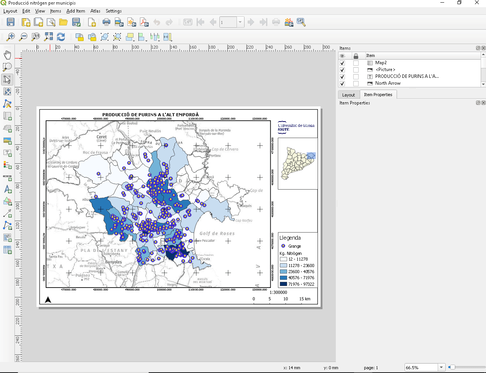

Si estem satisfets amb el resultat podem exportar l'atles com a una imatge, un SVG o un pdf.

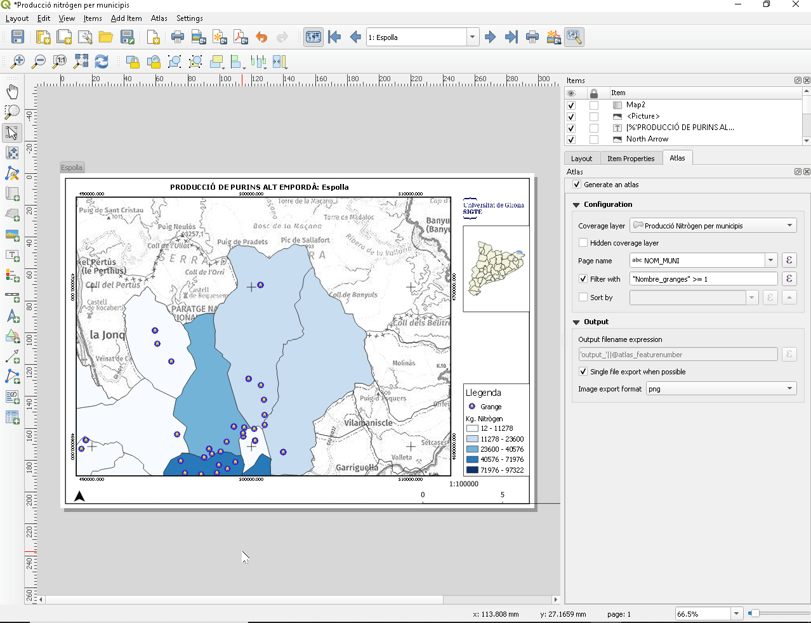

.. figure:: ./static/Exercici10_21.gif
   :align: center
   :scale: 75%

Si exportem a pdf, per defecte ens genera un únic document que inclou tots els fulls. En cas de voler tenir un únic pdf per cada full del mapa haurem d'anar a la pestanya **atlas** i desactivar l'opció **Single file export when possible**.

Per conèixer més sobre el procés de crear una composició i un atles podeu consultar els següents vídeos:

- `Curso Básico QGIS. Crear SHP, Simbología, Mapa Final <https://www.youtube.com/watch?v=ncfUS4Bk-8I&t=2s>`_

- `Crear un Atlas en QGIS <https://www.youtube.com/watch?v=LEyafFofnjI>`_

10.3. Visualització de dades 3D
-------------------------------

QGIS 3.x permet afegir noves vistes de mapa en 3D (natives), des de les quals podem visualitzar les capes del projecte des d'una perspectiva tridimensional. Les **Vistes de mapa 3**.

Preparar la cartografia de base
###############################

Obrim un nou projecte de QGIS i definim el **EPSG: 25831** corresponent a l'SRC UTM ETRS89 / UTM zone 31N. En les propietats de el projecte definim la ruta de la carpeta que conté les dades del projecte i li assignem un nom:

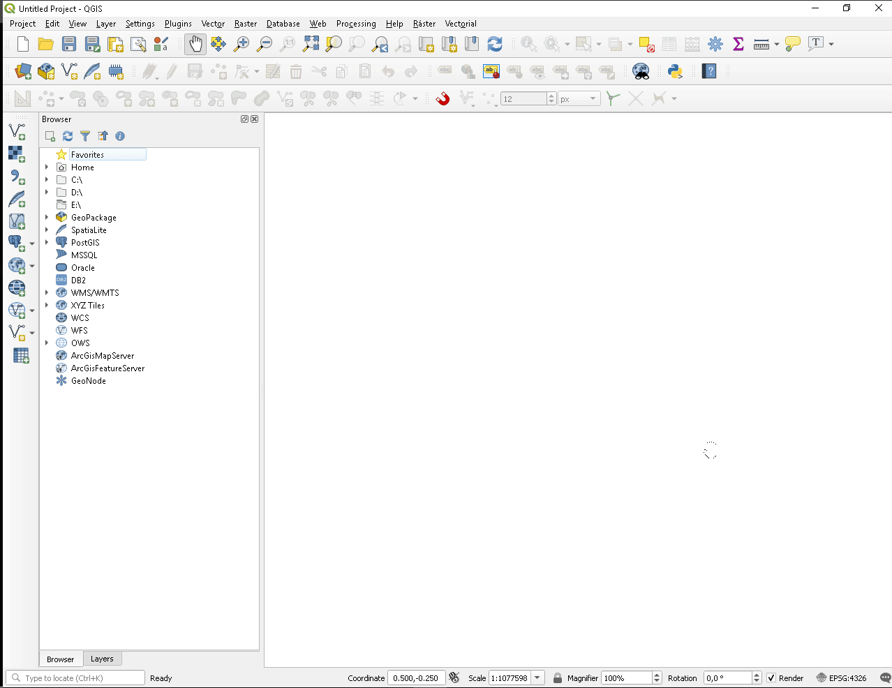

Carreguem els arxius ràster corresponents al MDT 2x2 de la zona corresponent a Canet d'Adri (Girona), que es troben a la carpeta MET_2x2 en format **TXT**. A continuació, unirem totes les capes raster utilitzant l'algorisme **Merge** des de l'apartat **Locator bar**.

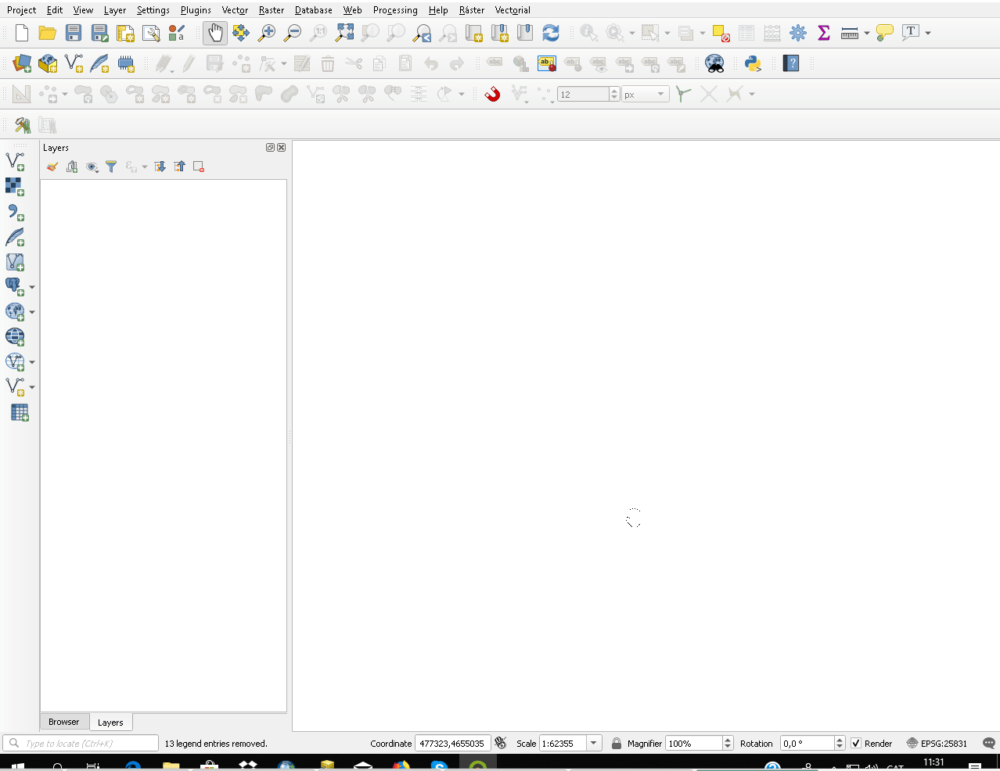

Carreguem la capa amb els límits municipals de l'àrea de treball **bm50mv33sh1fpm1_20160101_0.shp**. Seleccionem el municipi de Canet d'Adri i en l'apartat **Locator bar**, cerquem el geoprocés **Extract Selected Features** mitjançant el qual obtenim una capa temporal amb el polígon corresponent al terme municipal de Canet d'Adri. Seguidament fem permanent la capa que conté el terme municipal i li apliquem un estil sense farcit (clic amb el botó dret del ratolí sobre la capa temporal + **Make Permanent**).

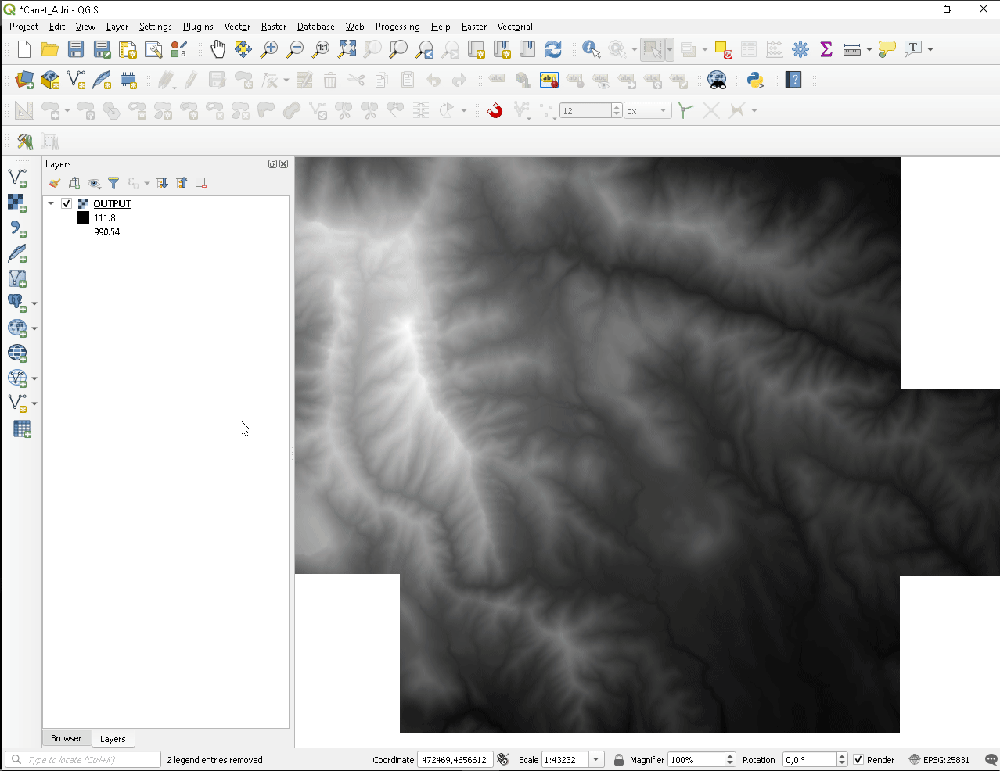

A continuació tallem l'MDT amb el límit municipal de Canet d'Adri. Per fer això fem servir l'algorisme **Clip raster by Mask Layer**.

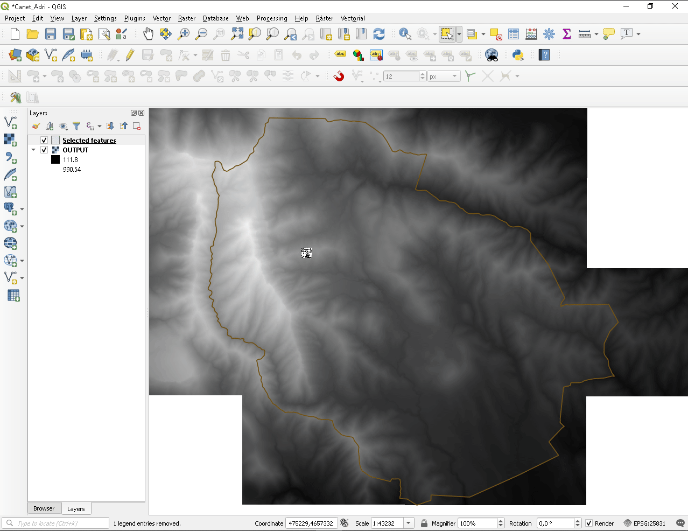

Aplicar estils a l'MDT
#####################

Aplicarem al nostre MDT una paleta de colors combinada amb un relleu ombrejat. Amb la tecla F7 activem el tauler de control d'estils de la capa. També es pot fer obrint les propietats de la capa, però l'avantatge de la primera és que l'estil es va actualitzant directament a mesura que canviem els paràmetres de visualització. A la part superior de la finestra d'estils seleccionem l'MDT i com a estil de representació, escollim **Singleband pseudocolors** i apliquem la paleta de color **wiki-Schwarzwald-cont151 colors-continuous** que trobarem a **Color ramp> Create New Color Ramp...> Catalog: cpt-city> Topograpy**.

Dupliquem l'MDT fent clic amb el botó dret sobre la capa dins el panell de capes i seleccionant l'opció **Duplicate Layer**. Sobre la capa duplicada apliquem l'estil de representació **Hillshade**. En l'apartat **Layer Rendering** modificarem el **Blending mode** a **Multiply**. D'aquesta manera, aconseguim que l'estil de relleu ombrejat es combini o barregi amb l'estil aplicat a l'MDT. En cas de no apreciar-se correctament la combinació d'estils, arrosseguem la capa en relleu ombrejat, per sobre de l'MDT.

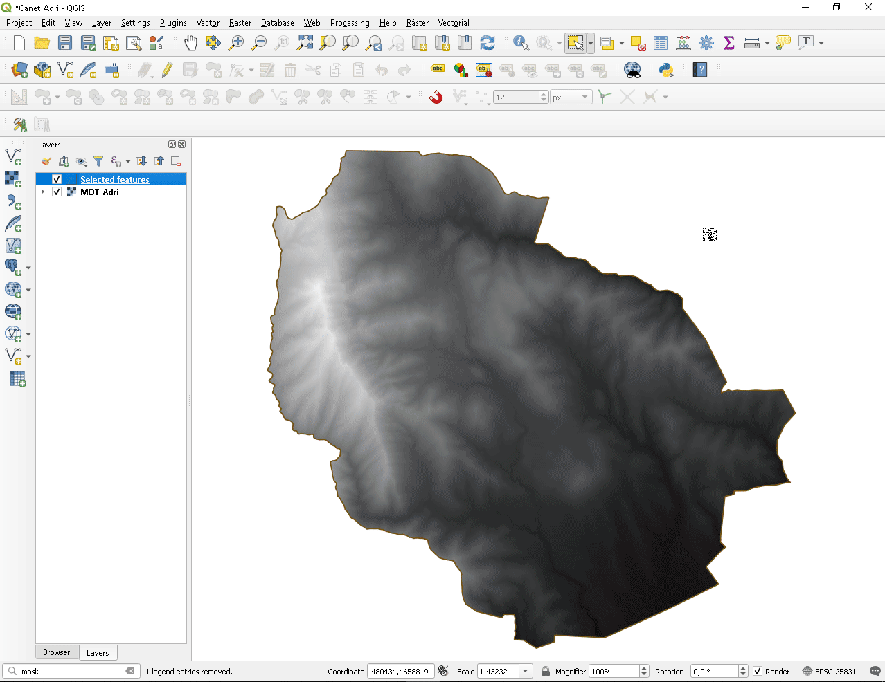

Crear una capa de cursos fluvials
#################################

A continuació crearem una capa de cursos fluvials mitjançant el càlcul de la xarxa de drenatge extreta del propi MDT. Per a això, utilitzarem l'algorisme de GRASS **r.stream.extract**. Per localitzar aquesta comanda podem fer ús de la barra de localització. Executem **r.stream.extract** i introduïm els següents paràmetres:

  * *Input map*: **MDT_Adri**
  * *Minimum flow accumulation for streams*: **5000**
  * *Delete stream segments shorter than cells*: **2500**
  * *v.out.ogr output type*: **line**
  * *Unique streams ids (vect)*: **Cursos_fluviales.geojson**

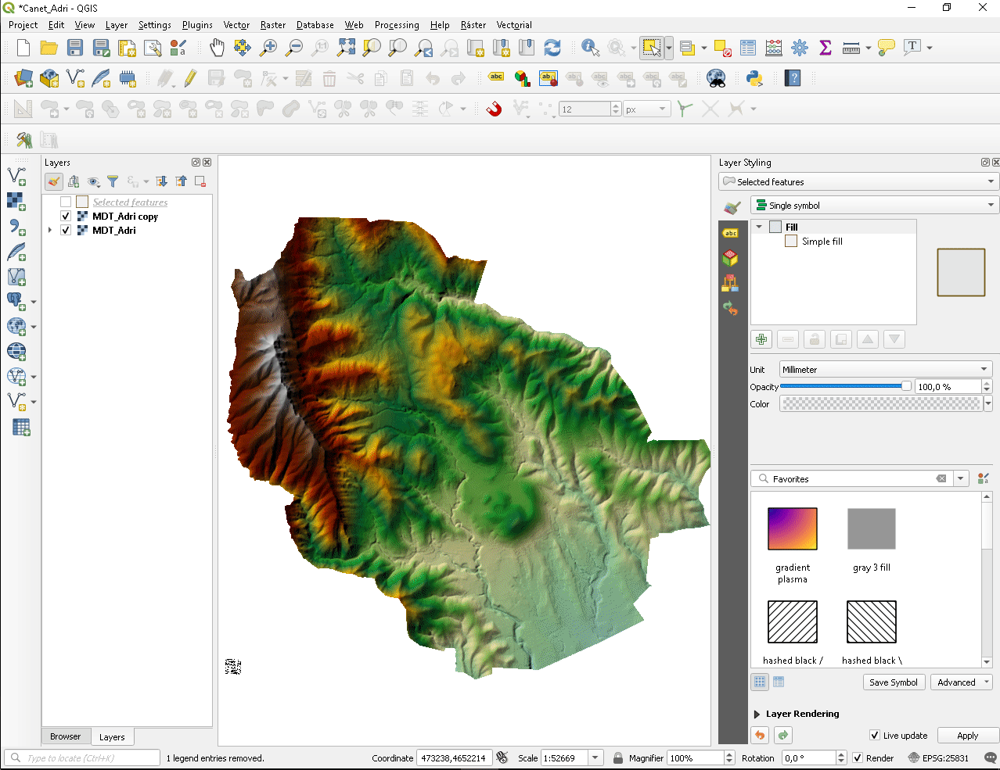

A la capa resultant li apliquem un estil per representar adequadament els rius.

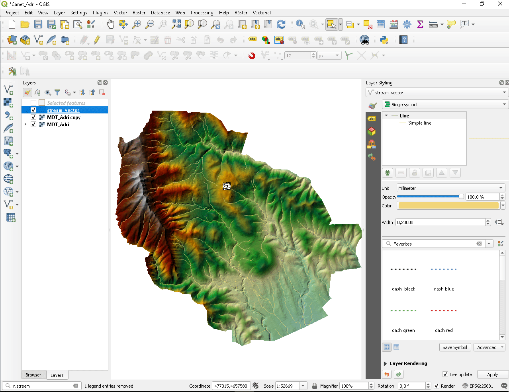

Generar Nova Vista 3D
#####################

Un cop tenim la cartografia de base, anem a mostrar-la en una vista 3D:

Des del menú **View**, seleccionem **New 3D Map View**. A la vista 3D farem un clic al botó **3D Configuration** i introduirem els següents paràmetres:

* *Elevation*: **MDT_Adri**
* *Vertical scale*: **1.5**

Una cop a la vista 3D podem navegar-hi utilitzant els següents controls:

* **roda central del ratolí** per augmentar/disminuir el zoom.
* **Majúscula + botó esquerra** per canviar la perspectiva.
* **Control + botó esquerra** per canviar la panoràmica.

.. figure:: ./static/3D_8.gif
  :align: center
  :scale: 75%

11. Preparació del projecte per a la publicació
===============================================

A banda de la clàssica creació d'una composició de mapa que hem vist a la lliçó anterior, hi ha altres opcions de compartir i publicar les dades del nostre projecte QGIS.

11.1. Exportar projecte a imatge georreferenciada
-------------------------------------------------

Podem exportar la vista del projecte a una imatge que podem inserir en una pàgina web, un document, una publicació, un informe, etc... Per fer això anirem al menú  **Project>Import/Export** i escollirem l'opció **Export to image...**.

Podem escollir si volem exportar tota la imatge o només una extensió determinada, l'escala del mapa, la resolució i si volem que la imatge sigui georreferenciada. En aquest darrer cas, la imatge inclourà la projecció i sistema de coordenades i podrem fer-la servir en un altre SIG i combinar-la amb altres capes georreferenciades.

.. figure:: ./static/Exercici11_1.gif
  :align: center
  :scale: 75%

11.2. Exportar a Geopdf
-----------------------

Un GeoPDF és una solució per fer arribar la cartografia a usuaris no familiaritzats amb els Sistemes d'Informació Geogràfica. GeoPDF geoespacial és una extensió d'arxius amb format Adobe PDF. S'utilitza per presentar dades GIS i cartografia en fitxers PDF d'Adobe Systems, els quals poden brindar funcionalitats SIG com activació de capes de dades (punts, línies i polígons) o visualització d'etiquetes. Al seu torn, l'extensió afegeix una matriu de transformació de coordenades i altres metadades perquè el nostre GeoPDF quedi projectat.

https://mappinggis.com/2019/11/como-crear-un-geopdf-con-qgis/

11.3. Publicar mapes amb QGIS Cloud
-----------------------------------

QGIS Cloud és una plataforma per publicar mapes, dades i serveis a Internet. Permet compartir de forma ràpida i senzilla els nostres projectes de QGIS a través d'un navegador web. Tot i que per accedir de forma il·limitada a tota la funcionalitat de QGIS es necessita un compte de pagament, existeix un compte gratuït **QGIS Cloud Free**que ofereix una base de dades PostGIS al núvol per pujar les nostres dades amb 50 MB de emmagatzemat i 10 connexions simultànies. Amb el compte gratuït tots els mapes publicats són de lliure accés per qualsevol persona. Per poder limitar l'accés s'ha de tenir un compte de pagament **QGIS Cloud Pro**.

- Obrim el projecte QGIS que volem publicar.
- Instal·lem el *plugin* **QGIS Cloud**

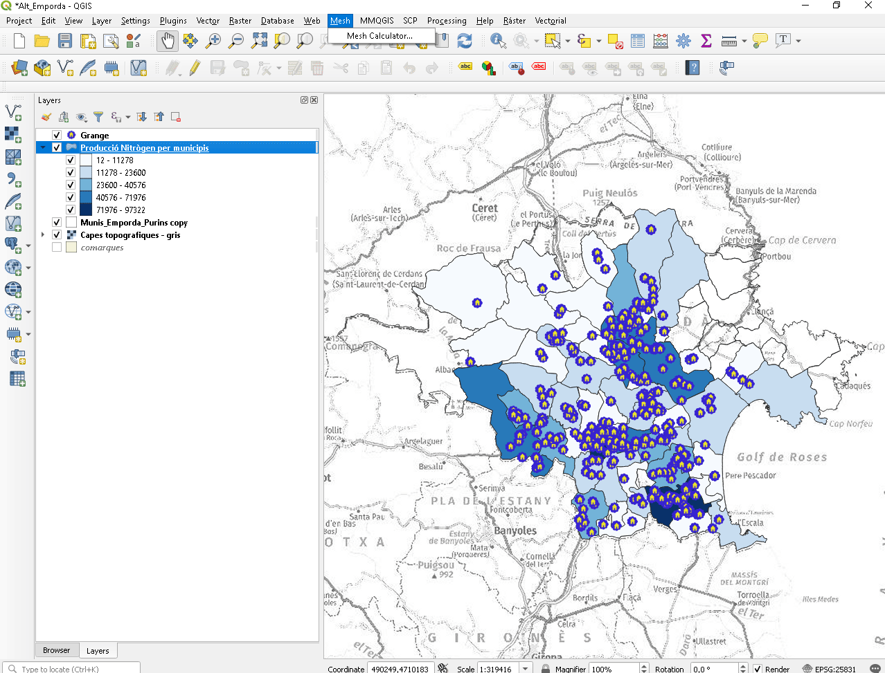

A la part esquerra de la pantalla apareix el panell d'opcions de QGIS Cloud.

- Primer de tot hem de crear un compte des de la pestanya **Account** fent clic sobre **Signup**

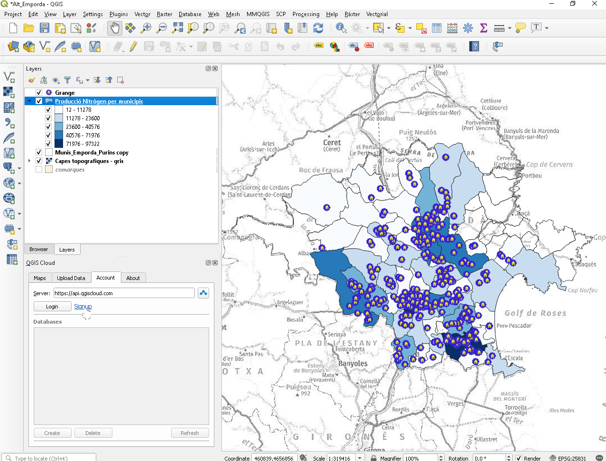

Rebreu un email on haureu de confirmar el vostre registre i acceptar els termes d'ús del servei per poder continuar.

- Un cop registrats a QGIS Cloud ens connectem amb el compte que acabem de crear.

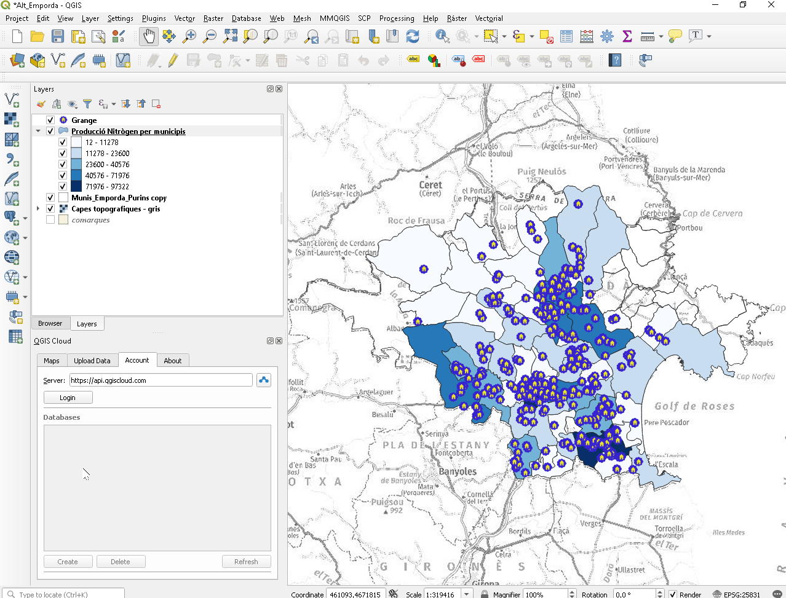

- Primer de tot, crearem la base de dades PostGIS al núvol on s'emmagatzemaran les capes del nostre projecte a la mateixa pestanya **Account**. Amb el compte gratuït només podem crear una única base de dades, però la podem esborrar i crear-ne una de nova.

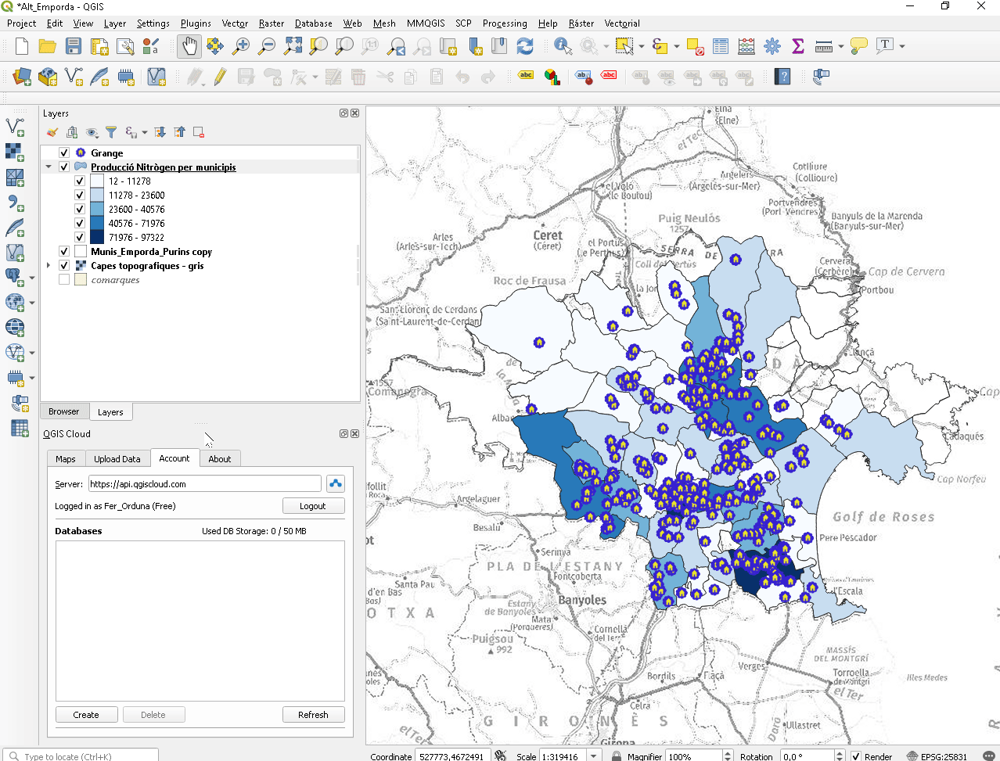

- Anem a la pestanya **Upload Data** on pujarem a la base de dades les capes de municipis de l'Alt Empordà representats segons la producció anual de purins i les granges porcines de la comarca. Aquestes capes seran taules amb geometries espacials a la base de dades. Primer de tot, reanomenarem les taules amb un altre nom i seguidament farem clic a **Upload Data** .

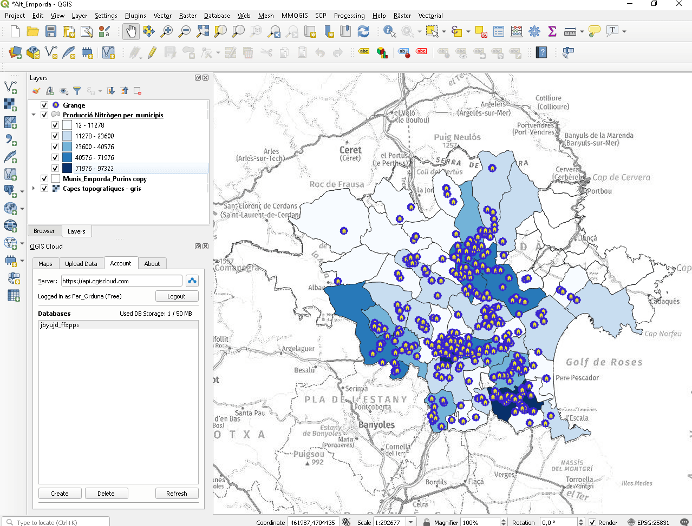

- Quan finalitza la pujada de les capes a la base de dades, ens apareix la finestra **Save Project** on s'indica que ha finalitzat la pujada de les dades i que les capes locals seran reemplaçades al projecte per les que s'ha pujat a la base de dades de QGIS Cloud. Podem sobreescriure el projecte o guardar-lo amb un altre nom. Farem el segon i el reanomenarem com **Purins_Alt_Emporda_QGISCloud.qgz**.

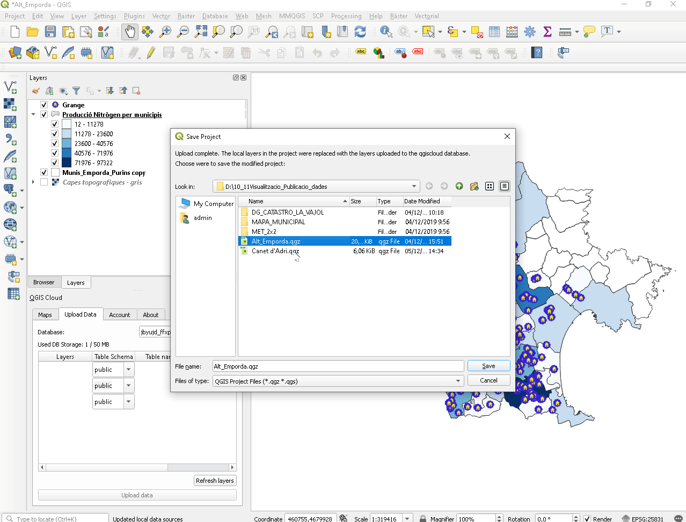

El panell de QGIS Cloud de la part esquerra de la pantalla salta automàticament a la pestanya **Maps**. Podem afegir una cartografia de referencia a través de la connexió a un servidor. QGIS Cloud ens dóna l'opció de triar entre Google Maps, OpenStreetMap, Bing Maps, o Apple Maps. Com que ja tenim al nostre projecte la base topogràfica del ICGC no afegirem cap cartografia més.

- Seguidament fem clic a **Publish Map**

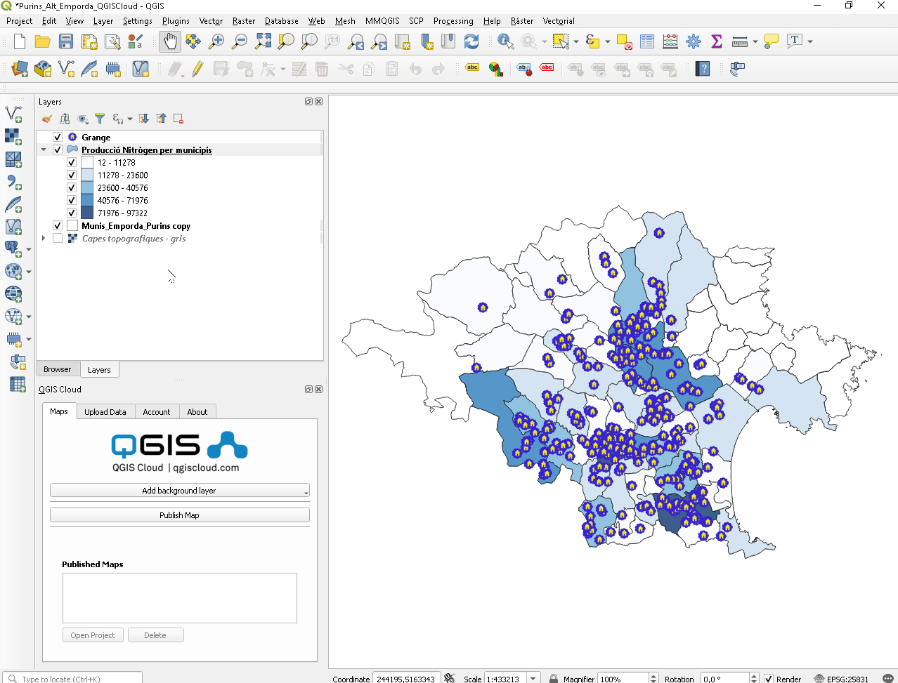

Es mostra el nostre mapa en una pàgina web amb alguns controls bàsics com zoom més/menys, activar/desactivar capes, consultar la llegenda, aplicar transparències, consultar la informació associada o fer mesuraments.

11.4. Altres eines per publicar projectes QGIS a Internet
----------------------------------------------------------

A banda de **QGIS Cloud** que acabem de veure, existeixen altres eines més o menys complexes que permeten publicar els nostres projectes QGIS a Internet.

QGIS Server
###########

Es tracta d'una aplicació de codi obert que permet crear serveis de mapes web (WMS), utilitzar simbologia avançada, identificar els atributs dels objectes de les capes i mostrar-ne les taules d'atributs.

**QGIS Server** requereix instal·lar-se a un servidor web Apache.

QGIS2WEB
########

Es tracta d'un *plugin* que exporta els projectes de QGIS a mapes web d'OpenLayers o de Leaflet. Genera automàticament els arxius HTML, Javascript i CSS. Crea un visor web amb totes les capes existents al projecte de QGIS. Aquest complement exporta totes les capes vectorials a format GeoJSON i crea una estructura de carpetes amb un arxiu index.html que conté el mapa web. També permet exportar la simbologia definida per les nostres capes al projecte QGIS.

GeoServer Explorer
##################

És un *plugin* que permet gestionar des de QGIS les capes, els estils, els repositoris de dades, les carpetes, etc... que seran publicats a través de GeoServer.

11.5. Crear un visor web 3D
---------------------------

Podem crear un visor 3D en HTML fent servir el complement **QGIS2threejs** el qual permet construir escenes tridimensionals i exportar-les a un visor en format HTML.

Afegir cartografia de referència
################################

En aquest punt millorarem la visualització de la vista de Canet d'Adri generat anteriorment afegint cartografia de referència i modificant alguns paràmetres de visualització de les capes que acabaran component l'escena 3D.

En primer lloc afegirem una capa de cartografia de referència. En concret, afegirem la cartografia d'OpenStreetMap. Per a fer això, hem d'instal·lar el complement **QuickMapServices** i carregar la capa **OSM Standard** des del menú **Web> QuickMapServices> OSM**.

Modifiquem les propietats de visualització de la capa **Canet_Adri_LM**, que és la que conté el límit municipal:

* **Inverted polygons** com estil de representació de la capa.
* A **Symbol layer type** seleccionem **Shapeburst fill**.
* A **Gradient Colors** seleccionem l'opció **Two colors**  i crearem un gradient de color marró clar a groc suau.
* A l'apartat **Shading Style** definim un valor pel paràmetre **Set distance** de **5**, y un valor de **10** per al paràmetre **Blur strength**.
* A **Layer rendering** definim un **60%** d'opacitat.

.. figure:: ./static/3D_9.gif
  :align: center
  :scale: 75%

Duplicarem a continuació la capa **Canet_Adri_LM**, l'arrosseguem a dalt del panell de capes i en canviem l'estil seguint els paràmetres següents:

* Seleccionem **Single symbol** com estil de representació de la capa.
* A **Symbol layer type** seleccionem **Outline: Simple line**.
* A **Color** li donem un color marró.
* A **Stroke width** aplicarem al perímetre un gruix d'**1**.
* A **Layer rendering** definim un valor del **80%** d'opacitat al perímetre.
* Activem l'opció **Draw effects** i seleccionem l'efecte **Drop shadow**.

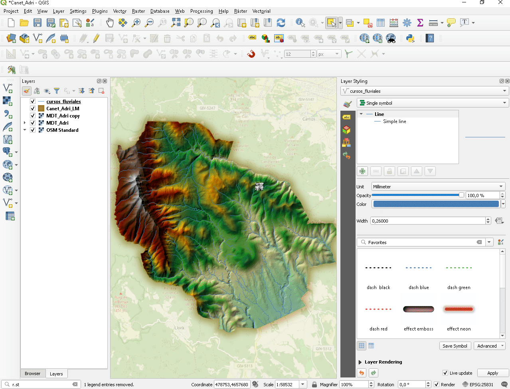

Afegir una capa d'edificacions
###############################

El següent pas consisteix en afegir una capa d'edificacions del municipi, que seran representats com volumetries sobre l'escena 3D. La capa vectorial d'edificacions l'obtindrem d'OpenStreetMap i per això utilitzarem un complement anomenat **QuickOSM**.

* Un cop instal·lat el complement, executarem **QuickOSM**, que trobarem al menú **Vector** o en forma d'eina representat per una lupa blanca sobre fons verd, i hi introduirem els següents paràmetres:

* *Key* = **building**
* *In* = **Canet d'Adri_LM**
* *Advanced*: Deixem seleccionat únicament **Way**, **Multilinestrings**, **Relation**, **Multipolygons**
* Executem **Run query**

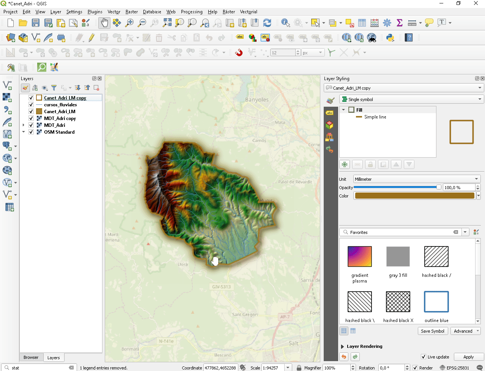

Per poder fer una extrusió dels edificis en l'escenari 3D podem indicar una alçada constant per a tots, o bé indicar un camp que contingui l'alçada de cadascun. Com que en aquest cas no tenim aquesta alçada, podem calcular-ne una d'aleatòria a partir de la següent fórmula:

.. code-block:: sql

  **Cota / 1000 X 2**

On cota seria la cota altimètrica en què es troba cada edificació.

Per calcular la cota altimètrica farem servir l'eina **Zonal statistics** la qual ens permet calcular les estadístiques dels valors de les cel·les coincidents amb una àrea o polígon. En aquest cas només ens interessa calcular l'altura mitjana de totes les cel·les.

A **Locator bar** busquem i executem la comanda **Zonal estatistics** i introduïm els següents paràmetres:

* *Raster Layer* = **MDT_Adri**
* *Vector layer containing zones* = **building_Canet d'Adri**
* *Statistics to calculate* = **Mean**

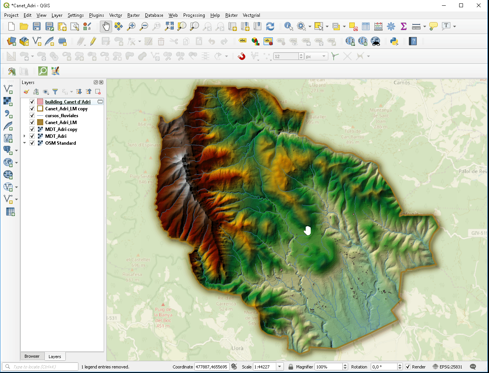

Amb la capa **building_Canet d'Adri** activa, obrim la calculadora de camps, crearem un camp nou i hi apliquem la fórmula:

.. code-block:: sql

  "_mean"  / 100 * 2``

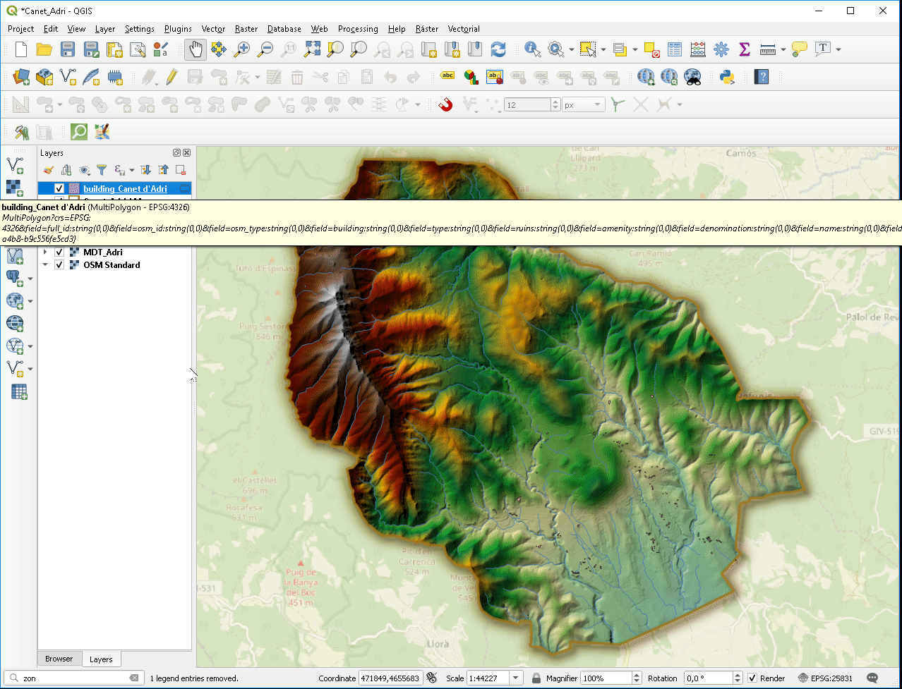

Fem permanent la capa **building_Canet d'Adri** fent clic sobre aquesta amb el botó dret y seleccionant **Make permanent**.

Crear l'escena 3D
#################

Un cop preparada la vista amb les capes podem crear l'escena 3D. Si tenim instal·lat el complement **QGIS2threejs** podem activar l'exportador d'escenes 3D des del menú **Web** o l'eina que representa un triangle verd amb una línia taronja sota. Amb això, obrirem la finestra on podrem definir les propietats de visualització de l'escena.

En cas de no estar-ho, activem l'opció **Preview** a la part inferior dreta de la finestra. A l'apartat **Layers** activem l'MDE **MDT_Adri** i hi fem doble clic a sobre per obrir les seves propietats on definim els següents paràmetres:

* A **Geometry** activem l'opció **Surrondings** que mostrarà les capes que formen part del escenari més enllà de l'extensión de l'MDE.
* A **Material** activem l'opció **Layer image** i a **Select layer(s)** seleccionem les capes **OSM Standard**, **MDT_Adri**, **Canet_Adri_LM**, **Canet_Adri_LM copy**. Aquestes seran les capes que seran renderitzades i, per tant, seran la cartografia de base de l'escena que no podrà ser modificada. Fent clic a la pestanya **Preview** podem fer una vista prèvia de la capa. Deixem la resta de paràmetres per defecte i fem un clic a **Apply**.

Anem a **Scene Settings** al menú **Scene** y en **Vertical exaggeration** indiquem un valor d'**1,5**.

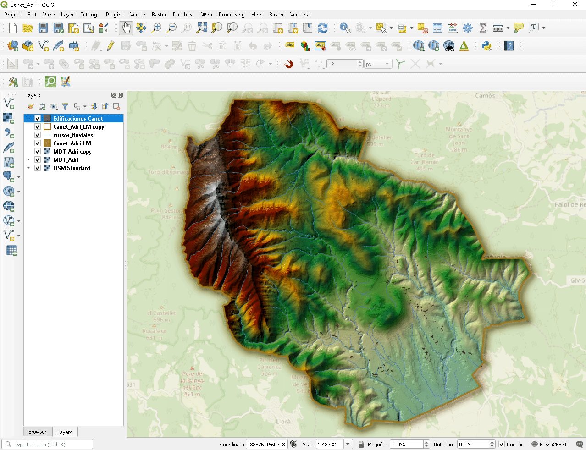

Activem la capa **cursos_fluvials** i obrim les seves propietats:

* A *Mode* seleccionem **Relative to MDT_Adri layer**.
* A *Altitude* indiquem **25**.
* Fem clic en **Apply** i **OK**.

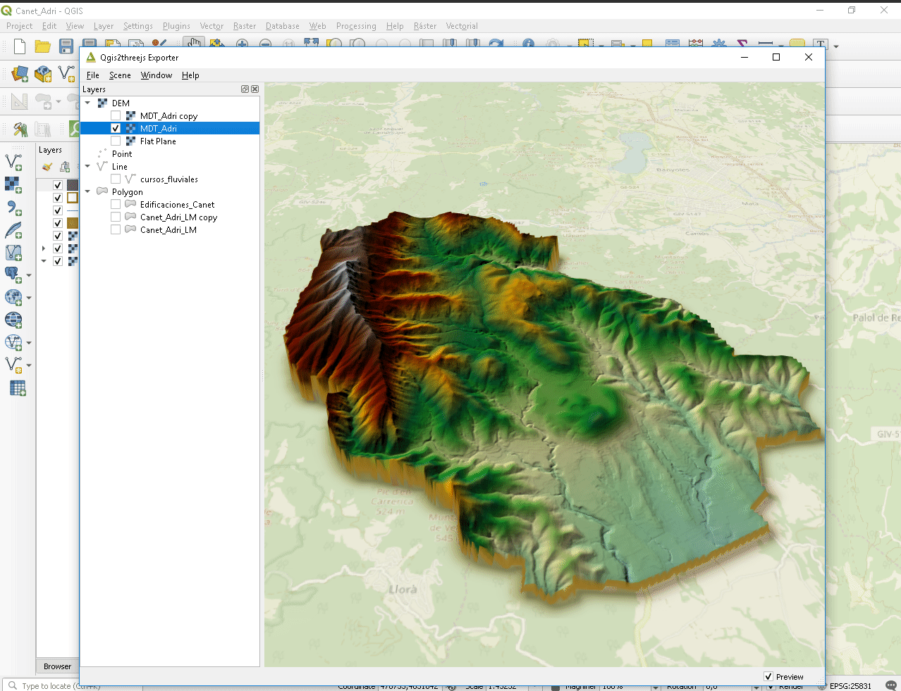

* Activem la capa **Edificacions_Canet** i fem doble clic per obrir les propietats:

* A *Object type* seleccionem **Extruded**.
* A l'apartat *Z_coordinate*, en *Mode*, seleccionem **Relative to MDT_Adri layer** i indiquem valor **0**.
* A *Style* indiquem els següents paràmetres:
  * *Color* = **Random**.
  * *Height* = **Altura**.
  * *Border color* = **Feature style**

.. figure:: ./static/3D_16.gif
  :align: center
  :scale: 75%

Podem navegar per l'escena 3D utilitzant els següents controls:

* **Roda central** del ratolí per augmentar/disminuir el zoom.
* **Botó esquerra** per canviar l'orientació i perspectiva.
* **Ctrl + botó esquerra** per  desplaçar-nos per dins de l'escena sense canviar l'orientació i la perspectiva.

Para acabar, afegirem un títol i un autor a l'escena. Al menú *Scene*, seleccionem **Decorations** i **Header/Footer Labels**

* *Header Label text*: **Paratge del Massís de Rocacorba (Gironès)**
* *Footer Label text*: **Curs QGIS (2019)**

Exportar escena 3D a Web
########################

Finalment exportem l'escena a un visor 3D en format HTML.

En el menú **File** seleccionem **Export to Web...**. Indiquem la carpeta de destí, el nom de l'arxiu index del HTML y escollim la plantilla **3D Viewer with dat-gui panel**. Aquesta plantilla inclou un panell on podem activar o desactivar capes de l'escena i aplicar transparencies entre altres opcions.

.. figure:: ./static/3D_17.gif
  :align: center
  :scale: 75%

-----------------------
